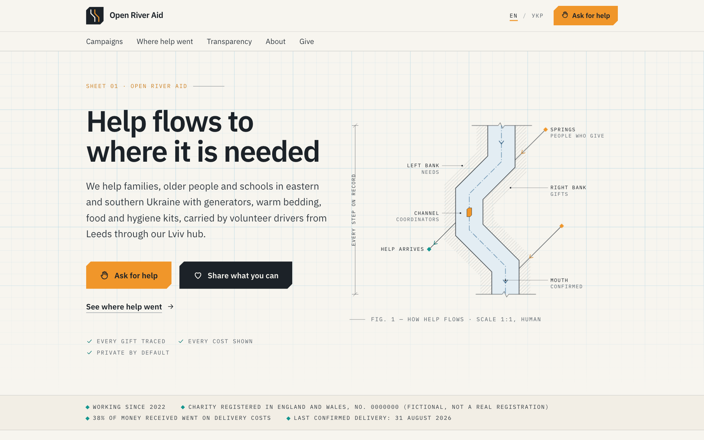
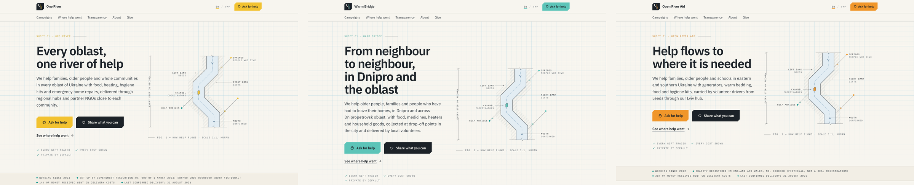
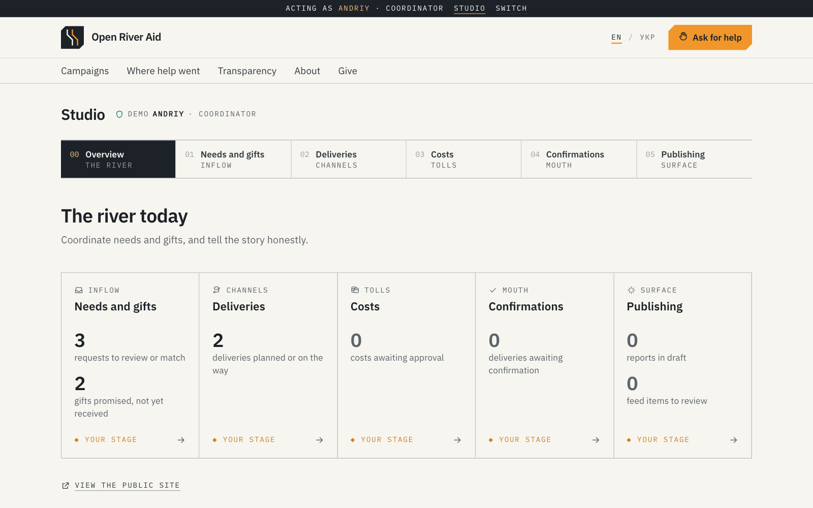
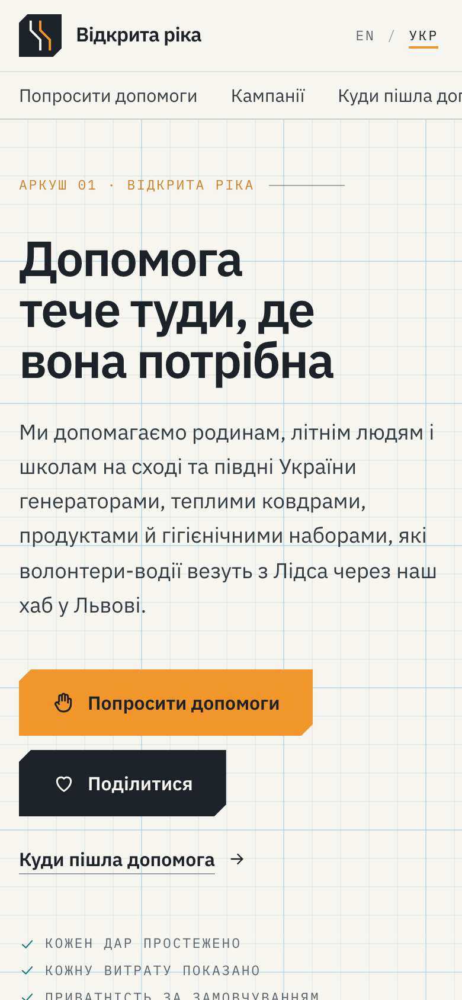
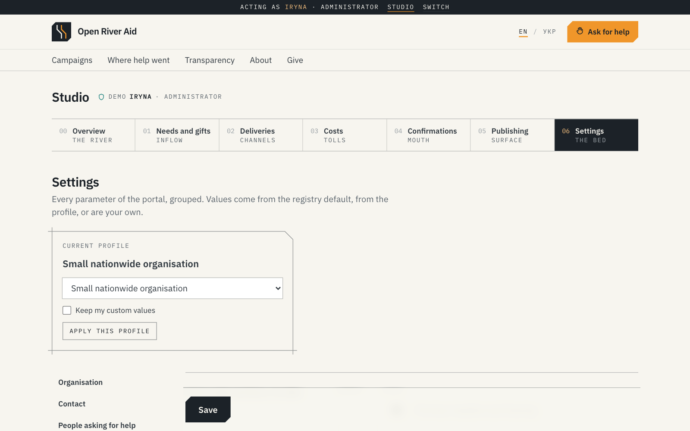
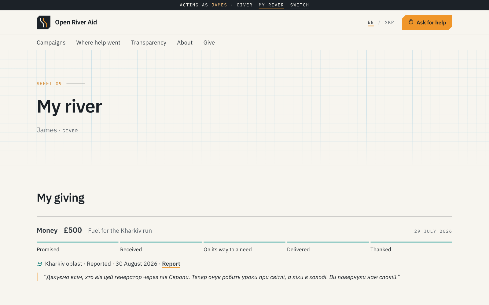
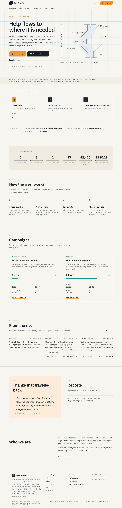
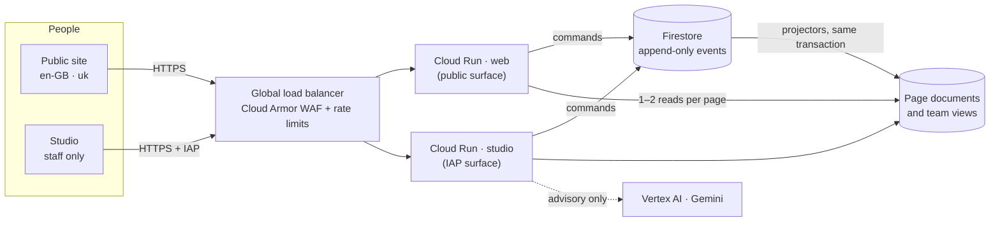
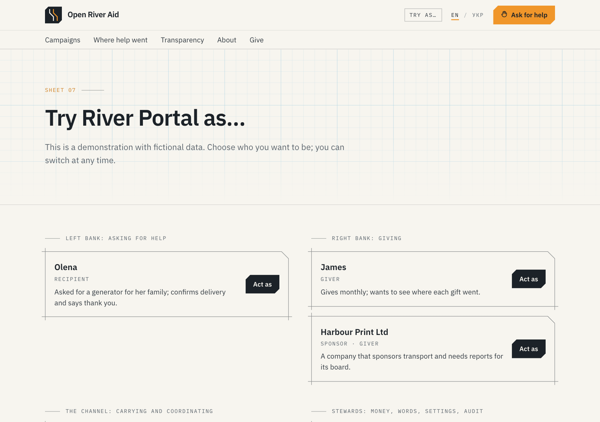

<p align="center">
  
</p>

<h1 align="center">River Portal</h1>

<p align="center">
  <strong>An open-source portal where needs and gifts meet, and every step of help is visible.</strong><br>
  A research project in AI-driven development · a free template for civil-society organisations · a call to remember Oleshky.
</p>

<p align="center">
  <a href="LICENSE"></a>
  <a href="LICENSE-DOCS.md"></a>
  
  
  
  
</p>

---

> [!IMPORTANT]
> **What this repository is, and what it is not**
>
> 1. **A research project.** It explores how far a real, production-minded portal can be *specified, designed and built* by people working with an AI assistant. The three Obsidian vaults (`spec/`, `adr/`, `meta/`) are the framework that directs the AI: every decision and observation is written down, so the next session, human or AI, starts from the same ground.
> 2. **A free, open-source template** (Apache 2.0) for charities and civil-society organisations that want to coordinate help openly. It is a **research preview**: it has not been independently audited, and it must not store real personal data until the documented hard gates are closed ([`SECURITY.md`](SECURITY.md)). The demo organisation *Open River Aid* and every person in the demo data are fictional.
> 3. **A way to draw attention** to what is happening in **Oleshky**, a town in Ukraine's Kherson oblast under Russian occupation and blockade. [Read the fact sheet →](docs/oleshky-fact-sheet.md)

## Oleshky: where the left bank is closed

This portal is built on one rule: **the left bank is always open**. Anyone who needs help may ask for it, and help may reach them. In **Oleshky** (Олешки), a town on the Dnipro opposite Kherson that Russia has occupied since the first days of the full-scale invasion, that rule has been broken by force.

- About **24,000** people lived there before 2022. Ukrainian officials estimate that about **2,000** remain in the town and up to **6,000** in the surrounding area, including around 200 children.
- The UN human rights mission reported that, as of 24 June 2026, **no food had been delivered since 26 May**. It recorded at least **29 civilians killed and 54 injured** in Oleshky and Hola Prystan in 2026.
- The roads are mined and watched by drones. There has been no evacuation since 26 May; people walk out along mined roads. Residents describe eating garden weeds.
- The UN calls for a local ceasefire so that people can leave and food and medicine can arrive. The ICRC says it is ready to help once the parties request it and guarantee security. The Kremlin acknowledges a "critical situation" but blames Ukraine.

> [!CAUTION]
> **Our position.** We, the authors of this project, regard the deliberate starvation and entrapment of Oleshky's civilian population by the Russian Federation as **genocide**, and we say so plainly. This is our position. International bodies have so far used narrower legal terms. The fact sheet sets out exactly what is documented, who has said what, and what is still unverified.

**[Read the fact sheet: sources, timeline and what you can do →](docs/oleshky-fact-sheet.md)** It is licensed CC BY 4.0, so please share it freely.


## What the portal does

River Portal treats help as a river. **Needs** stand on one bank and **gifts** on the other, with the people who carry help in between. Every step is recorded, and what the public sees is derived from those records.

| | |
|---|---|
| **Ask for help** | A very simple form in English or Ukrainian. No account and no proof required. It returns a private tracking link that shows the request's journey in plain words. |
| **Give** | Money, goods, transport, a service or time, shaped by real needs. A gift is a gift: it buys no status, and nobody is ranked by amount. |
| **Coordinate** | A studio for staff behind Identity-Aware Proxy, arranged along the river: inflow of needs and gifts, deliveries, costs, confirmations, publishing and settings. Each role sees its own stages; an auditor sees everything and changes nothing. |
| **Close the circle** | The recipient confirms receipt and can send thanks to everyone who helped. Each use of the thanks needs its own consent. |
| **Report honestly** | A private report is generated from the flow's records, edited in the studio, and published only after a consent check and a safety delay for conflict zones. |
| **Tell the story with AI, carefully** | Vertex AI (Gemini) proposes short feed items from a report. People edit, accept or reject each one. AI never publishes. |
| **Show the numbers** | Counters, campaign pages with an honest cost breakdown, an open ledger, the feed and a thank-you wall. The public sees oblast-level places only and no personal data. |
| **Set it up for your organisation** | Every parameter lives in one settings registry, with floors that cannot be lowered: currency, approval limits, safety delays, texts, contacts, the order of the home page. Three profiles set it up for a state programme, a city foundation or a small organisation working across the country. |
| **Walk every role** | Locally, act as any of nine demo people (a recipient, a giver, a sponsor, a carrier, a coordinator, a Finance Steward, an editor, an administrator, an auditor) and follow a guided walk of ten steps from a request to the thanks. |

## Screenshots

<p align="center"></p>
<p align="center"><sub><strong>One code base, three organisations.</strong> The same texts, written once with settings tokens, become a national programme, a city foundation and a small volunteer group.</sub></p>

<table>
  <tr>
    <td width="67%"></td>
    <td width="33%"></td>
  </tr>
  <tr>
    <td><sub><strong>Studio.</strong> The river today for a coordinator: what waits at each stage, and which stages are theirs.</sub></td>
    <td><sub><strong>Mobile, Ukrainian.</strong> Both languages are first-class.</sub></td>
  </tr>
  <tr>
    <td width="67%"></td>
    <td width="33%"></td>
  </tr>
  <tr>
    <td><sub><strong>Settings.</strong> Generated from the registry; every value shows where it comes from.</sub></td>
    <td><sub><strong>My river.</strong> A giver follows a gift to the thanks, without seeing anyone's name.</sub></td>
  </tr>
</table>

<details>
<summary>The whole home page</summary>
<p align="center"></p>
</details>

The visual language is an **open plan**: flat paper and graphite, hairlines that overshoot their corners like pencil lines, bevelled plates, numbers drawn as dimensions and a technical drawing of the river. It was reached through a scored design loop, documented in [`meta/iterations/Iteration 02 — Drafting Table Design.md`](meta/iterations/Iteration%2002%20%E2%80%94%20Drafting%20Table%20Design.md) and [ADR-0018](adr/records/ADR-0018%20Drafting-Table%20Visual%20Language.md).

## Principles built into the code

- **The left bank is always open.** Anyone may ask. History and reputation affect routing and checks, never access.
- **Private by default.** Personal details live in private documents, never in the event log or on public pages. Tests check that names, places, phones and e-mails never reach public documents.
- **The river remembers.** Every action is an append-only event; corrections are new events.
- **Honest numbers.** Every public figure is derived from the log, including costs.
- **Consent is specific and revocable.** Thanks, stories and photos each need their own consent.

## How it is built



| Layer | Choice |
|---|---|
| UI | Next.js 16 (App Router, Server Components, Server Actions), React 19, Tailwind CSS 4, Tiptap 3 for editing in the studio, IBM Plex |
| Domain | 17 TypeScript packages behind `gate.ts` entry points: `foundation` → `record` → `river` / `steward` / `assist` → `surface` → `compose` ([`TOPOLOGY.md`](TOPOLOGY.md)) |
| Settings and identity | A typed settings registry with three organisation profiles; roles and signed sessions (IAP for staff, demo people locally) |
| Data | Firestore: append-only log plus projections written in the same transaction; public pages read pre-shaped documents |
| Edge and security | Global external Application Load Balancer, Cloud Armor Standard (OWASP CRS 3.3), Identity-Aware Proxy for the studio, Cloud Run reachable only through the balancer |
| AI | Gemini on Vertex AI with PII redaction before prompts and an offline fallback; every suggestion is logged and reviewed by a person |
| Infrastructure | Pulumi (TypeScript); images built by Cloud Build; no manual console changes |
| Supply chain | Versions two minor lines behind latest, installs only through Socket Firewall (`sfw`), exact pins, no install scripts, audited ([ADR-0007](adr/records/ADR-0007%20Dependency%20Supply-Chain%20Policy.md)) |

## The AI development framework: `spec/`, `adr/`, `meta/`

Each folder is an [Obsidian](https://obsidian.md) vault with linked notes. Together they are the working memory of the project: the AI assistant reads them before it acts and writes back what it decided and learnt.

| Vault | Question it answers | Contents |
|---|---|---|
| [`spec/`](spec/00%20Home.md) | *What* are we building, and why? | 146 notes (~137,000 words): business description, entities, relationships, the portal's form, publications, achievements, decision points and responsibility, architecture, privacy and ethics, bilingual demo content. Sources of truth: the Vault Map, Canonical Parameters and an event catalogue of more than 360 events. |
| [`adr/`](adr/00%20ADR%20Home.md) | *How* do we build it, and what did we decide? | 23 architecture decision records, with amendments where reality changed them (for example, security advisories overriding the version policy, or editing moving from public pages into the studio). |
| [`meta/`](meta/00%20Meta%20Home.md) | *How* are we working, and what did we learn? | Iterations, observations, working agreements, the dependency register, technical debt with repay triggers, and assumptions taken while questions were open. |

Practices you can reuse:
- **Nearest-variant assumptions.** When a product question is open, take the nearest sensible option, record it and move on.
- **Harmonisation passes** after parallel AI authoring.
- **Canonical parameters** as the single source of numbers.
- **Scored design loops** with emulated screenshots.
- **Gates and a topology checker** that keep AI-written code in shape.

## Getting started

Requirements: Node.js 22 and [Socket Firewall](https://socket.dev) (`sfw`) for installing dependencies.

```bash
sfw npm install
```

```bash
npm run dev
```

Open http://localhost:3000/en-gb/demo and choose who to be, or follow **Walk the river**. Locally the app uses an in-memory store seeded with bilingual demo data. The demo organisation starts from the `small-nationwide` profile; start with another one, or switch on the demo page (this starts the demo data again):

```bash
RIVER_PROFILE=city-foundation npm run dev
```

The profiles are `state-programme`, `city-foundation` and `small-nationwide`.

<p align="center"></p>

```bash
npm run check
```

`npm run check` runs the type check, the topology check and the unit tests, including the demo seed of every profile. For design reviews, `node tools/design-shot.mjs <url> <width> <out.png> [--mobile] [--reduce] [--cookie=river-session=…]` takes full-page screenshots with device emulation in your local Chrome, also as a demo person.

## Deploying to Google Cloud

The owner runs Pulumi; nothing is changed by hand in the console ([ADR-0008](adr/records/ADR-0008%20Pulumi%20TypeScript%20for%20Infrastructure.md)).

```bash
gcloud auth login --update-adc
```

```bash
cd infra && pulumi stack select dev --create
```

```bash
pulumi config set gcp:project <project-id>
```

```bash
pulumi config set --path 'river-portal:iapMembers[0]' user:you@example.org
```

Optionally, choose the profile the organisation starts from, and give staff their roles (everyone else admitted by IAP coordinates):

```bash
pulumi config set river-portal:profile city-foundation
```

```bash
pulumi config set river-portal:staffRoles 'you@example.org:administrator|editor'
```

```bash
pulumi preview
```

```bash
pulumi up
```

`pulumi up` does the following:
- builds the image with Cloud Build;
- deploys two Cloud Run services, `river-web` and `river-studio`, behind a global load balancer with Cloud Armor, with IAP on the studio;
- creates Firestore with rules that deny all client access.

Without a configured domain, the URLs are `https://<ip>.sslip.io` and `https://studio.<ip>.sslip.io`.

## Status

**Research preview.** The whole river can be walked by every role: ask, triage, give, match, dispatch, hand over, record and approve costs, confirm with thanks, report, publish, and AI-assisted feed items. The last iteration and its evaluation of the three profiles: [`meta/iterations/Iteration 04 — Identity, Trust and Settings.md`](meta/iterations/Iteration%2004%20%E2%80%94%20Identity%2C%20Trust%20and%20Settings.md).

Before real use:
- per-person encryption of personal free text (TD-01);
- delayed public aggregates (TD-08);
- payments;
- real sign-in for givers, recipients and carriers (Firebase Authentication, TD-15). Until then, "My river" works only with the demo people.

See the [technical debt register](meta/process/Technical%20Debt%20Register.md) and [open questions](spec/00-meta/Open%20Questions.md).

## Licensing

| Part | Licence |
|---|---|
| Source code, configuration, infrastructure, tools and screenshots (everything below not listed separately) | [Apache License 2.0](LICENSE), see [`NOTICE`](NOTICE) |
| `spec/`, `adr/`, `meta/`: the AI development framework | [CC BY-NC 4.0](LICENSE-DOCS.md). Free for non-commercial use with attribution; **commercial use by separate agreement** |
| [`docs/oleshky-fact-sheet.md`](docs/oleshky-fact-sheet.md) | [CC BY 4.0](https://creativecommons.org/licenses/by/4.0/). Please republish it freely |

Third-party dependencies keep their own licences. IBM Plex is licensed under the SIL Open Font License 1.1.

## Contributing

Contributions are welcome, including AI-assisted ones. See [`CONTRIBUTING.md`](CONTRIBUTING.md). Report security issues privately ([`SECURITY.md`](SECURITY.md)).

## Acknowledgements

Specified, designed and built by a human product owner working with **Claude** (Anthropic) in Claude Code, as research into AI-driven development of software for the public good.

<p align="center"><em>Dedicated to the people of Oleshky, and to everyone who carries help across the river.</em></p>
