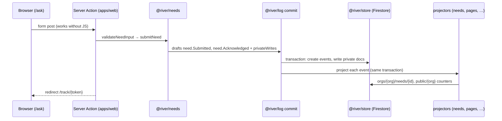

# TOPOLOGY

How the River Portal code is organised, and the rules that keep it ordered. Decisions: `adr/records/ADR-0002 Package Topology and Gates.md` and `ADR-0003 One Public Function per File.md`. The check runs as `npm run topology`, and `node tools/check-topology.mjs --write` regenerates the diagram and table at the end of this file.

## Shape

```
apps/web            Next.js — one app, two surfaces (public web, IAP studio)
infra               Pulumi (TypeScript) — Google Cloud
packages/
  foundation/       ids, language, privacy, who acts,     (layer 0)
    kernel  i18n  privacy  identity  settings             the settings registry
  record/           the append-only log and storage       (layer 1)
    store  log
  river/            the write side: needs, gifts, flows   (layer 2)
    needs  gifts  flows
  steward/          the organisation's own configuration  (layer 2)
    config
  assist/           AI assistance (Vertex AI)             (layer 2)
    assist
  surface/          what is shown: content, reports,      (layer 3)
    content  reports  feed  pages                         feed, page documents
  compose/          wiring for applications               (layer 4)
    runtime
tools/              topology checker, version picker, design screenshots (design-shot.mjs)
spec/ adr/ meta/    Obsidian vaults: product, decisions, process
```

## Rules

1. **One entry point per package: `gate.ts`.** `package.json` `exports` is `{ ".": "./gate.ts" }`, so deep imports fail to resolve. Other packages import only `@river/<name>`.
2. **Dependencies point down or sideways, never up.** foundation ← record ← river/steward/assist ← surface ← compose ← apps. There are no cycles. Every cross-package import is declared in `package.json`.
3. **One public function per file**, named like the file. Data structures live in `types/`, constant data in `data/`. Tests sit next to the code as `*.test.ts`.
4. **Writes are commands, reads are projections.** A command validates its input, builds event drafts and calls `commit`. `commit` appends the events and runs every registered projector in one transaction. Personal data goes to `private` documents through `privateWrites`, never into events.
5. **Pages read page documents.** Public pages read one or two pre-shaped documents (`public/{org}`, `public/{org}/campaigns/{slug}`, …) that the `surface` projectors keep up to date.

## Data flow of one request for help



## Where data lives (Firestore)

| Path | Visibility | Written by |
|---|---|---|
| `orgs/{org}/events/{id}` | per event | `@river/log` commit (append only) |
| `orgs/{org}/needPrivate/{id}`, `giverPrivate/{id}`, `gratitude/{id}`, `tracking/{hash}` | private | command `privateWrites` |
| `orgs/{org}/needs`, `gifts`, `campaigns`, `flows`, `reports`, `feed`, `content` | team | river / surface projectors |
| `public/{org}` (site document), `public/{org}/campaigns/{slug}`, `public/{org}/reports/{id}`, `public/{org}/feed/{id}` | public | surface projectors |

## Packages (generated)

<!-- generated:start (node tools/check-topology.mjs --write) -->
```mermaid
flowchart BT
  subgraph foundation
    i18n["@river/i18n"]
    identity["@river/identity"]
    kernel["@river/kernel"]
    privacy["@river/privacy"]
    settings["@river/settings"]
  end
  subgraph record
    log["@river/log"]
    store["@river/store"]
  end
  subgraph river
    flows["@river/flows"]
    gifts["@river/gifts"]
    needs["@river/needs"]
  end
  subgraph steward
    config["@river/config"]
  end
  subgraph assist
    assist["@river/assist"]
  end
  subgraph surface
    content["@river/content"]
    feed["@river/feed"]
    pages["@river/pages"]
    reports["@river/reports"]
  end
  subgraph compose
    runtime["@river/runtime"]
  end
  subgraph apps
    web["@river/web"]
  end
  subgraph infra
    infra["@river/infra"]
  end
  assist --> privacy
  runtime --> config
  runtime --> pages
  privacy --> kernel
  privacy --> i18n
  settings --> i18n
  settings --> kernel
  log --> identity
  log --> privacy
  log --> settings
  log --> store
  store --> kernel
  flows --> needs
  flows --> gifts
  gifts --> log
  needs --> log
  config --> log
  content --> log
  feed --> assist
  feed --> reports
  pages --> feed
  reports --> content
  reports --> flows
  web --> runtime
```

| Package | Layer | Directory | Purpose | Depends on (@river) | External |
|---|---|---|---|---|---|
| `@river/i18n` | foundation (0) | `packages/foundation/i18n` | Locales, formatters and oblast names with Ukrainian grammatical cases. | — | — |
| `@river/identity` | foundation (0) | `packages/foundation/identity` | Roles, identities and signed demo sessions. | — | — |
| `@river/kernel` | foundation (0) | `packages/foundation/kernel` | Identity, time and small primitives shared by every package. | — | — |
| `@river/privacy` | foundation (0) | `packages/foundation/privacy` | Visibility levels, PII redaction and public pseudonymisation. | kernel, i18n | — |
| `@river/settings` | foundation (0) | `packages/foundation/settings` | The settings registry: typed definitions, three profiles, resolution and validation. | i18n, kernel | — |
| `@river/log` | record (1) | `packages/record/log` | Append-only event log: event envelope, commit with projectors. | identity, kernel, privacy, settings, store | — |
| `@river/store` | record (1) | `packages/record/store` | Document store interface with memory and Firestore drivers. | kernel | firebase-admin |
| `@river/flows` | river (2) | `packages/river/flows` | Flows linking gifts to needs: dispatch, costs, delivery, confirmation, gratitude. | kernel, i18n, privacy, store, log, needs, gifts, settings | — |
| `@river/gifts` | river (2) | `packages/river/gifts` | Campaigns, offers and gifts. | i18n, kernel, log, privacy, settings, store | — |
| `@river/needs` | river (2) | `packages/river/needs` | Needs: intake, triage, status and recipient tracking. | i18n, kernel, log, privacy, settings, store | — |
| `@river/config` | steward (2) | `packages/steward/config` | The organisation's stored settings: profile, overrides, commands and projection. | kernel, log, settings, store | — |
| `@river/assist` | assist (2) | `packages/assist/assist` | AI assistance via Vertex AI (Gemini) with an offline extractive fallback. | kernel, i18n, privacy | @google/genai |
| `@river/content` | surface (3) | `packages/surface/content` | Editable site content blocks and safe rich-text rendering. | kernel, i18n, store, log | — |
| `@river/feed` | surface (3) | `packages/surface/feed` | Public feed items composed from reports with AI suggestions and human approval. | assist, content, i18n, kernel, log, privacy, reports, store | — |
| `@river/pages` | surface (3) | `packages/surface/pages` | Page documents (projections) shaped for fast public page rendering. | kernel, i18n, privacy, store, log, needs, gifts, flows, reports, feed, content | — |
| `@river/reports` | surface (3) | `packages/surface/reports` | Reports generated from flows, edited in the studio, published with consent checks. | content, flows, gifts, i18n, kernel, log, needs, privacy, settings, store | — |
| `@river/runtime` | compose (4) | `packages/compose/runtime` | Wires store driver, projectors and demo seed for applications. | assist, config, content, feed, flows, gifts, i18n, identity, kernel, log, needs, pages, privacy, reports, settings, store | — |
| `@river/web` | apps (5) | `apps/web` |  | config, content, feed, flows, gifts, i18n, identity, kernel, log, needs, pages, privacy, reports, runtime, settings | @tiptap/core, @tiptap/pm, @tiptap/react, @tiptap/starter-kit, next, react, react-dom, tailwindcss, @tailwindcss/postcss, @types/react, @types/react-dom |
| `@river/infra` | infra (5) | `infra` | Google Cloud infrastructure for River Portal (Pulumi, TypeScript). The owner runs `pulumi up`. | — | @pulumi/pulumi, @pulumi/gcp, @pulumi/command |
<!-- generated:end -->
