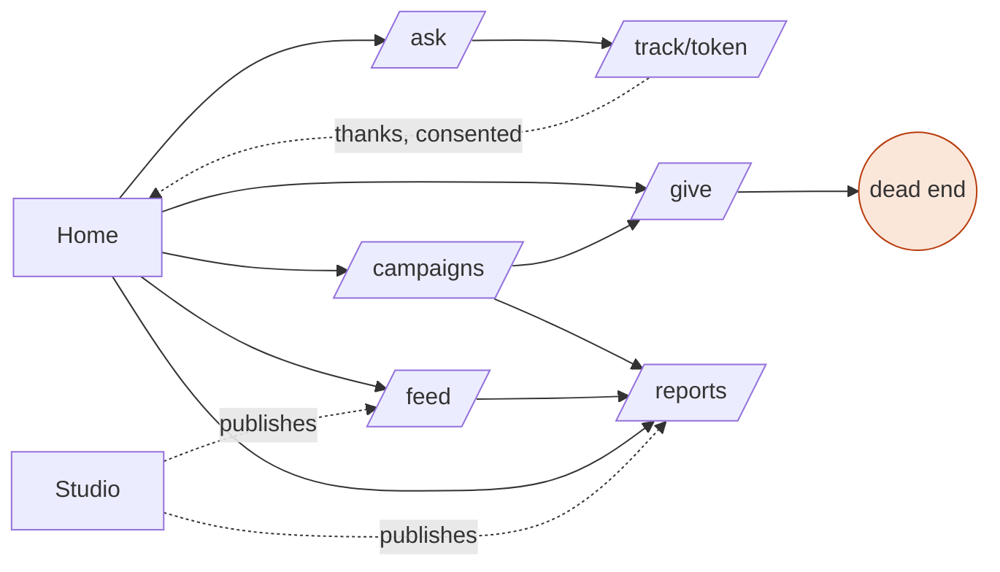

# Site Map and Domain Review (after iterations 01–03)

Back to [[00 Meta Home]]. A look at what has been built, set against the river frame (spec: The River Concept, Guiding Principles) and the ordinary structures of humanitarian and charity portals. Purpose: to find blind spots and decide where to change direction.

## 1. Site map as built

`*` marks a block editable in place; `token` means reachable only through a private link.

```
PUBLIC  /{locale}  (en-gb · uk)                                   open
├─ Home
│  ├─ Hero: headline*, lead*, [Ask for help] [Share what you can] [See where help went → /feed],
│  │        trust line, Fig. 1 river drawing
│  ├─ The river so far: 6 counters (requests, people reached, deliveries, gifts, money in, delivery costs)
│  ├─ § 01 How the river works*: 4 steps
│  ├─ § 02 Campaigns ──────────────► /campaigns/{slug}
│  ├─ § 03 From the river* (3 items) ► /feed, /reports/{id}
│  ├─ § 04 Thanks*   § 05 Reports ─► /reports/{id}
│  └─ Footer*: note, 4 links, principles, title block
├─ /ask ── form ──────────────────► /track/{token}?new=1
├─ /track/{token}                                                  token
│     status timeline → confirm receipt + optional thanks + two consents
├─ /give ── pledge (money · goods · transport · service · time) ─► thank-you   (dead end)
├─ /campaigns/{slug} ──► /give?campaign=…, /reports/{id}
├─ /reports/{id}                                                   (no onward links)
├─ /feed ──► /reports/{id}
└─ 404

STUDIO  /{locale}/studio   (IAP in the cloud; development identity locally)
├─ Needs queue ─► /studio/needs/{id}
│     private details · triage · match (gifts, campaign) · dispatch (carrier, costs in 5 currencies)
│     · approve cost · record delivery · draft report · audit trail · demo tracking link
├─ Gifts: list · mark received
├─ Reports ─► /studio/reports/{id}: edit en/uk (Tiptap) · publish (safety delay) · take down · suggest feed items (AI)
└─ Feed: review suggestions (edit en/uk · publish · reject) · take down published items
Edit mode (staff): 11 site blocks, in place
```

**Built: 8 public and 6 studio routes. The spec plans about 40 public and 15 studio routes** (spec: Site Map). Iteration 01 deliberately built one thread; the question is which gaps matter most.

## 2. How the sections relate



Findings:
- **The flow runs one way**: needs → studio → publications. What the river promises in both directions stops early.
  - **Givers** leave at a thank-you screen, with no trace of their gift, no receipt and no thanks.
  - **Thanks** marked "share with the people who helped" is stored but **delivered nowhere**. Principle P9, "thanks travels upstream", is not yet real.
  - **Recipients** have no way to **withdraw** the consents they gave. Principle P5 is only half real.
- **The left bank is invisible to the public.** Givers can respond only to campaigns, never to what is needed now. The spec already defines a safe "need card" (category, oblast, form, urgency band), but no page shows one.
- **"See where help went"** leads to the feed, a stream of news. It should lead to a trace: reports, the ledger and, later, the map.
- The studio and the public site meet only through the header.

## 3. Role coverage

| Role (spec) | What the spec expects | Built | Gap |
|---|---|---|---|
| Recipient | ask, track, confirm, thanks, consents, own requests | ask, track, confirm + thanks | withdraw consent, recover a lost link, SMS updates, assisted intake |
| Giver | give by form, my giving, trace of each gift, donor report, thanks received | pledge form | everything after the gift |
| Sponsor | commitments, sponsor report (public or private) | — | all |
| Carrier | leg link: checklist, handover proof, costs with receipts | — (the coordinator types costs) | all |
| Volunteer | tasks | — | all |
| Partner organisation | shared needs and offers, co-coordination, credit | — | all |
| Coordinator | queue, triage, offers, flows, routes and legs, confirmations, gratitude outbox | queue, need page, gifts, reports, feed | offers (DP-03), flows board, assignment ("mine"), confirmation review (DP-08), gratitude delivery |
| Finance Steward | costs queue, reconciliation | approve inside a need page | a queue, receipts |
| Editor | pages, articles, media | 11 blocks, reports, feed | pages and articles, media |
| Safeguarding Lead | sealed cases | — | all |
| Administrator | organisation, roles, settings, audit | — | all |
| Auditor | read-only ledger and audit | — | all |

Identity today has two states only: anonymous, and "staff" through IAP. Every other role in the spec exists in data and seed, but nobody can **be** that role in the interface, so the whole scenario cannot be walked or tested.

## 4. The first visitor

Measured on the production build, phone profile, Ukrainian (25 September 2026):

| Page | Total | Fonts | JS | HTML |
|---|---|---|---|---|
| `/uk` | 387 KB | 210 KB (10 files) | 140 KB | 19 KB |
| `/uk/ask` | 385 KB | 210 KB | 143 KB | 13 KB |

The spec's budget for the help-seeker's first load is **150 KB**. Fonts alone exceed it.

What each visitor needs in the first ten seconds:

| Visitor | Needs to know | The home page gives | Missing |
|---|---|---|---|
| Person in need (phone, Ukrainian, anxious) | Can you help me, where, with what, is it safe, how soon, other ways to reach you | a clear "Ask for help" button; reassurance on `/ask`; "reply within 2 days" | the areas and kinds of help covered; phone, Viber or Telegram; an emergency line (112); quick exit; a "we'll refer you" promise |
| Giver (UK, trust-seeking) | Who you are, whether you are legitimate, what is needed now, what my gift will do, where the money went | counters, campaigns with costs, stories | identity and registration, the people behind it, **needs now**, what a gift buys, **payment** (the pledge is a dead end), a complete ledger |
| Driver, volunteer or partner | How to help beyond money | "Give" includes transport and time | a door of their own: runs, drop-off points, tasks |
| Journalist, funder or auditor | Legitimacy, reports archive, method, contact | reports list | about, policies, ledger, press contact |

The home page explains **how** the river works well. It does not yet say **who** runs it, **where** it flows, or **what is needed now**.

## 5. Blind spots, grouped

**A. Trust and legitimacy.**
- There is no About page (organisation, registration number, trustees or roles, partners), no contact and no policies.
- **There is no privacy notice, although `/ask` collects personal data.** UK GDPR requires one at the point of collection (Article 13).
- The spec's 57-question Portal Q&A is unpublished.

**B. The left bank is invisible.** There is no public "needs now" board, and no earmarked giving for a need.

**C. The returning tide stops at the recipient.** Thanks are not delivered; givers have no trace of their gift and no donor report.

**D. Money reality.**
- There are no payment rails. For Ukrainian givers that means Monobank jars; for UK givers, cards and Gift Aid.
- **Purchases are not modelled.** Only transport costs exist, so "£2,420 received, £964.88 spent on delivery" leaves the rest unexplained. Honest numbers (P8) need purchases, overheads and a balance.

**E. Logistics reality.**
- **Offers** are not accepted before they become gifts (DP-03 is skipped).
- Goods are delivered 1 : 1 from gift to need, but real operations run through **hub stock** and **runs** (convoys serving many households).
- The public cannot see **drop-off points**, carriers have no view, and there is no assisted or proxy confirmation for people without a smartphone.

**F. Conflict-zone reality.**
- There are no **access constraints**. The model assumes every need can be reached. Oleshky shows the opposite case: needs known but unreachable, where advocacy for access *is* the help.
- There is no referral when we cannot help, and no quick exit or emergency line.
- The page weight exceeds the budget.
- There is no intake beyond the web form, although Viber and Telegram are the norm in Ukraine.

**G. Roles and identity.** See section 3.

**H. The template is not yet a template.** The organisation's name, texts and branding live in code and seed data, not in settings. There is no setup path for a new NGO.

**I. The current and clear water.**
- Reputation, which the concept calls the river itself, is neither computed nor shown.
- Intent statements do not appear anywhere.

**J. Operations.** There are no notifications (SMS or e-mail), no error page and no public impact-metrics page.

## 6. What the domain suggests structurally (not just more pages)

1. **Runs (convoys) as the unit of logistics**, with costs apportioned to the needs they serve. The demo campaign "Fuel for the Kharkiv run" is already a run in disguise.
2. **Hubs and stock** between gifts and needs, for goods. Money becomes **purchases** that enter stock; flows draw from stock.
3. **Distribution points** (village council, school) with assisted, evidenced confirmation.
4. **Access status per area** (open, restricted, blocked) that drives what is promised to recipients and what the public sees. **Appeals** are a publication type for blocked channels.
5. **Omnichannel intake**: web, phone, Telegram and Viber all issue the same `submitNeed` command.
6. **Organisation profile as data**: identity, registration, areas served, kinds of help, payment rails, policies and theme.

## 7. Vectors: where to change direction

| # | Vector | Why now | Size |
|---|---|---|---|
| **V1** | **A walkable river.** An identity layer with **demo personas** (not IAP) and a home for each role, plus a guided walk through the whole scenario | We cannot see or test most of the model; this is also the base for Firebase Auth later | M |
| **V2** | **Make the left bank visible.** A public "needs now" board of safe need cards, "help with this" earmarked pledges, and the areas and kinds of help covered | Gives the river its second bank; givers answer real needs | M |
| **V3** | **Close the tide.** Deliver thanks; "my giving" with a trace of each gift; donor report; recipients' consent withdrawal | Principles P5 and P9 become real | M |
| **V4** | **A trust layer for the first visitor.** Concrete hero lead, audience doors (need · give · carry/volunteer), a live trust strip (registered since, costs share, last confirmed delivery), About, transparency ledger, privacy notice and policies, contact, FAQ from the spec | High impact at low cost; the privacy notice is a legal must | S–M |
| **V5** | **Conflict-zone realism.** Quick exit, emergency line, referrals; **access status and appeals** (Oleshky as the demo appeal); a lighter `/ask` (fonts, JS) | Safety and reach for the people we exist for | S → M |
| **V6** | **Money and logistics reality.** Runs, hubs and stock, purchases, drop-off points; payment links (card or Stripe, Monobank jar), Gift Aid | Makes honest numbers complete; spec and ADR work first | L |
| **V7** | **Template-ness.** An organisation profile and theme from data; a setup wizard | The "free template" promise | M |
| **V8** | **The current.** Participation records from events: carrier reliability in the studio and a personal record in "my river", never for recipients | Central to the concept; needs V1 first | M |

### Proposed information architecture, aligned with the river
- **Public header**: Needs now · Give · Campaigns · Where help went (reports, stories, ledger, later the map) · About · [Ask for help] · [My river] when signed in.
- **Home, in order**:
  1. Hero with a concrete promise and three doors
  2. Live trust strip
  3. **Needs now**
  4. The river so far (links to the ledger)
  5. How it works
  6. Campaigns and next runs
  7. Where help went
  8. Thanks
  9. **Where the river is blocked** (appeals)
  10. Who we are
  11. Footer with legal information and contact
- **Studio, ordered as stages of the river**:
  - **Inflow**: new needs, new offers
  - **Channels**: runs and flows
  - **Pools**: hubs and stock
  - **Tolls**: costs to approve
  - **Mouth**: confirmations to review
  - **Tide**: thanks to deliver
  - **Surface**: reports, feed, pages
  - **Sediment**: audit
  - **Settings**

### V1 in more detail (the owner's question about non-IAP sign-in for debugging)
- `Identity = { personId, name, roles[], scopes, via: 'iap' | 'demo' | 'firebase' | 'token' }`. `proxy.ts` resolves it from the IAP JWT, a signed demo session cookie or (later) a Firebase ID token, and forwards it in a signed header. `getIdentity()` and `requireRole()` replace `getStaff()` and `requireStaff()`.
- `RIVER_AUTH=demo` (local and demo sandboxes only) enables `/{locale}/demo`: persona cards grouped by bank. The left bank has Olena (recipient). The right bank has James (giver) and Harbour Print (sponsor). The channel has Andriy (coordinator), Mykola (carrier) and the Sumy hub (partner). The stewards are Helen (Finance Steward), an Editor, Iryna (Administrator) and an Auditor. A persistent banner shows "Acting as … · switch".
- **Guard-rails**:
  - demo auth is refused with the Firestore driver unless an explicit sandbox flag is set;
  - it is never enabled on the IAP studio service;
  - every page shows that data resets.
- **Role homes**:
  - `/me`: requests, giving, legs, record, privacy, by role;
  - `/leg/{token}` for carriers;
  - studio sections filtered by role, for example Tolls for the Finance Steward.
- **A guided walk** (`/demo/walk`): the thread from ask to thanks, with "act as" buttons at each step. It serves NGO demonstrations, and later end-to-end tests.

## 8. Decisions for the owner
1. Order of vectors. Proposed for iteration 04: **V1 + V4 + the quick wins from V5**, then **V2 + V3**, then **V6** after a spec and ADR round.
2. Should the demo sandbox become a public deployment ("try it as a coordinator")?
3. Payments: which rails first (card via Stripe, Monobank jar links, bank details only)?
4. Should an "appeals / blocked channels" publication type join the spec, with Oleshky as the demo appeal?
5. Is the concrete scope of the demo organisation (areas, kinds of help, UK→Lviv→east route) right for the default texts?
