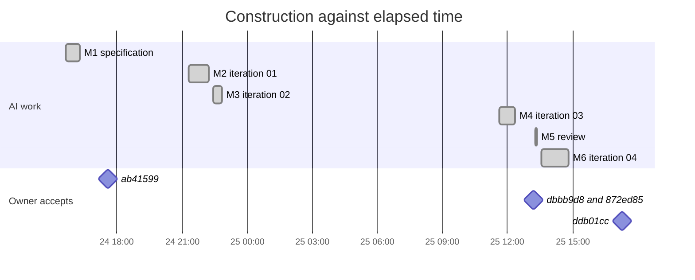

# Timeline of Milestones

Back to [[00 SDLC Home]]. Times are EEST (UTC+3), as in the git history. An AI work window runs from the first to the last tool call of the main thread after a directive.

| # | Directive from the owner | Length | AI work window | Main output | Accepted in commit |
|---|---|---|---|---|---|
| M1 | 24 Sep 15:38. Turn the river concept into a specification vault in `spec/`, sections 1–7. *"Is everything clear?"* | 3,298 characters | 15:38–16:16, plus 8 parallel authors and a harmoniser | Iteration 00: 146 notes | `ab41599` "initial commit", 24 Sep 17:35 |
| M2 | 24 Sep 21:18. Continue with nearest variants. Set up `adr/` and `meta/`. Choose a UI stack with in-place editors. Install dependencies through `sfw`. The owner runs Pulumi. One function per file behind gates; `TOPOLOGY.md`. Visible UI first | 2,062 | 21:18–22:14 | Iteration 01: 14 packages, web app, Pulumi program, ADR-0001–0017 | `872ed85` (below) |
| M3 | 24 Sep 22:21. A flat, elegant design of bevelled pencil lines; loop until stable | 334 | 22:25–22:50 | Iteration 02: design rounds R0–R4, ADR-0018 | `872ed85` |
| M4 | 25 Sep 11:36. Prepare for GitHub: README with screenshots, a disclaimer, an Oleshky fact sheet, licences. *"Is everything clear, and do you agree with this meta structure?"* | 810 | 11:38–12:20, plus a research agent | Iteration 03: README, licences, fact sheet, ADR-0019 | `dbbb9d8` "add: license and docs", 13:13; `872ed85` "add: initial design implementation", 13:14 |
| M5 | 25 Sep 13:15. *"Already committed."* Review the site map with domain understanding: blind spots, where to change vectors | 681 | 13:17–13:21 | Review: site map, blind spots, vectors V1–V8 | `ddb01cc` |
| M6 | 25 Sep 13:26. *"Agreed."* Iteration 04 = V1 + V4 + quick steps of V5. Blocks configurable in the admin part only. The whole system parameterised through a settings registry in three profiles. *"That is how we will test and evaluate from now on"* | 472 | 13:33–14:48, plus a content agent; one context compaction at 13:51 | Iteration 04: identity, trust pages, settings registry, studio by river stages, ADR-0020–0023 | `ddb01cc` "add: deepening of the functional", 17:17 |
| M7 | 25 Sep 17:21. Describe the SDLC as a vault in `reflections/sdlc/v1` | 363 | 17:22– | This vault | — |

## What the timeline shows
- **Construction was about 4 hours of about 25½ elapsed.** AI work windows add up to 240 minutes between 24 Sep 15:38 and 25 Sep 17:17. The rest of the time belonged to the owner: reading, deciding and committing, or time away.
- **Acceptance latency.** From the end of the AI's work to the owner's commit it was 1 h 19 min, then 53 min, then 2 h 29 min. The largest and most cross-cutting change (iteration 04) took longest to accept.
- **Reply latency.** When the AI ended with a proposal that could be accepted as it stood, the next directive came fast: 5 minutes from the review to *"Agreed, start iteration 04"*.
- **Phases, not days.** Each directive opened a new phase: specification, engineering rules, design, publication, review, iteration, reflection. Each commit closed one or more of them.

Interpretation: in this mode the scarce resource is the owner's attention, not the speed of construction. The lifecycle should therefore be designed to make acceptance cheap. See [[Directive Amplification]] and [[SDLC v2 — Proposed Loop]].
