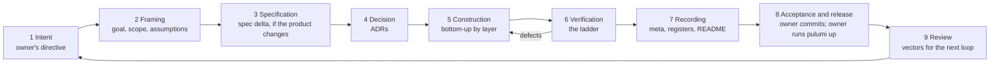

# The Lifecycle as Observed

Back to [[00 SDLC Home]].

The work runs as a loop of nine stages. The owner opens it with a directive and closes it with a commit. Inside, the AI moves from framing through construction to recording, with a fast inner loop of edit → check → look.

| Stage | Main actor | Artefacts | Evidence of exit | Note |
|---|---|---|---|---|
| 1 Intent | Owner |   | — | [[Stage 1 — Intent]] |
| 2 Framing | AI | Iteration goal, scope, assumptions (mostly implicit) | A restated goal | [[Stage 2 — Framing]] |
| 3 Specification | AI and sub-agents | `spec/` notes, dated appendices, open questions | Links resolve; parameters agree | [[Stage 3 — Specification]] |
| 4 Decision | AI | `adr/records/` | Status `accepted` or `accepted-provisional` | [[Stage 4 — Decision]] |
| 5 Construction | AI and a content agent | Packages, app, infra | `tsc` clean | [[Stage 5 — Construction]] |
| 6 Verification | AI with tools | Test output, screenshots, route matrix | The ladder is green; defects fixed | [[Stage 6 — Verification]] |
| 7 Recording | AI | Iteration note, observations, registers, README, TOPOLOGY | Notes linked from the vault homes | [[Stage 7 — Recording]] |
| 8 Acceptance and release | Owner | Commit; `pulumi up` | A commit exists | [[Stage 8 — Acceptance and Release]] |
| 9 Review | AI proposes; owner chooses | Review note, vectors | The owner picks vectors | [[Stage 9 — Review and Re-vectoring]] |

## How the loop was actually entered
The first loops were deliberately lopsided: each put its weight on one stage.

| Loop | Directive | Weight |
|---|---|---|
| Iteration 00 | M1 | Specification only; no code |
| Iteration 01 | M2 | Decisions (17 ADRs) and construction of the first thread |
| Iteration 02 | M3 | Verification as design: screenshot, critique and score, five rounds |
| Iteration 03 | M4 | Recording for the public: README, licences, fact sheet |
| Review | M5 | Review only; no code |
| Iteration 04 | M6 | Construction and verification across roles and profiles |

Only iteration 04 ran the whole loop at full weight. It is the best evidence of the lifecycle as it now stands (see [[Anatomy of Iteration 04]]).

## Two loops, two speeds
- **Outer loop:** directive → commit, measured in hours and paced by the owner (see [[Timeline of Milestones]]).
- **Inner loop:** edit → `tsc` → tests → browser → fix, measured in seconds to minutes and paced by the AI. Iteration 04 made 320 tool calls in 75 minutes, about four a minute.

In practice the stages overlap:
- Decisions were often written *after* the code proved them.
- Recording ran throughout.
- Verification interleaved with construction, layer by layer.
