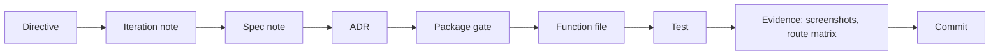

# Traceability

Back to [[00 SDLC Home]].

The chain from intent to evidence:

## Example: cost approval (DP-06)
1. **Spec.** `spec/07-decisions/DP-06 Cost Approval.md` and `Canonical Parameters`: a Lead Coordinator may approve a cost alone up to GBP 250; larger costs need the Finance Steward.
2. **Decisions.**
   - ADR-0020 makes the limit a setting, `money.costApprovalLimit`.
   - ADR-0023 compares it in the reporting currency.
   - ADR-0021 records the capacity in which a person acts.
3. **Code.** `packages/river/flows/approveCost.ts` refuses a coordinator above `approvalLimitMinor(settings)`, and `costDrafts.ts` approves costs within the limit at dispatch.
4. **Test.** `flows.test.ts` asserts that a coordinator cannot approve above the limit and that the Finance Steward can.
5. **UI.** The *Tolls* stage shows the limit, and who may approve what.
6. **Evidence.** Iteration 04's evaluation: the same van hire is approved by the coordinator in one profile and waits for the Finance Steward in another.
7. **Commit.** `ddb01cc`, together with 262 other files. **The chain breaks here.**

## Where the links exist
- ADR frontmatter names the spec note it serves (`spec:`).
- Code comments cite ADRs and decision points by path or identifier.
- Iteration notes name their ADRs, and the README names the latest iteration note.

## Where they are missing
- Commits cite nothing.
- Spec notes do not point to the code that realises them.
- Tests cite rules only in their titles, not by identifier.

## Proposal
- A `Refs:` trailer in every commit.
- A `build:` field in spec notes.
- A generated table: spec note → ADRs → packages → tests.

See [[Commit and Branch Policy]].
