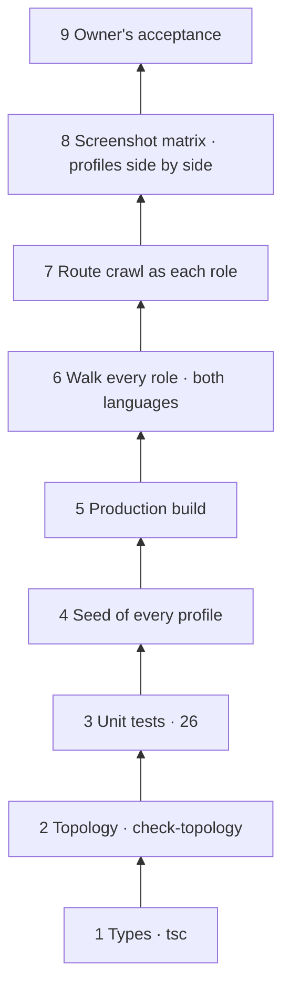

# The Verification Ladder

Back to [[00 SDLC Home]].

| Rung | Cost | Automated | What it finds | Examples from this project |
|---|---|---|---|---|
| 1 Types | seconds | yes (`npm run check`) | shapes, renames, missing fields | the `reportingMinor` rename, used as a work list |
| 2 Topology | seconds | yes | structure; undeclared or upward dependencies | three undeclared packages in the web app |
| 3 Unit tests | about a second | yes | domain rules, privacy, redaction | DP-06 capacity; the "petrol" regression; settings semantics |
| 4 Seed per profile | about a second | yes, inside the tests | commands and projections together; leaks; walkability | the 14-day delay refusing the seed (iteration 01) |
| 5 Production build | tens of seconds | locally | boundaries between server and client; route compilation | 28 routes and the proxy in iteration 04 |
| 6 Walk every role | minutes | no: the AI in a browser | scenario continuity, serialisation, cascade | 13 defects in iteration 04 |
| 7 Route crawl | about 30 seconds | scripted ad hoc | the role matrix (200, 404, 307) | matrix exactly as designed |
| 8 Screenshot matrix | minutes | scripted ad hoc | layout, language, fit to the profile, credibility | truncated name in Ukrainian; a 73% cost share |
| 9 Owner | hours | no | fit with intent | acceptance by commit |

## What the ladder teaches
- **Yield rises with realism.** Rungs 1–5 were green when rungs 6–8 found 13 defects. Boundary defects sit where the framework, the browser, the language and the scenario meet (see [[Defect Taxonomy]]).
- **The expensive rungs are not regression protection.** They ran once, driven by the AI. Nothing runs them again after the next change.
- **Rung 8 checks meaning, not just correctness.** Comparing three profiles side by side found problems of credibility and fit that no assertion would express.

## Proposal
Put rungs 1–8 in CI, and make rungs 6–8 repeatable:
- the ten walk steps as Playwright tests for every profile and language;
- the crawl as a test;
- the screenshot matrix as one command, with the images attached to the pull request.

See [[Automation Backlog]].
