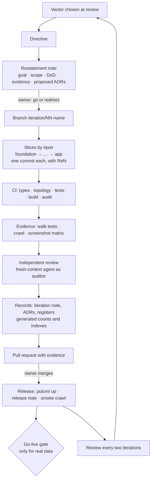

# SDLC v2 — Proposed Loop

Back to [[00 SDLC Home]]. A proposal for the owner, not yet agreed.

Keep what works (directives, vaults, topology, the walk). Add grain, independence and automation where v1 is weakest.

## Changes from v1
| # | Change | What it fixes |
|---|---|---|
| 1 | A **restatement note** before construction, as the skeleton of the iteration note | Silent reinterpretation; plans lost at compaction |
| 2 | **Proposed ADRs** for irreversible or outward-facing decisions | Decisions that take effect unreviewed |
| 3 | **A branch per iteration, a commit per layer slice**; Conventional Commits with scopes and `Refs:` | A coarse history with no blame, bisect or revert |
| 4 | **CI** on every push | Checks that run only in the AI's session |
| 5 | **Automated upper rungs:** walk, crawl, screenshot matrix | No protection against regressions |
| 6 | **Independent review** by a fresh-context agent with a review-only brief | Self-review |
| 7 | **Generated projections and a vault checker** | Counts, links and statuses that drift |
| 8 | **Release notes and smoke checks** | Invisible releases |
| 9 | **A go-live gate** for real data | Hard gates without a stage |
| 10 | **A rhythm of review** | Reviews only on request |

## What stays
- **Directives in the owner's own words;** artefacts in British English.
- **Nearest variants** instead of blocking questions.
- **The topology** and its checker; one function per file; gates.
- **Evaluation by profile** as a standing practice.
- **The owner alone accepts and deploys.**
