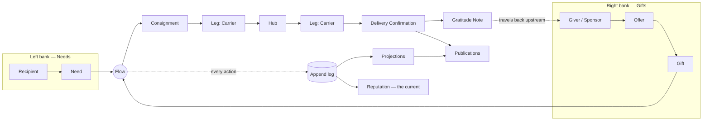

# River Portal — Specification Vault

> *A portal where needs and gifts meet like two banks of one river — and help flows to where it is needed, in the form it is needed.*

This vault is the living specification of the **River Portal**: a ready-to-use charitable portal for organisations of any size. It lets people **ask for help**, **offer help**, and **see how help is formed, carried, received and acknowledged** — with strict privacy, explicit visibility settings and an ethic in which a gift remains a gift, not a commodity, and a need is respected rather than processed.

## How to read this vault

| # | Section | Question it answers |
|---|---------|---------------------|
| 00 | [[Conventions]] · [[Glossary]] · [[Vault Map]] · [[Canonical Parameters]] · [[Open Questions]] | How is this vault written and organised? |
| 01 | [[Business Overview]] | What is the system, in the language of the client? |
| 02 | [[Entities Index]] | What things live in the system? |
| 03 | [[Entity Relationship Map]] | How do those things relate and interact? |
| 04 | [[Portal Q&A]] · [[Site Map]] | What shape does the portal take? |
| 05 | [[Publications Overview]] | What does the system publish from its own flows? |
| 06 | [[Achievements Overview]] | What does the system count and celebrate? |
| 07 | [[Decision Points Overview]] · [[Responsibility Matrix]] | Where are decisions made and who is accountable? |
| 08 | [[Architecture Overview]] | How is it built (Node.js, Google Cloud, Firebase, IAP, Vertex AI)? |
| 09 | [[Privacy Model]] · [[Ethics Charter]] | How are people protected? |
| 10 | [[Demo Content Overview]] | What demo content do we test with (en-GB / uk)? |
| 99 | Templates | Skeletons for new notes |

## The concept in one picture

See [[The River Concept]] for the full metaphor and [[Guiding Principles]] for the ethics that shape every design decision.

## Status

- Phase: **Specification (vault structuring)**
- Language: British English (docs); demo content in en-GB and Ukrainian
- Owner: product team; see [[Responsibility Matrix]]
