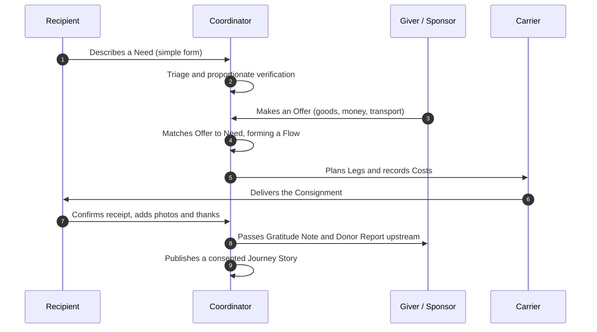

# Business Overview

*The system described in the language of the client: a charitable organisation of any size.*

## What it is

**River Portal** is a ready-to-use website and working platform for a charitable organisation. In one place it lets people:

1. **Find help.** Anyone in need can describe what they need in a few simple steps, in their own language, without having to prove they "deserve" it. See [[Help Seeker Section]].
2. **Give help.** Money, goods, services, time or transport, shaped by what is actually needed and by what the giver can offer. See [[Giver Section]].
3. **See help travel.** Every gift can be followed from where it came from, through the hands that carried it, to the person who received it, and to the thanks that came back. See [[Journey Story]] and [[Flow Map]].
4. **Run the work.** Coordinators receive requests, match them with offers, organise transport, record costs, collect delivery confirmations and publish reports, all from a calm, well-designed workspace. See [[Coordinator Workspace]].
5. **Tell the story honestly.** Articles, campaign pages and donor reports are created with a built-in editor. The numbers come straight from the system's own records, and nothing is published without consent. See [[Publications Overview]].

## Who it is for

| Organisation size | Typical use | Tier |
|---|---|---|
| A few volunteers | Collect money for fuel and transport of one van of aid, then show a report | [[Scaling Tiers#Tier 1 — Spring]] |
| Small charity | Ongoing requests, a warehouse, regular deliveries, donor reports | [[Scaling Tiers#Tier 2 — Stream]] |
| Regional organisation | Several coordinators, hubs and carriers, partner organisations | [[Scaling Tiers#Tier 3 — River]] |
| Large humanitarian programme | Many programmes, countries, languages, audits, AI assistance | [[Scaling Tiers#Tier 4 — Basin]] |

The same product grows with the organisation. There is nothing to migrate, only more features to switch on.

## What makes it different

- **A gift is a gift.** No "buy a badge" mechanics and no price tags on people. Recognition is given for taking part, not for the amount. See [[Guiding Principles]] and [[Recognition Anti-Patterns]].
- **Access for those in need is always open.** Reputation, verification and history shape *how* help is routed and checked. They never decide *whether* someone may ask. See [[ADR-005 Open Access for Recipients]].
- **Privacy by default.** Personal details are visible only to the people who must see them to deliver help. Everything public is aggregated, anonymised or explicitly consented. See [[Privacy Model]] and [[Visibility Levels]].
- **Honest numbers.** Every figure on the site, whether money raised, transport costs, deliveries or thanks, is derived from an immutable log of real actions. See [[Transparency Ledger]] and [[Event Log and Projections]].
- **Beautiful and positive.** A modern, bright, dynamic design that celebrates what people do together. It avoids pity imagery and sensationalism. See [[Design Language]] and [[Brand and Tone of Voice]].

## The core journey

## Business outcomes the portal must deliver

1. Shorter time from a need being expressed to help arriving.
2. Givers who trust the organisation because they can *see* what their gift became.
3. Recipients who feel respected, safe and heard.
4. Coordinators who spend time on people, not spreadsheets.
5. Reports and audits produced from the records, not written by hand after the fact.

These outcomes are measured in [[Impact Metrics]].

## Continue reading
- [[The River Concept]]: the metaphor that shapes the architecture
- [[Guiding Principles]]: the non-negotiables
- [[Audiences and Personas]]: who uses the portal
- [[Value for Each Party]]: what each participant gains
- [[Scaling Tiers]]: from a single fundraiser to a humanitarian programme
- [[Brand and Tone of Voice]]
