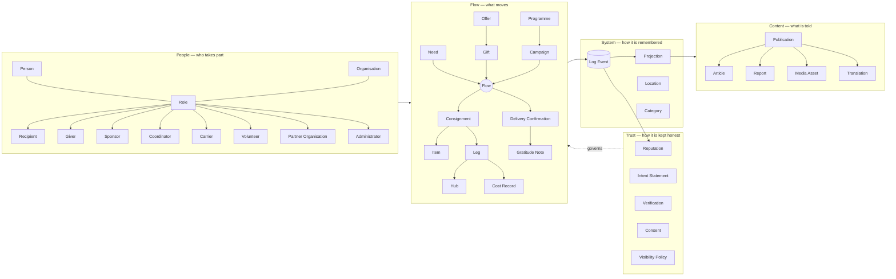

# Entities Index

*What lives in the river.* Every entity of the River Portal, grouped in five families. Each note follows [[Template — Entity]]: purpose, attributes with default [[Visibility Levels|visibility level]], lifecycle, relationships, events, decision points, privacy and principles. Back to [[00 Home]]. How the entities interact is described in [[Entity Relationship Map]].

> [!principle] Entities follow the principles
> Every entity is checked against [[Guiding Principles]]. Anything touching a person defaults to `private` ([[ADR-006 Private by Default Visibility]]), and every change is a [[Log Event]] ([[ADR-001 Event-Sourced Append Log]]).

## Overview

## People — `#entity/people`

| Entity | River alias | One line |
|---|---|---|
| [[Person]] | — | A human being known to the portal; the single holder of personal data, referenced by id everywhere else. |
| [[Organisation]] | Riverbed owner | The charity (tenant) or other legal body that operates flows or takes part in them. |
| [[Role]] | — | A scoped grant (organisation / programme / campaign / flow) that lets a Person act; includes variants Safeguarding Lead, Finance Steward, Editor, Auditor. |
| [[Recipient]] | Left bank | A person, household, community or institution with a Need. Never needs an account to ask. |
| [[Giver]] | Spring | A person or organisation that gives money, goods, services or time. |
| [[Sponsor]] | Tributary | A giver who funds a defined, restricted purpose, often transport costs. |
| [[Coordinator]] | Riverkeeper | Shapes flows: triage, matching, routing, reporting. One Lead plus Contributing Coordinators per Flow. |
| [[Carrier]] | Boatman | Moves goods along a Leg: volunteer driver, courier, postal service, logistics firm. |
| [[Volunteer]] | — | Gives time and skills: packing, sorting, translating, calling back. |
| [[Partner Organisation]] | Tributary / neighbouring river | Another organisation acting as giver, carrier, hub operator or co-coordinator. |
| [[Administrator]] | — | Configures the organisation's portal: people, roles, defaults, integrations. |

## Flow — `#entity/flow`

| Entity | River alias | One line |
|---|---|---|
| [[Need]] | Left bank | A request for help, capturing *what*, *where*, *when* and in *what form*. |
| [[Offer]] | Spring | A declared willingness to give, clarified before acceptance. |
| [[Gift]] | Water | What is actually given once an Offer is accepted. |
| [[Flow]] | Stream | The living link between Gifts and Needs; the central unit of coordination. |
| [[Campaign]] | Channel | A time-bound, purpose-bound collection. |
| [[Programme]] | Basin | A long-running body of work grouping campaigns and flows. |
| [[Consignment]] | Boat | A physical bundle of Items moving towards a Need. |
| [[Item]] | — | A countable unit of goods within a Consignment or Hub stock. |
| [[Leg]] | Reach | One transport segment by one Carrier. |
| [[Hub]] | Pool | A place where goods rest, are sorted or re-packed. |
| [[Cost Record]] | Toll | A receipted cost attributed to a Flow or Leg, in its original currency. |
| [[Delivery Confirmation]] | Mouth | Evidence that help arrived, from recipient, proxy or carrier. |
| [[Gratitude Note]] | Returning tide | Thanks travelling upstream to every hand that took part. |

## Trust — `#entity/trust`

| Entity | River alias | One line |
|---|---|---|
| [[Reputation]] | The Current | Explainable, contestable signals derived from the log. Never a gate to asking for help. |
| [[Intent Statement]] | Source | A short declaration of why someone asks or gives; for clarity, not judgement. |
| [[Verification]] | Soundings | A proportionate check that a claim is real, recorded as a level and outcome. |
| [[Consent]] | — | A specific, purpose-bound, revocable permission recorded per purpose. |
| [[Visibility Policy]] | Clear / murky water | Field-level rules deciding who sees what, resolved per audience. |

## Content — `#entity/content`

| Entity | River alias | One line |
|---|---|---|
| [[Publication]] | Surface | Anything the organisation publishes; built from projections and consent. |
| [[Article]] | — | An editorial piece written in the [[Content Editor]]. |
| [[Report]] | — | A generated or edited account of a flow, campaign, giver or period. |
| [[Media Asset]] | — | A photo, video or document with its own visibility and consent. |
| [[Translation]] | — | A locale version of a content block, human-reviewed. |

## System — `#entity/system`

| Entity | River alias | One line |
|---|---|---|
| [[Log Event]] | Sediment | An immutable, append-only record of something that happened. |
| [[Projection]] | Surface | A rebuildable read model derived from Log Events. |
| [[Location]] | — | A place, held at the precision each audience is allowed to see. |
| [[Category]] | — | A shared taxonomy for needs, items and costs. |

## Cross-cutting rules

- **Events**: every entity emits events named `aggregate.PastTense` (e.g. `person.Registered`, `consent.Granted`), catalogued in [[Event Catalogue]].
- **Personal data** lives only on [[Person]]; other entities hold `personId` references. See [[Data Minimisation]].
- **Decisions** that change an entity's state are taken at the decision points listed in [[Decision Points Overview]].
