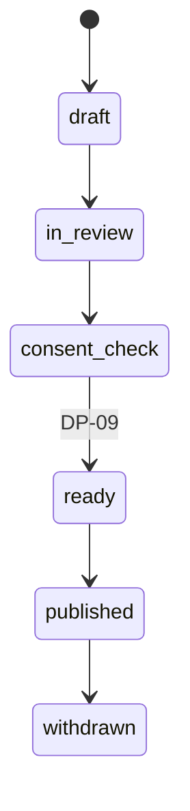

# Article

Back to [[Entities Index]] · Parent: [[Publication]] · Section: [[Publications Overview]]

## Purpose

An **Article** (uk: «Стаття») is an authored, narrative [[Publication]]: news, a field update, an explainer ("How we choose routes to Kharkiv oblast"), a volunteer profile, or a story built around a consented [[Journey Story]]. Articles give the organisation its human voice on the [[Public Portal]].

## Business description

Articles are written in the [[Content Editor]] with TipTap blocks: text, headings, image and gallery ([[Media Asset]]), quote, call-to-action (to a [[Campaign]] or the [[Giver Section]]), and **live data blocks** such as "deliveries this month", a ledger excerpt, a mini [[Flow Map]] or a journey timeline. Live blocks keep articles honest over time. A number in a six-month-old article can show "as of publication" or "live", as the editor chooses.

Articles are written in one locale and translated by a human, possibly from an AI draft, before publishing in the second. Ukrainian copy must read as native ([[Brand and Tone of Voice]]). An article can be published in one locale first, with the other marked "translation coming".

Articles follow the tone rules strictly. No pity imagery, credit goes to the chain of people, and costs are mentioned openly.

## Attributes

Inherits all [[Publication]] attributes. Adds:

| Field | Type | Default visibility | Notes |
|---|---|---|---|
| `articleType` | enum | `public` | `news`, `field_update`, `explainer`, `profile`, `story` |
| `heroMediaId` | id → [[Media Asset]] | `public` | Must pass DP-09 |
| `readingTimeMin` | int | `public` | Derived |
| `topics` | id[] → [[Category]] | `public` | Also used for related-content |
| `ctaTarget` | `{kind, id}` | `public` | Campaign, give page, volunteer sign-up |
| `dataSnapshotMode` | enum | `team` | `live`, `frozen_at_publication` for each live block |
| `relatedFlowIds` | id[] → [[Flow]] | `team` | For consent walk and back-links |

## States and lifecycle

Same as [[Publication#States and lifecycle]]: `draft → in_review → consent_check → ready → published → withdrawn`, with `revised` as a self-transition.

## Relationships

Is a [[Publication]] · embeds [[Media Asset]]s, [[Projection]]s, [[Gratitude Note]]s (consented) · translated via [[Translation]] · tagged with [[Category]] · may promote a [[Campaign]] or [[Programme]].

## Events emitted

Uses `publication.*` events with `payload.kind = "article"`. See [[Publication#Events emitted]].

## Decision points involved

[[DP-09 Publication Consent]] · [[DP-12 Visibility Change]].

## Privacy notes

> [!privacy]
> A profile article about a carrier, volunteer or recipient requires that person's [[Consent]] for *this* article. General consent to "appear in stories" is not enough. Locations are named at oblast level unless the person agrees to more.

## Principles

> [!principle] P10 — dignity in every pixel
> Agency, not pity: "Olena's village keeps its school warm", not "desperate villagers".

## UI touchpoints

[[Content Editor]] · [[Public Portal]] (news and stories) · [[Newsletter Digest]] · [[Multilingual Experience]].
