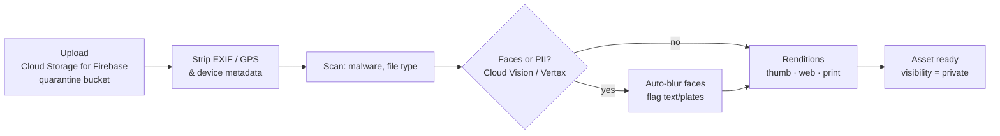
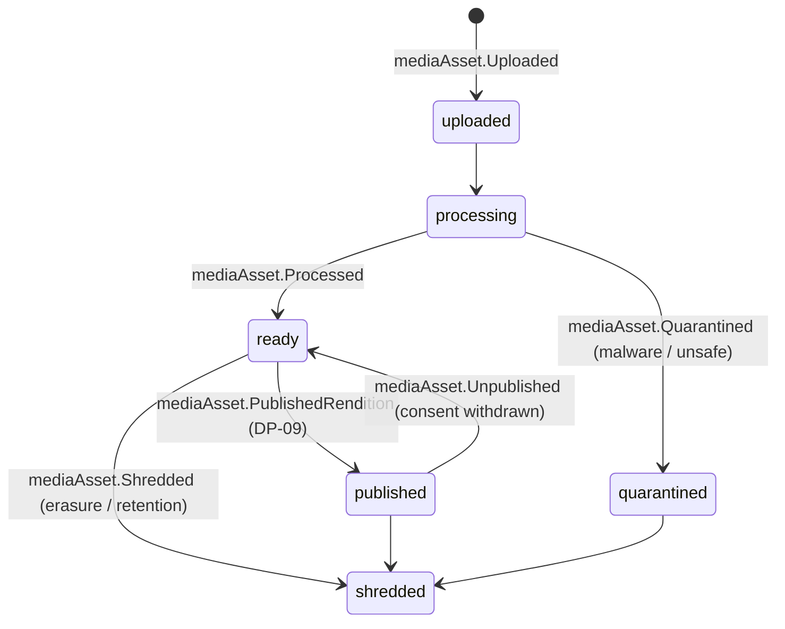

# Media Asset

Back to [[Entities Index]]

## Purpose

A **Media Asset** (uk: «Медіафайл») is any uploaded file: a photo, video, voice note, receipt, document or scan. Each asset carries its **own visibility level and consent references**, independent of the record it is attached to.

## Business description

Photos travel the river too: a handover photo from a carrier, a receipt from a fuel station, a thank-you picture from a recipient, a hero image for a [[Campaign Page]]. Every upload goes through a **safety pipeline** before anyone else can see it:

- **Originals** of sensitive assets are kept in a restricted bucket, encrypted, and are subject to crypto-shredding on erasure ([[Data Retention]]).
- **Renditions** are what the product actually serves. A `public` rendition exists only after [[DP-09 Publication Consent]].
- Face-blur is **on by default** for any asset attached to a [[Need]], [[Delivery Confirmation]] or [[Gratitude Note]]. An unblurred rendition requires the depicted person's specific [[Consent]].
- Receipts ([[Cost Record]]) are OCR-assisted to pre-fill amount and currency, and redaction of names and card fragments is suggested. A human confirms.

## Attributes

| Field | Type | Default visibility | Notes |
|---|---|---|---|
| `id` | ULID | `team` | |
| `orgId` | id → [[Organisation]] | `team` | |
| `kind` | enum | `team` | `photo`, `video`, `voice_note`, `receipt`, `document`, `illustration` |
| `mimeType`, `bytes`, `dimensions` | technical | `team` | |
| `uploadedBy` | id → [[Person]] | `team` | Or `system` |
| `attachedTo` | `[{kind, id}]` | `team` | Need, Leg, Cost Record, Publication… |
| `visibility` | visibility level | — | **Own** level; default `private` |
| `depictsPersonIds` | id[] → [[Person]] | `sealed`/`private` | Who is identifiable in it; drives consent check |
| `consentIds` | id[] → [[Consent]] | `private` | Specific to this asset + purpose |
| `processing` | `{exifStripped, facesDetected, blurred, piiFlags[], scannedAt}` | `team` | |
| `renditions` | `[{variant, path, blurred}]` | per variant | |
| `alt` | per-locale text | same as asset | Required before `public` use ([[Accessibility]]) |
| `caption` | per-locale text | same as asset | |
| `credit` | text | same as asset | Photographer credit if consented |
| `originalPath` | storage path | `sealed` | Restricted bucket |
| `status` | enum | `team` | |

## States and lifecycle

## Relationships

Attached to [[Need]], [[Leg]], [[Consignment]], [[Item]], [[Cost Record]], [[Delivery Confirmation]], [[Gratitude Note]], [[Publication]], [[Campaign]] · depicts [[Person]]s governed by [[Consent]] · alt text and captions translated via [[Translation]].

## Events emitted

`mediaAsset.Uploaded`, `mediaAsset.Processed`, `mediaAsset.Quarantined`, `mediaAsset.FacesBlurred`, `mediaAsset.PiiFlagged`, `mediaAsset.Redacted`, `mediaAsset.VisibilityChanged`, `mediaAsset.PublishedRendition`, `mediaAsset.Unpublished`, `mediaAsset.Shredded`.

## Decision points involved

[[DP-09 Publication Consent]] · [[DP-12 Visibility Change]] · [[DP-08 Delivery Confirmation Review]] (evidence photos) · [[DP-06 Cost Approval]] (receipts).

## Privacy notes

> [!privacy] Location leaks
> GPS is stripped at upload, but backgrounds leak too: a house number, a shop sign, a car plate, a school name. The DP-09 reviewer checks backgrounds as well as faces, especially near the front line. See [[Safeguarding]].

> [!privacy] Children
> Images in which a child is identifiable are `sealed` by default. They can never be made `public` without guardian consent and Safeguarding Lead approval.

## Principles

> [!principle] P10 — dignity in every pixel
> No pity imagery: queues, tears, rubble as backdrop. Editors prefer hands, goods, places and consenting, confident people.

> [!principle] P5 — consent is specific and revocable
> Consent is recorded per asset and per purpose. Withdrawal unpublishes every rendition and purges CDN caches.

## UI touchpoints

Uploaders in [[Help Seeker Section]], the carrier leg checklist and [[Coordinator Workspace]] · media library in [[Content Editor]] · consent and blur review in [[Admin Studio]].
