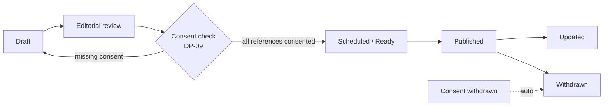
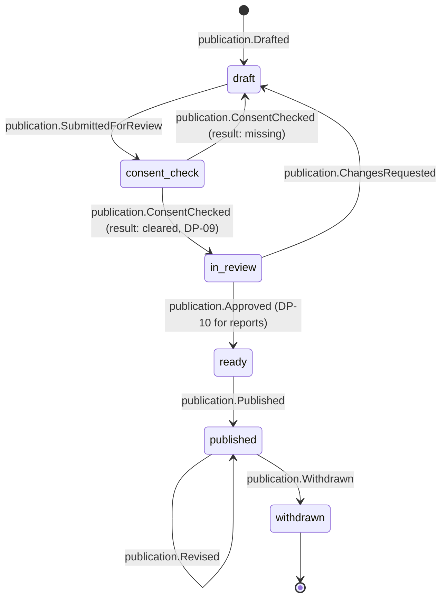

# Publication

Back to [[Entities Index]] · Section: [[Publications Overview]] · Pipeline: [[Publication Pipeline]]

## Purpose

A **Publication** (part of *the surface*; uk: «Публікація») is any piece of content the organisation makes visible beyond the people directly working on a flow. It is the common parent of [[Article]] and [[Report]], and of the specialised formats in section 05: [[Journey Story]], [[Campaign Page]], [[Impact Report]], [[Donor Report]], [[Newsletter Digest]].

## Business description

Publications tell the river's story honestly. They combine **authored content** (TipTap blocks written in the [[Content Editor]]) with **live data blocks** that embed [[Projection]]s: counters, a ledger excerpt, a journey timeline, a map. Because the numbers come from the log, a publication cannot overstate impact ([[Guiding Principles#P8. Honest numbers, beautifully shown]]).

Every publication passes through a pipeline:

The **consent check** walks every reference in the content: persons, [[Media Asset]]s, [[Gratitude Note]]s, precise [[Location]]s. Each must be covered by a valid [[Consent]], or be aggregated or anonymised at the required [[Visibility Levels|visibility level]]. If consent is later withdrawn, the affected block is removed automatically and the publication records a `publication.Revised` event.

Publications have an **audience level**: `public`, `participants` (e.g. a flow report for its givers), `team`, or `private` (a personal [[Donor Report]]). This is the same scale as everything else in the vault.

AI (Vertex) may draft text, for example a first cut of a campaign report. Every draft is labelled, logged with `via: vertex`, and needs human editing and approval. AI **never** auto-publishes ([[Vertex AI Integration]]).

## Attributes

| Field | Type | Default visibility | Notes |
|---|---|---|---|
| `id`, `slug` | ULID, per-locale slug | `team` | |
| `orgId` | id → [[Organisation]] | `team` | |
| `kind` | enum | `team` | `article`, `report`, `journey_story`, `campaign_page`, `newsletter` |
| `audience` | visibility level | `team` | Target level of the whole publication |
| `sourceLocale` | BCP 47 | `team` | |
| `title`, `summary` | per-locale | per `audience` | |
| `blocks` | structured JSON (TipTap) | per `audience` | Text, media, quote, live-data blocks |
| `dataBindings` | `[{blockId, projection, params}]` | `team` | Which [[Projection]]s are embedded |
| `references` | `[{kind, id, consentId}]` | `team` | Extracted automatically from blocks |
| `translationIds` | id[] → [[Translation]] | `team` | |
| `authorIds` / `editorIds` | id[] → [[Person]] | `team` | Byline optional on `public` |
| `scope` | `{flowId \| campaignId \| programmeId}` | `team` | |
| `publishedAt`, `scheduledAt` | date-time | `public` once published | |
| `seo` | `{description, ogImageId}` | `public` | |
| `aiAssisted` | boolean + model | `team` | Disclosed on page if substantial |
| `status` | enum | `team` | |

## States and lifecycle

## Relationships

Specialised as [[Article]] and [[Report]] · embeds [[Media Asset]]s and [[Projection]]s · has [[Translation]]s · references [[Flow]], [[Campaign]], [[Programme]], [[Gratitude Note]], [[Person]] (only via [[Consent]]) · edited by an Editor ([[Role]]) · rendered by the [[Public Portal]].

## Events emitted

`publication.Drafted`, `ai.SuggestionMade`, `publication.SubmittedForReview`, `publication.ConsentChecked` (result: cleared / missing), `publication.ChangesRequested`, `publication.Approved`, `publication.Scheduled`, `publication.Published`, `publication.Revised`, `publication.Withdrawn`.

## Decision points involved

[[DP-09 Publication Consent]] · [[DP-10 Report Publication]] · [[DP-12 Visibility Change]].

## Privacy notes

> [!privacy]
> Publication is the moment private data is most likely to leak. The consent check is a hard gate, not a checklist. Live data blocks bind only to projections at or above the publication's audience level: a `public` page cannot embed a `team` projection. See [[Privacy Model]].

## Principles

> [!principle] P5 — consent is specific and revocable
> Withdrawal removes content automatically, including from cached pages (CDN purge on `publication.Revised`).

> [!principle] P10 — dignity in every pixel
> Editorial review checks tone against [[Brand and Tone of Voice]]: agency, not pity.

## UI touchpoints

[[Content Editor]] · [[Public Portal]] · [[Admin Studio]] (roles, schedule) · [[Multilingual Experience]].
