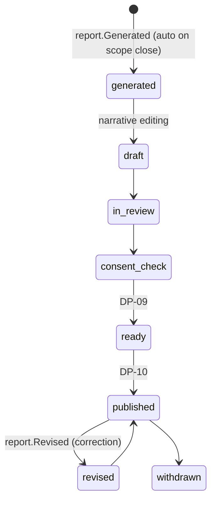

# Report

Back to [[Entities Index]] · Parent: [[Publication]] · Section: [[Publications Overview]]

## Purpose

A **Report** (uk: «Звіт») is a data-first [[Publication]] generated from the log for a defined **scope** (a [[Flow]], [[Campaign]], [[Programme]], giver or period) and a defined **audience**. It is how the organisation shows what gifts became, what they cost, and what came back as thanks. Formats: [[Donor Report]] (per giver), [[Impact Report]] (programme or period), campaign and flow reports, and grant reports.

## Business description

Reports are **assembled, not written from scratch**. A report template defines sections, such as summary, money in, costs by category, deliveries by oblast, journey highlights, gratitude and what's next, and each section binds to [[Projection]]s. The system generates a draft when a scope closes: a campaign ends or a flow reaches `confirmed`. A coordinator or editor adds narrative, optionally from an AI draft, then approves it at [[DP-10 Report Publication]].

Every figure is **reproducible**. A report stores a `snapshot` (the event position it was generated at), so re-running it gives the same numbers, and later corrections appear as a revision with a changelog. That makes reports audit-ready ([[Accountability and Audit]]).

Money figures are shown in the report's currency, with original currencies available on drill-down and the FX method stated. Restricted and unrestricted funds are separated. In-kind value is labelled as an estimate.

The same report can be rendered at **different audience levels**: a sponsor's private board version (`private`), a participants version for everyone in the flow, and a `public` version, as in Sarah's case in [[Audiences and Personas]]. Each version is redacted per level by its projections.

## Attributes

Inherits all [[Publication]] attributes. Adds:

| Field | Type | Default visibility | Notes |
|---|---|---|---|
| `reportType` | enum | `team` | `flow`, `campaign`, `programme`, `donor`, `impact`, `grant` |
| `scope` | `{kind, id, period}` | per audience | |
| `templateId` | id | `team` | Section and binding layout |
| `snapshot` | `{eventPosition, generatedAt}` | `team` | Reproducibility |
| `currency` | ISO 4217 | per audience | Report currency |
| `fxMethod` | text | per audience | "Rate at time of each event (NBU/ECB)" |
| `recipientPersonId` | id → [[Person]] | `private` | For donor reports |
| `renditions` | `[{audience, publicationUrl \| pdfAssetId}]` | `team` | Per level; PDF export for trustees and funders |
| `revisionOf` | id → Report | `team` | With changelog |

## States and lifecycle

A private [[Donor Report]] is "published" by delivering it to the giver. The giver may then choose to make it public ([[DP-12 Visibility Change]]).

## Relationships

Is a [[Publication]] · scoped to [[Flow]] / [[Campaign]] / [[Programme]] / [[Giver]] · built from [[Projection]]s over [[Log Event]]s · aggregates [[Gift]]s, [[Cost Record]]s, [[Delivery Confirmation]]s, [[Gratitude Note]]s · feeds [[Impact Metrics]] and [[Transparency Ledger]].

## Events emitted

`report.Generated`, `report.Revised` plus the generic `publication.*` events with `payload.kind = "report"`.

## Decision points involved

[[DP-10 Report Publication]] · [[DP-09 Publication Consent]] · [[DP-12 Visibility Change]].

## Privacy notes

> [!privacy]
> Small-number suppression applies to any `public` or funder-facing table: counts below 5 per oblast or category are merged. Donor Reports are `private` to the giver by default, and a giver sees only pseudonymised recipients.

## Principles

> [!principle] P8 — honest numbers, beautifully shown
> A report never hides costs or write-offs, and never shows a number that cannot be traced to the log.

## UI touchpoints

[[Content Editor]] (report templates and narrative) · [[Coordinator Workspace]] ("report ready to review") · [[Giver Section]] (my reports) · [[Admin Studio]] (templates, PDF branding) · [[Public Portal]].
