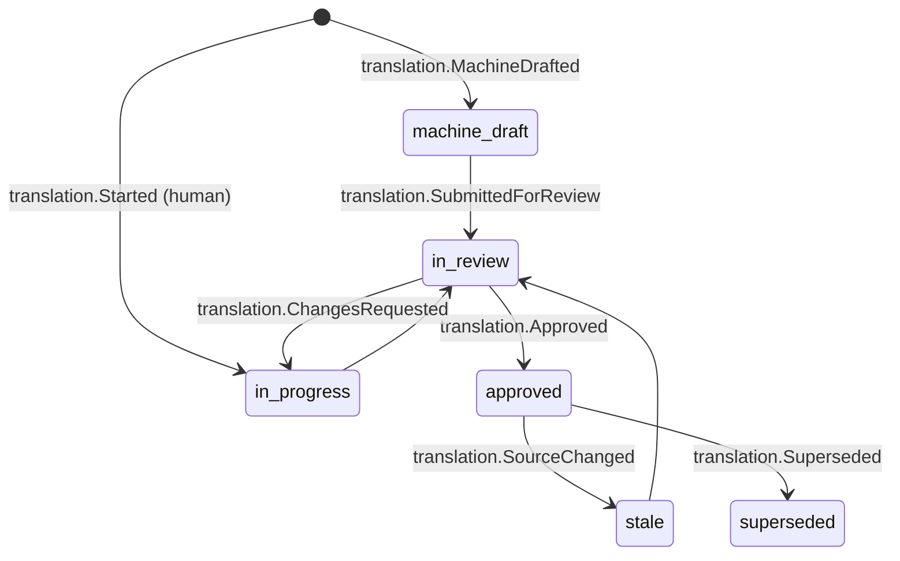

# Translation

Back to [[Entities Index]] · See [[Internationalisation]] and [[Multilingual Experience]]

## Purpose

A **Translation** (uk: «Переклад») is a locale version of a piece of user or editorial text: a [[Publication]] block, a [[Campaign]] title, a [[Gratitude Note]], a [[Need]] description shown to a UK giver, or the alt text of a [[Media Asset]]. It records **who translated it, how, from which source version, and whether a human has reviewed it**.

## Business description

The portal is bilingual by design, in en-GB and uk, and can be extended to more locales. There are two kinds of text:

1. **UI strings**: managed as next-intl message catalogues in code. Keys come from the [[Glossary]] Ukrainian column. These are *not* Translation entities.
2. **Content and user text**: stored as Translation records alongside the source.

Translations may start as a **machine draft** from Vertex AI (Gemini). A draft is always labelled, logged with `actor.via: vertex`, and **must be human-reviewed** before it reaches `public`. Within `participants` (for example, a gratitude note relayed to a giver), a clearly labelled machine translation may be shown with the original alongside, if the organisation allows it. Ukrainian public copy must read as native ([[Brand and Tone of Voice]]).

Translations are tied to a **source version**. When the source changes, the translation becomes `stale`: it is still shown, with a subtle "updated in the original" note, until it is re-reviewed.

## Attributes

| Field | Type | Default visibility | Notes |
|---|---|---|---|
| `id` | ULID | `team` | |
| `source` | `{kind, id, field, blockId?, version}` | `team` | What is translated |
| `sourceLocale` / `targetLocale` | BCP 47 | `team` | `uk`, `en-GB`, `pl`, … |
| `text` / `blocks` | text or TipTap JSON | inherits source field's level | Never more visible than the source |
| `method` | enum | `team` | `human`, `machine_draft`, `machine_post_edited` |
| `engine` | `{provider, model}` | `team` | e.g. Vertex AI Gemini |
| `translatorId` / `reviewerId` | id → [[Person]] | `team` | [[Volunteer]] translators welcome |
| `glossaryVersion` | string | `team` | Enforces [[Glossary]] terms |
| `status` | enum | `team` | |

## States and lifecycle

## Relationships

Translates fields of [[Publication]], [[Article]], [[Report]], [[Campaign]], [[Programme]], [[Need]], [[Offer]], [[Gratitude Note]], [[Media Asset]], [[Category]] · made by [[Volunteer]]s, Editors ([[Role]]) or Vertex AI.

## Events emitted

`translation.MachineDrafted`, `translation.Started`, `translation.SubmittedForReview`, `translation.ChangesRequested`, `translation.Approved`, `translation.SourceChanged`, `translation.Superseded`.

## Decision points involved

[[DP-09 Publication Consent]] (a translation is a new rendering of consented content, so the consent scope must cover the locale's audience) · [[DP-10 Report Publication]].

## Privacy notes

> [!privacy]
> A translation inherits the **visibility of its source field** and can never exceed it. Sending private text to Vertex AI happens only within the organisation's GCP project and region, with PII minimised first. Organisations can disable machine translation of `private` text entirely. See [[Vertex AI Integration]].

## Principles

> [!principle] Bilingual parity
> Neither language is a second-class citizen. Recipients write in their own language, and givers read it respectfully rendered, never as rough machine output on public pages.

## UI touchpoints

[[Content Editor]] (side-by-side locale editing, "draft with AI" button) · [[Coordinator Workspace]] (inline translate for needs and notes) · [[Multilingual Experience]] · [[Admin Studio]] (locale settings, MT policy).
