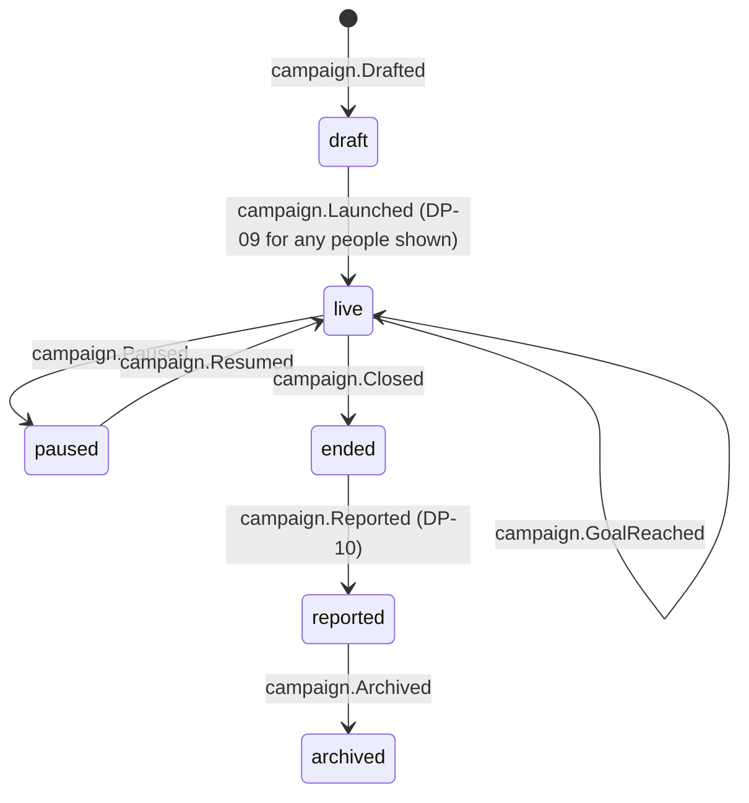

# Campaign

Back to [[Entities Index]]

## Purpose

A **Campaign** (river alias: *channel*; uk: «Кампанія / збір») is a time-bound, purpose-bound collection of gifts, such as "Fuel for three convoys to Kharkiv, November 2026". It is the unit a Tier 1 organisation starts with ([[Scaling Tiers#Tier 1 — Spring]]).

## Business description

A campaign gives givers a clear, honest purpose to join, and gives the organisation one page, one goal and one report. It collects [[Gift]]s (money most often, but also goods, transport and time) and channels them into one or more [[Flow]]s. The goal may be money ("£2,400 for diesel, tolls and the ferry") or practical ("40 generators"). Progress is always derived from the log, never typed in by hand.

A campaign states its **cost purpose openly**. If most of it pays for transport, the page says so and links to the [[Transparency Ledger]]. Gifts to a campaign are **restricted** to its purpose by default ([[Gift]] → `restriction.kind = campaign`). If the campaign is over-funded, the page says what happens to the surplus before anyone gives, for example "Any surplus funds the next convoy under the Winter Warmth programme".

Campaigns can sit inside a [[Programme]] (Tier 3+). A [[Sponsor]] may underwrite a campaign's costs, often transport, so that other givers' money goes wholly to goods.

## Attributes

| Field | Type | Default visibility | Notes |
|---|---|---|---|
| `id`, `slug` | ULID, string | `public` | Slug per locale |
| `orgId` | id → [[Organisation]] | `public` | |
| `programmeId` | id → [[Programme]] | `public` | Optional |
| `title`, `summary`, `body` | per-locale content | `public` | Via [[Translation]]; body is [[Content Editor]] blocks |
| `purpose` | text | `public` | What the money or goods will become |
| `goal` | `{kind: money \| quantity, amount, currency \| unit}` | `public` | ISO currency |
| `costPurposeBreakdown` | `[{costCategory, estimate}]` | `public` | Honest forecast of transport and other costs |
| `surplusPolicy` | text | `public` | Stated upfront |
| `window` | `{opensAt, closesAt}` | `public` | No countdown pressure in the UI ([[Brand and Tone of Voice]]) |
| `leadCoordinatorId` | id → [[Person]] | `team` | |
| `sponsorIds` | id[] → [[Sponsor]] | `participants` | `public` only with sponsor consent |
| `paymentLinks` | `[{provider, url, currency}]` | `public` | External checkout / bank / jar |
| `flowIds` | id[] → [[Flow]] | `team` | Public shows a flow count and journey stories |
| `progress` | projection | `public` | Raised, spent, delivered |
| `heroMediaId` | id → [[Media Asset]] | `public` | Consented, dignified imagery only |
| `status` | enum | `public` | |

## States and lifecycle

Reaching the goal is an event, not a state. The organisation may keep the campaign open, under its stated surplus policy, or end it.

## Relationships

- Belongs to an [[Organisation]], optionally within a [[Programme]].
- Receives [[Gift]]s (from [[Giver]]s and [[Sponsor]]s) and [[Offer]]s; channels them into [[Flow]]s.
- Charged with [[Cost Record]]s via its flows (or directly, for campaign-level costs such as payment fees).
- Presented as a [[Campaign Page]]; closed with a [[Report]] ([[Impact Report]] / [[Donor Report]]).

## Events emitted

`campaign.Drafted`, `campaign.Launched`, `campaign.GoalChanged`, `campaign.GoalReached`, `campaign.Paused`, `campaign.Resumed`, `campaign.Closed`, `campaign.SurplusReallocated`, `campaign.Reported`, `campaign.Archived`.

## Decision points involved

[[DP-06 Cost Approval]] (campaign-level costs) · [[DP-09 Publication Consent]] (any person or photo on the page) · [[DP-10 Report Publication]] (closing report).

## Privacy notes

> [!privacy]
> A campaign page shows aggregates by default: number of givers, total raised, and deliveries by oblast. Named givers appear only with their [[Consent]] and never with amounts.

## Principles

> [!principle] P8 — honest numbers, beautifully shown
> The progress bar shows *raised*, *spent on goods* and *spent on transport and costs* side by side. See [[Money Flow and Cost Transparency]].

> [!principle] P10 — dignity in every pixel
> No pity imagery, no countdowns, no "only 3 hours left to save…".

## UI touchpoints

[[Campaign Page]] on the [[Public Portal]] · [[Giver Section]] (give to a campaign) · [[Coordinator Workspace]] (campaign dashboard) · [[Content Editor]] (campaign story with live data blocks) · [[Admin Studio]] (payment links).
