# Consignment

Back to [[Entities Index]] · See [[Transport and Logistics Flow]] and [[The Delivery Chain]]

## Purpose

A **Consignment** (river alias: *boat*; uk: «Відправлення») is a physical bundle of [[Item]]s moving together towards one or more [[Need]]s within a [[Flow]]. It can be a parcel, a pallet, a van load or a single generator.

## Business description

Consignments make physical movement trackable and accountable. A consignment is packed at a [[Hub]] (or at a giver's pickup point), labelled with a code and a QR label, and then travels over one or more [[Leg]]s. It may be split or merged at hubs: a pallet from the UK becomes six household parcels in Lviv. Each split or merge is an event, so the lineage from gift to recipient is preserved.

Labels carry **no personal data**, only the consignment code and a scan URL. Scanning with a leg-scoped magic link lets the [[Carrier]] record a handover. Customs paperwork, if needed, is attached as a restricted [[Media Asset]].

## Attributes

| Field | Type | Default visibility | Notes |
|---|---|---|---|
| `id`, `code` | ULID, short code | `team` | Code printed on label (`ORA-C-7Q4K`) |
| `flowId` | id → [[Flow]] | `team` | |
| `needIds` | id[] → [[Need]] | `team` | Destination needs (may be several) |
| `itemIds` | id[] → [[Item]] | `team` | Contents manifest |
| `packedAtHubId` | id → [[Hub]] | `participants` | |
| `packing` | `{weightKg, volumeM3, pieces, packedBy}` | `team` | |
| `handling` | enum[] | `team` | `fragile`, `keep_dry`, `temperature_controlled`, `medicine`, `heavy_two_person` |
| `legIds` | id[] → [[Leg]] | `team` | Ordered route |
| `currentCustodian` | `{personId \| hubId}` | `team` | Who holds it now |
| `destinationLocationId` | id → [[Location]] | `private` | Released to final-leg carrier only |
| `parentConsignmentId` / `childConsignmentIds` | id | `team` | Split / merge lineage |
| `customsDocs` | id[] → [[Media Asset]] | `team` | |
| `declaredValue` | `{amount, currency}` | `team` | For customs and insurance |
| `status` | enum | `participants` | |

## States and lifecycle

```mermaid
stateDiagram-v2
    [*] --> packing : consignment.PackingStarted
    packing --> ready : consignment.Packed
    ready --> dispatched : consignment.Dispatched (DP-07)
    dispatched --> in_transit : consignment.InTransit (first leg departed)
    in_transit --> in_transit : leg.HandedOver (between legs / hub; recorded on the Leg)
    in_transit --> delivered : consignment.Delivered
    in_transit --> returned : consignment.Returned
    in_transit --> lost : consignment.Lost
    dispatched --> returned
    delivered --> [*]
    returned --> [*]
    lost --> [*]
```

- `delivered` triggers a request for a [[Delivery Confirmation]].
- `lost` requires an incident note. Remaining items are written off in [[Item]] and the flow re-forms.
- Resting at a hub mid-route is recorded via `consignment.ArrivedAtHub` and does not change the top-level state.

## Relationships

Belongs to a [[Flow]] · contains [[Item]]s · moves over [[Leg]]s by [[Carrier]]s · packed and stored at [[Hub]]s · destined for [[Need]]s at a [[Location]] · evidenced by [[Delivery Confirmation]] · incurs [[Cost Record]]s (packaging, postage, customs).

## Events emitted

`consignment.PackingStarted`, `consignment.ItemAdded`, `consignment.ItemRemoved`, `consignment.Packed`, `consignment.Labelled`, `consignment.Dispatched`, `consignment.InTransit`, `consignment.ArrivedAtHub`, `consignment.Split`, `consignment.Merged`, `consignment.Delivered`, `consignment.Returned`, `consignment.Lost`.

## Decision points involved

[[DP-05 Routing and Carrier Assignment]] · [[DP-07 Dispatch]] (packing checked, carrier assigned, costs pre-approved) · [[DP-08 Delivery Confirmation Review]].

## Privacy notes

> [!privacy]
> Labels and manifests never contain recipient names or addresses. The destination is resolved at the final [[Leg]] through the carrier's leg-scoped link, and access ends when the leg closes. Photos of consignments go through the [[Media Asset]] pipeline (EXIF/GPS stripped).

## Principles

> [!principle] P7 — the river remembers
> Custody is a chain of events. Every handover says who, where (to hub or settlement level) and when, so a giver can follow their gift without anyone being exposed.

## UI touchpoints

[[Coordinator Workspace]] (packing lists, label printing, route timeline) · the carrier's mobile leg checklist, opened by a leg-scoped magic link (see [[Carrier]] and [[Site Map]]) · [[Flow Map]] (pseudonymised movement) · [[Journey Story]].
