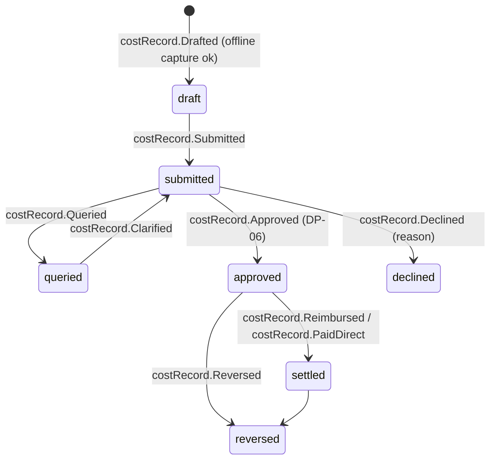

# Cost Record

Back to [[Entities Index]] · See [[Money Flow and Cost Transparency]]

## Purpose

A **Cost Record** (river alias: *toll*; uk: «Запис витрат») records a real cost of moving help: fuel, tolls, ferry, customs, packaging, postage, hub rent, payment fees, local purchases. It is always **attributed** to a [[Flow]], a [[Leg]], a [[Campaign]] or a [[Programme]], and always backed by evidence.

## Business description

Honest numbers need honest costs ([[Guiding Principles#P8. Honest numbers, beautifully shown]]). Carriers and coordinators log costs from their phone as they happen. They take a photo of the receipt, enter the amount in the currency actually paid, and pick a cost category. The system records the **FX rate at the time of the event** into the organisation's base currency (e.g. GBP) for reporting. The original currency and amount are always kept.

A cost is **approved** by a Finance Steward or by the flow's Lead Coordinator, within limits set per organisation ([[DP-06 Cost Approval]]). Approval checks that there is evidence, that the category is right, that the cost is allocated sensibly, and that **restricted funding** is respected: a sponsor's "transport only" gift cannot pay for hub rent. Queried costs go back to the submitter with a question. Approved costs can then be reimbursed to the person who paid, or recorded as paid directly.

Corrections are **reversing entries**, never edits. A wrong amount produces `costRecord.Reversed` plus a new record, so the [[Transparency Ledger]] reconciles by construction.

One cost may be **split** across several flows or campaigns, for example one van run serving three flows. Allocations are percentages or explicit amounts that must sum to 100%.

## Attributes

| Field | Type | Default visibility | Notes |
|---|---|---|---|
| `id` | ULID | `team` | |
| `orgId` | id → [[Organisation]] | `team` | |
| `category` | enum | `public` (aggregate) | `fuel`, `tolls`, `ferry`, `customs`, `packaging`, `postage`, `vehicle_hire`, `repairs`, `subsistence`, `hub_rent`, `utilities`, `payment_fees`, `local_purchase`, `other` |
| `description` | text | `team` | "Diesel, Rava-Ruska border queue" |
| `amount` | `{value, currency}` | `participants` | Currency paid, ISO 4217 (UAH, PLN, EUR, GBP…) |
| `fx` | `{rate, baseCurrency, source, at}` | `team` | Rate recorded at `incurredAt`; source e.g. NBU / ECB daily |
| `baseAmount` | `{value, currency}` | `public` (aggregate) | Derived; used by the ledger |
| `incurredAt` | date-time | `participants` | |
| `incurredBy` | id → [[Person]] | `team` | Who paid |
| `paidBy` | enum | `team` | `personal_reimbursable`, `org_card`, `org_transfer`, `in_kind_by_giver` |
| `receiptMediaIds` | id[] → [[Media Asset]] | `team` | Photo/PDF. Personal data on the receipt redacted before any `participants` view |
| `noReceiptReason` | text | `team` | Allowed with a higher approval threshold (e.g. unofficial checkpoint) |
| `allocations` | `[{target: flow \| leg \| campaign \| programme, id, share}]` | `team` | Sum = 100% |
| `fundingSource` | `[{giftId \| fundingLineId, amount}]` | `team` | Restricted funds drawn; checked at approval |
| `approval` | `{status, by, at, note}` | `team` | Finance Steward / Lead Coordinator |
| `reimbursement` | `{status, paidAt, reference}` | `private` | Bank details never stored in the record |
| `reversesId` | id → Cost Record | `team` | For corrections |
| `status` | enum | `team` | |

## States and lifecycle

`declined` is appropriate here because a cost is not a person. The submitter always receives the reason, and personal reimbursement disputes go to [[Escalation and Disputes]].

## Relationships

Attributed to [[Flow]], [[Leg]], [[Campaign]] or [[Programme]] · funded by [[Gift]]s (restricted or unrestricted) · evidenced by [[Media Asset]]s · may create [[Item]]s (local purchase) · aggregated in [[Transparency Ledger]], [[Donor Report]] and [[Impact Report]] · submitted by a [[Carrier]], [[Coordinator]] or [[Volunteer]].

## Events emitted

`costRecord.Drafted`, `costRecord.Submitted`, `costRecord.ReceiptAttached`, `costRecord.Queried`, `costRecord.Clarified`, `costRecord.Approved`, `costRecord.Declined`, `costRecord.Reallocated`, `costRecord.Reimbursed`, `costRecord.PaidDirect`, `costRecord.Reversed`.

## Decision points involved

[[DP-06 Cost Approval]]: evidence, category, allocation, restricted funding, thresholds (e.g. above £250 equivalent needs a Finance Steward, not only the lead). [[DP-10 Report Publication]]: costs are shown in reports.

## Privacy notes

> [!privacy]
> Receipts may show names, card fragments or plate numbers. They are `team` by default. The [[Transparency Ledger]] shows category totals and, where published, a redacted receipt thumbnail. Reimbursement bank details stay in the payee's private [[Person]] store, never in event payloads.

> [!question] Tolerance for missing receipts #open-question
> Informal costs are common on some routes: unofficial fees, cash fuel from private sellers. What evidence standard and monetary cap apply to `noReceiptReason`, and how are these shown on the public ledger?

## Principles

> [!principle] P8 — honest numbers, beautifully shown
> Costs are never hidden to make impact look bigger. Transport is part of the gift's journey, not an embarrassment.

> [!principle] P7 — the river remembers
> Reversal, not edit. Every figure on a public page traces back to approved records.

## UI touchpoints

Carrier leg checklist ("Add cost" with camera) · [[Coordinator Workspace]] (cost inbox, approval queue, restricted-fund balance) · [[Admin Studio]] (thresholds, FX source, export) · [[Transparency Ledger]] · [[Campaign Page]] cost breakdown.
