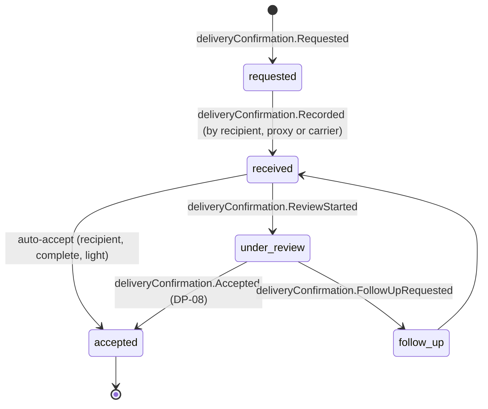

# Delivery Confirmation

Back to [[Entities Index]] · See [[The Delivery Chain]]

## Purpose

A **Delivery Confirmation** (river alias: *the mouth of the river*; uk: «Підтвердження отримання») records that help reached the person or place it was meant for. It closes the physical part of a [[Flow]] and opens the way for the [[Gratitude Note]].

## Business description

Confirmation must be **easy for the recipient and credible for the giver**. The system accepts three kinds:

| Kind | Who confirms | Typical evidence | Review |
|---|---|---|---|
| `recipient` | The [[Recipient]] | Tap "I received it" on the tracking link, SMS reply `ТАК` / `YES`, or a phone call logged by a coordinator; optional photo and note | Light |
| `proxy` | A neighbour, village head, school or care-home staff member, or partner | Name and role of proxy, signature or photo of goods at the institution | Standard |
| `carrier_evidence` | The final-leg [[Carrier]], when the recipient cannot confirm (no phone, illness, evacuation) | Handover photo (no faces unless consented), time, settlement-level check-in, witness | Enhanced at [[DP-08 Delivery Confirmation Review]] |

Confirmation can be **partial**: "the generator came, the fuel did not". It can also report a problem, such as damage or the wrong item. That is feedback, not a complaint against the recipient, and it re-opens the relevant part of the [[Need]].

Photos are optional and never demanded as a condition of future help. A recipient who does not confirm is not penalised. Their [[Reputation]] signals are internal and only shape verification depth.

## Attributes

| Field | Type | Default visibility | Notes |
|---|---|---|---|
| `id` | ULID | `team` | |
| `flowId` / `needId` / `consignmentId` | ids | `team` | |
| `kind` | enum | `participants` | `recipient`, `proxy`, `carrier_evidence` |
| `confirmedBy` | id → [[Person]] | `private` | |
| `proxy` | `{relation, institutionName}` | `private` | |
| `channel` | enum | `team` | `web_link`, `sms`, `phone_call`, `in_person`, `carrier_app` |
| `receivedAt` | date-time | `participants` | |
| `completeness` | enum | `participants` | `complete`, `partial`, `issue_reported` |
| `lines` | `[{itemId \| description, received, note}]` | `team` | |
| `note` | text | `private` | Recipient's own words |
| `mediaIds` | id[] → [[Media Asset]] | `private` | Each asset has its own visibility and consent |
| `locationCheck` | settlement-level [[Location]] | `team` | Never precise GPS |
| `review` | `{outcome, by, at, note}` | `team` | DP-08 |
| `gratitudeOffered` | boolean | `private` | Opens the [[Gratitude Note]] composer |
| `consentIds` | id[] → [[Consent]] | `private` | For photo or story use |

## States and lifecycle

`accepted` moves the [[Need]] to `confirmed` and contributes to the [[Flow]] reaching `confirmed`.

## Relationships

Confirms a [[Need]] within a [[Flow]], for a [[Consignment]] or service · given by a [[Recipient]], proxy [[Person]] or [[Carrier]] · evidenced by [[Media Asset]]s governed by [[Consent]] · leads to a [[Gratitude Note]] · feeds [[Reputation]] signals (confirmed deliveries for givers and carriers) · appears in [[Journey Story]] (consented) and [[Impact Metrics]].

## Events emitted

`deliveryConfirmation.Requested`, `deliveryConfirmation.Recorded` (by: recipient / proxy / carrier), `deliveryConfirmation.IssueReported`, `deliveryConfirmation.ReviewStarted`, `deliveryConfirmation.FollowUpRequested`, `deliveryConfirmation.Accepted`.

## Decision points involved

[[DP-08 Delivery Confirmation Review]] (all proxy and carrier-evidence confirmations; sampled recipient confirmations) · [[DP-09 Publication Consent]] (any photo or quote used publicly).

## Privacy notes

> [!privacy]
> Confirmation photos are `private` by default: EXIF/GPS stripped, faces blurred unless the recipient consents. A photo of goods in a doorway can still reveal a home, so public use requires [[DP-09 Publication Consent]] and a review for identifying background. See [[Media Asset]] and [[Safeguarding]].

## Principles

> [!principle] P2 — a need is respected
> No "proof of poverty" photos. We ask only "did it arrive, and is it right?"

> [!principle] P9 — thanks travels upstream
> Confirmation ends with a gentle, optional invitation to say thank you. It is never a requirement.

## UI touchpoints

[[Help Seeker Section]] (tracking page "Did it arrive?", SMS flow) · carrier leg checklist (handover evidence) · [[Coordinator Workspace]] (DP-08 review queue) · [[Journey Story]].
