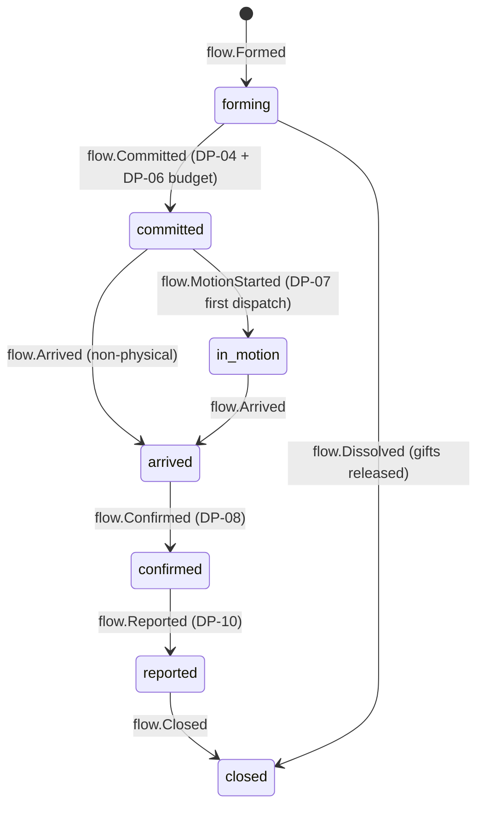
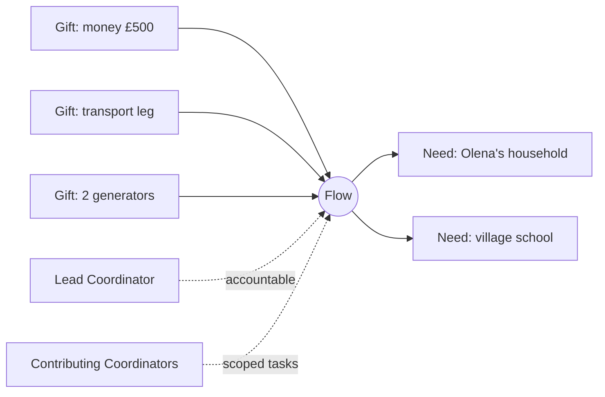

# Flow

Back to [[Entities Index]] · See [[Coordination Model]] and [[The Delivery Chain]]

## Purpose

A **Flow** (river alias: *stream*; uk: «Потік») is the living link between one or more [[Gift]]s and one or more [[Need]]s. It is **the central unit of coordination**: work is planned, costed, tracked, confirmed, thanked and reported per flow.

## Business description

A flow begins when a [[Coordinator]] sees that some water can reach some bank. That might be "James's money + Sarah's transport fund → diesel and a generator for Olena's village", or "40 hygiene kits from the Lviv hub → three families and a care home in Kharkiv oblast". The link is **many-to-many**: a flow bundles several gifts and serves several needs, and a need or gift can take part in several flows.

A flow owns the practical shape of delivery: the [[Consignment]]s packed, the [[Leg]]s travelled, the [[Hub]]s passed, the [[Cost Record]]s incurred, the [[Delivery Confirmation]]s received and the [[Gratitude Note]]s returned. Non-physical flows, such as a pharmacy voucher or a remote service, have no consignments. They move straight from `committed` to `arrived` when the service is rendered or the voucher is redeemed.

**Coordination.** Each flow has exactly one **Lead Coordinator** at any moment, accountable for its decisions, and any number of **Contributing Coordinators** with scoped tasks (routing, finance, content, partner liaison). The lead role can be handed over, for example across a shift or a border, and every hand-off is logged with a note so that nothing is lost between hands. [[Partner Organisation]]s may co-coordinate at Tier 3+. See [[Coordination Model]].

## Attributes

| Field | Type | Default visibility | Notes |
|---|---|---|---|
| `id` | ULID | `team` | |
| `orgId` | id → [[Organisation]] | `team` | Owning organisation |
| `title` | text | `team` | Internal ("Izium generators, Nov") |
| `publicTitle` | text | `public` | Consent-safe ("Warm winter in Kharkiv oblast") |
| `status` | enum | `participants` | Public sees aggregate progress only |
| `leadCoordinatorId` | id → [[Person]] | `team` | Exactly one |
| `contributors` | `[{personId, scope, since}]` | `team` | `scope`: `routing`, `finance`, `content`, `partner`, `safeguarding` |
| `partnerOrgIds` | id[] → [[Partner Organisation]] | `team` | Co-coordinators / carriers / hub operators |
| `needLinks` | `[{needId, portion, forms[]}]` | `team` | Which parts of each need this flow serves |
| `giftAllocations` | `[{giftId, amount \| quantity}]` | `team` | Mirror of [[Gift]] allocations; restricted funds flagged |
| `campaignId` / `programmeId` | id | `participants` | Optional grouping |
| `consignmentIds` | id[] → [[Consignment]] | `team` | |
| `legIds` | id[] → [[Leg]] | `team` | Ordered route |
| `budget` | `{estimate, currency, costCategories[]}` | `team` | Estimate at commitment |
| `costSummary` | projection | `participants` | From [[Cost Record]]s; `public` in aggregate on the [[Transparency Ledger]] |
| `targetArrival` | date window | `participants` | |
| `regionSummary` | derived from [[Location]] | `public` | Oblast-level only |
| `visibilityDefaults` | map field → level | `team` | Seeded from the org [[Visibility Policy]] |
| `publicationIds` | id[] → [[Publication]] | `team` | [[Journey Story]], [[Report]] |
| `correlationId` | id | system | Shared by all events in the flow for tracing ([[Log Event]]) |

## States and lifecycle

- **forming**: candidate gifts and needs gathered; nothing promised yet to recipients.
- **committed**: recipients told what is coming and roughly when; budget approved.
- **in_motion**: at least one consignment dispatched or leg departed.
- **arrived**: all consignments delivered, or the service rendered.
- **confirmed**: [[Delivery Confirmation]]s accepted at [[DP-08 Delivery Confirmation Review]]; costs reconciled.
- **reported**: participants have received a flow report / [[Journey Story]] draft and gratitude has been passed upstream.
- **closed**: immutable summary; still readable by replay.

A committed flow that fails, for example because a consignment was lost, is not "cancelled". It re-forms: a new flow is created with `causationId` pointing to the failed one, and recipients are kept informed.

## Relationships

- Links many [[Gift]]s ↔ many [[Need]]s.
- Contains [[Consignment]]s → [[Item]]s; routed over [[Leg]]s via [[Hub]]s; incurs [[Cost Record]]s.
- Evidenced by [[Delivery Confirmation]]s; thanked via [[Gratitude Note]]s.
- Grouped under [[Campaign]] / [[Programme]]. Coordinated by [[Coordinator]]s holding a [[Role]] scoped to this flow.
- Feeds [[Reputation]] signals of all participants and [[Impact Metrics]].

## Events emitted

`flow.Formed`, `flow.NeedLinked`, `flow.NeedUnlinked`, `gift.Allocated`, `flow.BudgetEstimated`, `flow.Committed`, `flow.LeadHandedOver`, `flow.CoordinatorJoined`, `flow.CoordinatorLeft`, `flow.MotionStarted`, `flow.Arrived`, `flow.Confirmed`, `flow.Reported`, `flow.Closed`, `flow.Dissolved`, `flow.Reformed`. See [[Event Catalogue]].

## Decision points involved

[[DP-04 Matching]] (forming → committed) · [[DP-05 Routing and Carrier Assignment]] · [[DP-06 Cost Approval]] · [[DP-07 Dispatch]] · [[DP-08 Delivery Confirmation Review]] · [[DP-10 Report Publication]] · [[DP-12 Visibility Change]]. Who decides what: [[Responsibility Matrix]].

## Privacy notes

> [!privacy]
> The flow is the unit at which `participants` visibility is defined. Everyone who took part (givers, sponsors, carriers) sees the flow's journey in pseudonymised form. Precise locations and names are released only per role and only for as long as they are needed. See [[Visibility Levels]].

## Principles

> [!principle] P7 — the river remembers
> Hand-offs, re-forming and corrections are new events, never edits. The whole flow can be replayed for audit ([[Accountability and Audit]]).

> [!principle] P9 — thanks travels upstream
> A flow is not `reported` until gratitude, if the recipient offered it, has been passed to every contributor ([[Gratitude Loop]]).

## UI touchpoints

- [[Coordinator Workspace]]: flow board (kanban by status), flow detail with route timeline, hand-off dialogue, "next action" hints, AI matching suggestions (advisory).
- [[Giver Section]]: "your gift's journey" per flow.
- [[Flow Map]] and [[Journey Story]] on the [[Public Portal]].
