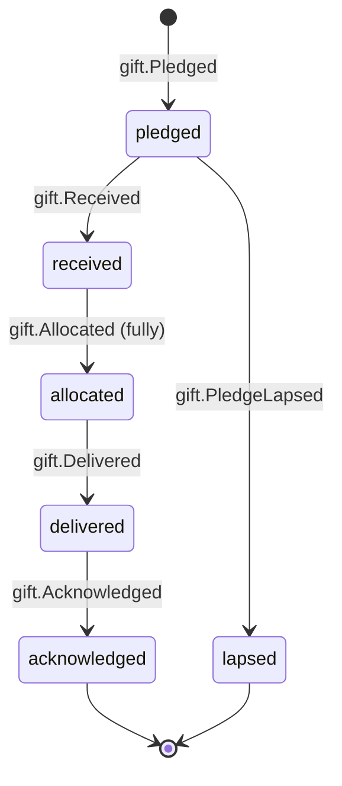

# Gift

Back to [[Entities Index]] · Lifecycle narrative: [[Lifecycle of a Gift]]

## Purpose

A **Gift** (river alias: *water*; uk: «Дар») is what is actually given: money received, goods in hand, a service scheduled, time committed or transport provided. Gifts are the water that [[Flow]]s carry from the right bank to the left.

## Business description

**A gift is a gift, not a commodity** ([[Guiding Principles#P1. A gift is a gift]]). It is never a purchase and never an exchange. It buys no status, priority, visibility or influence, and it is never made conditional on publicity or on the recipient's story. The system has no price tags on people ("£30 feeds a child" is not how gifts are modelled), no sponsor-a-person mechanics, and no leaderboards by amount. Givers are thanked for *taking part*.

Gifts come from an accepted [[Offer]], directly from a payment link (money), or from a [[Campaign]]. There are five **kinds**:

| Kind | Received means | Measured in | Typical example |
|---|---|---|---|
| `money` | Funds arrived (provider webhook or bank evidence) | amount + ISO currency | £25 via Stripe Checkout; ₴1,000 to a Monobank jar |
| `goods` | Items physically in hand at a [[Hub]] or with a carrier | [[Item]]s | 12 sleeping bags |
| `service` | Provider has confirmed a date | hours / sessions | A pharmacist's remote consultations |
| `time` | Volunteer has confirmed a shift | hours | Packing shift at the Lviv hub |
| `transport` | Carrier has confirmed a [[Leg]] | km / leg | A van from Przemyśl to Lviv |

**Restricted funds.** A [[Sponsor]] or giver may restrict a gift to a purpose: a campaign, a programme, a cost type ("transport and fuel only") or a single flow. Restrictions are recorded at receipt and carried with every allocation. [[DP-06 Cost Approval]] refuses to charge a [[Cost Record]] to a restricted gift outside its purpose. The [[Transparency Ledger]] reports restricted and unrestricted totals separately. If a restriction cannot be honoured, for example because the purpose has already been fully funded, the giver is asked before the gift is re-purposed. That consent is recorded as an event.

A money gift may be **split** across several flows through allocations. A goods gift may be split across consignments. The gift reaches `allocated` when its whole value or quantity is allocated.

## Attributes

| Field | Type | Default visibility | Notes |
|---|---|---|---|
| `id` | ULID | `team` | |
| `orgId` | id → [[Organisation]] | `team` | |
| `giverId` | id → [[Person]] / [[Organisation]] | `private` | Giver + finance stewards; `team` sees name only when needed |
| `offerId` | id → [[Offer]] | `team` | Absent for direct money gifts |
| `kind` | enum | `participants` | `money`, `goods`, `service`, `time`, `transport` |
| `money` | `{amount, currency, fxRateToBase, baseCurrency, fxAt}` | `private` | FX recorded at receipt. Amount is public only in aggregate, or named if the giver opts in |
| `paymentEvidence` | `{provider, providerRef, receivedAt}` | `team` | Provider ref only. Card data never touches the portal |
| `giftAid` | `{eligible, declarationId}` | `private` | UK Gift Aid (Tier 2+); declaration held in the person's private store |
| `itemIds` | id[] → [[Item]] | `team` | Goods gifts |
| `serviceOrTime` | `{description, hours, schedule}` | `team` | |
| `transportLegIds` | id[] → [[Leg]] | `team` | Transport gifts |
| `restriction` | `{kind, scopeId, purposeText, expiresAt}` | `team` | `kind`: `unrestricted`, `campaign`, `programme`, `cost_type`, `flow` |
| `allocations` | `[{flowId, amount \| quantity, allocatedAt, by}]` | `team` | Many-to-many with [[Flow]] |
| `campaignId` / `programmeId` | id | `participants` | |
| `recognitionPreference` | enum | `private` | Inherited from the offer; changeable via [[DP-12 Visibility Change]] |
| `acknowledgement` | `{receiptSentAt, gratitudeNoteIds[]}` | `private` | Receipt ≠ gratitude; both tracked |
| `status` | enum | `private` | |

## States and lifecycle

- **received** means: money received (webhook or evidence), goods in hand, or service/time/transport scheduled.
- **delivered**: every flow the gift was allocated to has reached `arrived` or later.
- **acknowledged**: a receipt has been sent *and* the [[Gratitude Note]]s from the served flows (if any) have been passed upstream. See [[Gratitude Loop]].
- A refund is modelled as a compensating `gift.Refunded` event (money) or `gift.ReturnedToGiver` (goods). The log is never rewritten ([[Guiding Principles#P7. The river remembers]]).

> [!question] Lapsed pledges and refunds #open-question
> The brief's canonical Gift statuses do not include a terminal state for pledges that never arrive or for refunds. This note proposes `lapsed` as a side state and handles refunds as compensating events. Needs confirmation.

## Relationships

- Arises from an [[Offer]], or directly from a [[Campaign]] payment link.
- Given by a [[Giver]] / [[Sponsor]] / [[Partner Organisation]].
- Allocated to one or more [[Flow]]s. Goods gifts consist of [[Item]]s; transport gifts are realised as [[Leg]]s.
- Funds [[Cost Record]]s via its flow allocations (restricted funding respected).
- Thanked through [[Gratitude Note]]s; reported in [[Donor Report]] and [[Transparency Ledger]].

## Events emitted

`gift.Pledged`, `gift.Received`, `gift.ReceiptIssued`, `gift.RestrictionRecorded`, `gift.Allocated`, `gift.Deallocated`, `gift.RepurposeConsentRequested`, `gift.RepurposeConsented`, `gift.Delivered`, `gift.Acknowledged`, `gift.PledgeLapsed`, `gift.Refunded`, `gift.ReturnedToGiver`. Payment-provider webhooks append `gift.Received` with `actor.via: system`. See [[Event Catalogue]].

## Decision points involved

- [[DP-03 Offer Acceptance]]: upstream, for non-money gifts.
- [[DP-04 Matching]]: allocation to flows.
- [[DP-06 Cost Approval]]: enforces restrictions when costs are charged.
- [[DP-09 Publication Consent]] / [[DP-12 Visibility Change]]: named recognition.

## Privacy notes

> [!privacy]
> Individual amounts are `private` to the giver and finance stewards. Publicly, gifts appear as aggregates ("214 givers, £8,420") or, with opt-in, as first name only with **no amount** on the [[Gratitude Wall]]. Recipients see "people in Leeds and Warsaw", never amounts. See [[Recognition Anti-Patterns]].

## Principles

> [!principle] P1 — a gift is a gift
> No status, priority or visibility is bought. Recognition tiers by amount are forbidden.

> [!principle] P8 — honest numbers
> A gift's journey shows what share went to costs such as fuel, tolls and ferries, openly. See [[Money Flow and Cost Transparency]].

## UI touchpoints

- [[Giver Section]]: give flow, "track your gift" timeline, restriction choice ("where it's needed most" by default).
- [[Coordinator Workspace]]: allocation board, restricted-fund balances.
- [[Admin Studio]]: finance view, receipts, Gift Aid export.
- [[Donor Report]], [[Journey Story]], [[Transparency Ledger]].
