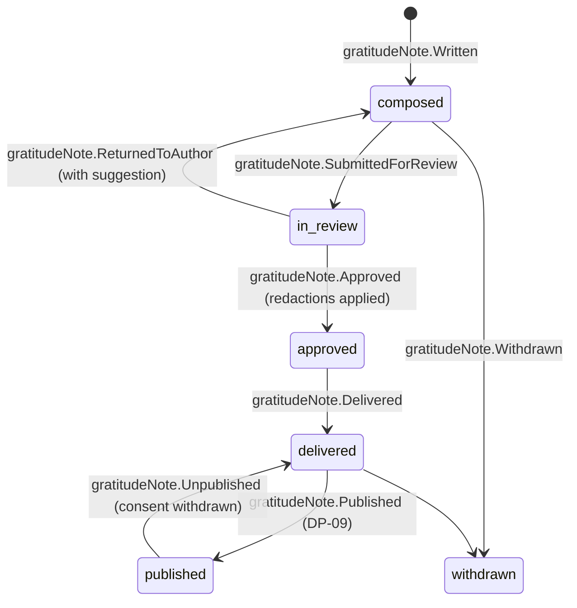

# Gratitude Note

Back to [[Entities Index]] · See [[Gratitude Loop]]

## Purpose

A **Gratitude Note** (river alias: *the returning tide*; uk: «Подяка») is a message of thanks that travels **back upstream** from a recipient to everyone who took part in a [[Flow]]: givers, sponsors, carriers, volunteers and coordinators.

## Business description

Thanks is **offered, never extracted** ([[Guiding Principles#P9. Thanks travels upstream]]). After a [[Delivery Confirmation]], the recipient may write a few words, record a voice note, send a photo, or simply tap a heart. They choose **who** receives it: everyone in the chain, only the givers, only the driver, or the organisation only.

A coordinator checks the note for accidental personal data, such as a surname, a street or a face in the background, before it travels ([[Vertex AI Integration]] may flag PII; a human decides). It is then translated if needed. Machine drafts are marked as such, and the original is always attached ([[Translation]]).

The note is delivered to each chosen participant through their preferred channel and appears in their [[Donor Report]]. With explicit, specific [[Consent]], it may appear on the [[Gratitude Wall]] or in a [[Journey Story]]. Thanks may also travel *downstream*: givers can reply with a short message of support, which the coordinator relays.

## Attributes

| Field | Type | Default visibility | Notes |
|---|---|---|---|
| `id` | ULID | `team` | |
| `flowId` / `needId` | ids | `team` | |
| `fromPersonId` | id → [[Person]] | `private` | Recipient or their proxy |
| `displayAs` | enum | `private` | `anonymous` ("a family in Kharkiv oblast"), `first_name`, `as_written` |
| `body` | text, original language | `private` → per audience | Visible to chosen audience |
| `translations` | id[] → [[Translation]] | same as body | Machine-draft flag + reviewer |
| `mediaIds` | id[] → [[Media Asset]] | `private` | Faces blurred by default |
| `voiceNoteId` | id → [[Media Asset]] | `private` | Transcribed on request |
| `audience` | enum[] | `private` | `givers`, `sponsors`, `carriers`, `volunteers`, `coordinators`, `organisation_only` |
| `review` | `{by, at, redactions[]}` | `team` | PII check |
| `publicConsentId` | id → [[Consent]] | `private` | Required for the [[Gratitude Wall]] |
| `deliveredTo` | `[{personId, channel, at}]` | `team` | |
| `replies` | `[{fromPersonId, body}]` | `private` | Downstream encouragement |
| `status` | enum | `team` | |

## States and lifecycle

Withdrawal by the author removes the note from all publications and future deliveries. Participants who already received it keep a notice that it was withdrawn, but not its text.

## Relationships

Written by a [[Recipient]] (or proxy) after a [[Delivery Confirmation]] · addressed to participants of a [[Flow]]: [[Giver]], [[Sponsor]], [[Carrier]], [[Volunteer]], [[Coordinator]] · may carry [[Media Asset]]s and [[Translation]]s · published only via [[Consent]] on the [[Gratitude Wall]] / [[Journey Story]] · counted in [[Reputation Signals]] ("gratitude received") and [[Impact Metrics]].

## Events emitted

`gratitudeNote.Written`, `gratitudeNote.SubmittedForReview`, `gratitudeNote.Approved`, `gratitudeNote.ReturnedToAuthor`, `gratitudeNote.Translated`, `gratitudeNote.Delivered`, `gratitudeNote.ReplyRelayed`, `gratitudeNote.Published`, `gratitudeNote.Unpublished`, `gratitudeNote.Withdrawn`.

## Decision points involved

[[DP-09 Publication Consent]] · [[DP-12 Visibility Change]].

## Privacy notes

> [!privacy]
> Default audience is the flow's participants, in pseudonymised form. Publishing to `public` needs a specific [[Consent]] for this note. Withdrawing consent unpublishes it automatically ([[Consent Management]]).

## Principles

> [!principle] P9 — thanks travels upstream
> Every hand may receive thanks, and none may demand it. There is no "please thank your donor" reminder.

> [!principle] Recognition, not currency
> Gratitude is never weighted by gift size, and it is never used to rank givers ([[Recognition Anti-Patterns]]).

## UI touchpoints

[[Help Seeker Section]] (thank-you composer after confirmation; voice and photo) · [[Giver Section]] (thanks inbox) · [[Coordinator Workspace]] (review with PII hints) · [[Gratitude Wall]] · [[Donor Report]].
