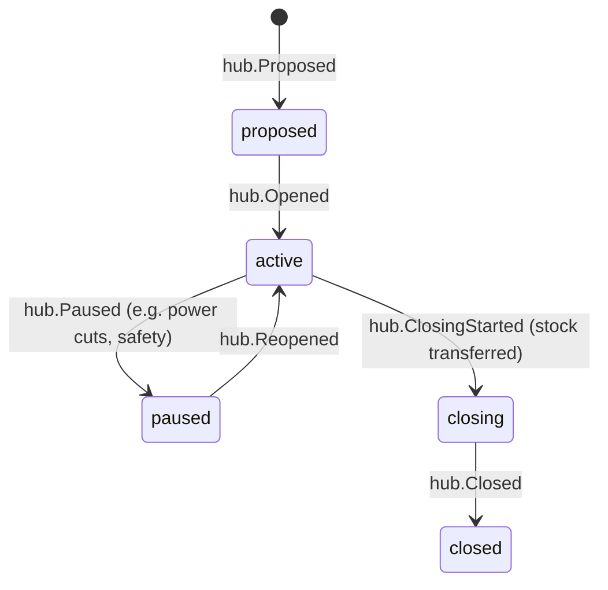

# Hub

Back to [[Entities Index]]

## Purpose

A **Hub** (river alias: *pool*; uk: «Хаб / склад») is a place where goods rest, are sorted, re-packed or collected: a warehouse, a church hall, a school storeroom, a partner's depot. In the demo, Open River Aid runs a hub in Lviv and, from Tier 3, a second in Dnipro ([[Demo Organisation]]).

## Business description

Hubs turn many small gifts into well-formed consignments and split large deliveries into household parcels. A hub has an operator (the organisation or a [[Partner Organisation]]), opening hours, capacity, and staff or [[Volunteer]]s who receive, count, sort and pack [[Item]]s. Hubs can also serve as **collection points** where recipients pick up help, by appointment and discreetly.

Hub **addresses** are shared with carriers and relevant partners. Publicly, a hub is shown by city only. Some hubs, such as those near the front line, are marked `discreet`, and even their city is withheld publicly.

## Attributes

| Field | Type | Default visibility | Notes |
|---|---|---|---|
| `id`, `code` | ULID, string | `team` | e.g. `LVIV-1` |
| `name` | per-locale text | `public` | "Open River Aid — Lviv" |
| `operatorOrgId` | id → [[Organisation]] / [[Partner Organisation]] | `public` | |
| `locationId` | id → [[Location]] | `team` (address), `public` (city) | |
| `discreet` | boolean | `team` | If true, public shows oblast only |
| `kind` | enum[] | `participants` | `storage`, `sorting`, `packing`, `collection_point`, `cross_dock` |
| `capacity` | `{palletSpaces, m3, coldStorage}` | `team` | |
| `openingHours` | schedule | `team` | Collection times given to recipients individually |
| `managerIds` | id[] → [[Person]] | `team` | Hub-scoped [[Role]] |
| `acceptedCategories` | id[] → [[Category]] | `public` | What the hub can currently accept ("we need: sleeping bags; please no used clothing") |
| `stockSummary` | projection | `team` (full), `public` (category-level signals) | |
| `status` | enum | `public` | |

## States and lifecycle

## Relationships

Operated by an [[Organisation]] or [[Partner Organisation]] · located at a [[Location]] · holds [[Item]]s · origin and destination of [[Leg]]s · packing site of [[Consignment]]s · staffed by [[Volunteer]]s and [[Coordinator]]s · incurs [[Cost Record]]s (rent, utilities, packaging).

## Events emitted

`hub.Proposed`, `hub.Opened`, `hub.AcceptedCategoriesUpdated`, `hub.StockCounted`, `hub.Paused`, `hub.Reopened`, `hub.ClosingStarted`, `hub.Closed`.

## Decision points involved

[[DP-03 Offer Acceptance]] (capacity and accepted categories) · [[DP-05 Routing and Carrier Assignment]] · [[DP-07 Dispatch]].

## Privacy notes

> [!privacy]
> Collection-point appointments are `private` to the recipient and hub staff. Recipients are never queued publicly or photographed at a hub without specific [[Consent]]. Discreet hubs are hidden from the [[Flow Map]] below oblast level.

## Principles

> [!principle] P10 — dignity in every pixel
> Collection is designed like a pharmacy pickup, not a handout line: an appointment slot, a code and a bag ready.

## UI touchpoints

[[Coordinator Workspace]] (hub inventory, receive and pack screens) · [[Admin Studio]] (hub set-up) · [[Giver Section]] ("what our hubs need now") · [[Public Portal]].
