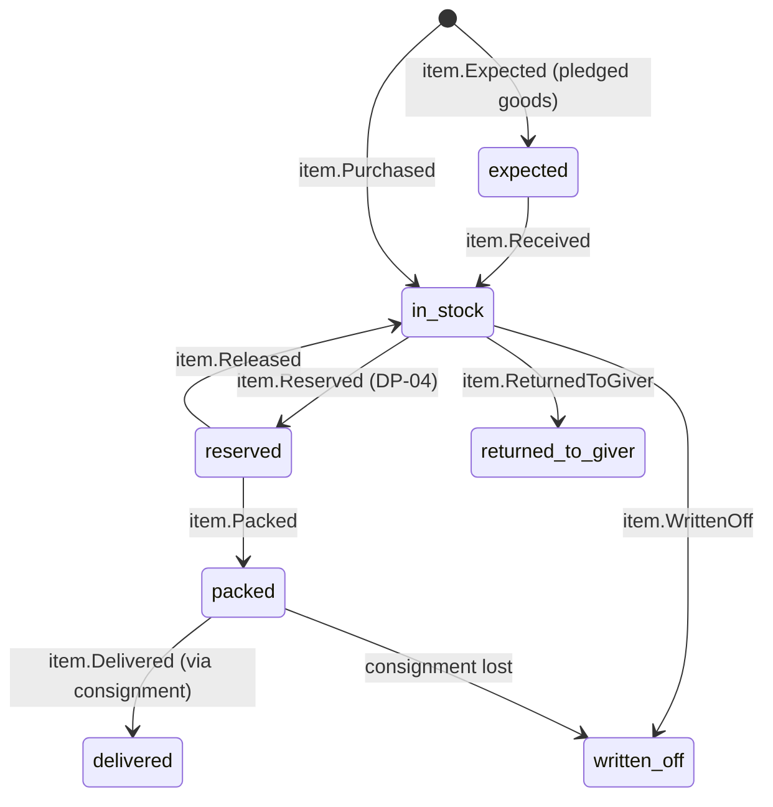

# Item

Back to [[Entities Index]]

## Purpose

An **Item** is a unit (or a counted batch) of physical goods: a generator, 20 packs of nappies, a box of insulin pens. Items are what goods [[Gift]]s are made of and what [[Consignment]]s carry. The Item gives the portal inventory at [[Hub]]s and a line-by-line trace from giver to recipient.

## Business description

Items appear when a goods gift is received: counted and checked at a hub, or recorded at pickup. They are classified by [[Category]], tracked by quantity and condition, and **reserved** for a [[Flow]] when matched. Batches are the default ("24 × thermal blankets"). Serial-level tracking is used only where it matters, for generators, power stations and medical devices.

Some items need special care:
- **Medicines**: batch number, expiry, storage conditions, and a check by a qualified volunteer where local law requires it. Expired medicine is never sent. It is written off with a reason.
- **Food**: best-before dates; first-expiring stock is used first.
- **Used clothing**: sorted by size and season. Unusable items go to textile recycling and are recorded as `written_off`, without judgement of the giver.

Items can also be bought locally with money gifts ("local purchase" form of a [[Need]]). The purchase receipt links the item to its [[Cost Record]], closing the loop from money to goods.

## Attributes

| Field | Type | Default visibility | Notes |
|---|---|---|---|
| `id` | ULID | `team` | |
| `giftId` | id → [[Gift]] | `team` | Source (absent for local purchase → `costRecordId`) |
| `costRecordId` | id → [[Cost Record]] | `team` | When bought with money gifts |
| `categoryId` | id → [[Category]] | `participants` | |
| `name` | per-locale text | `participants` | uk + en-GB |
| `quantity` | `{amount, unit}` | `participants` | `pcs`, `kg`, `l`, `pack`, `box` |
| `condition` | enum | `team` | `new`, `as_new`, `used_good` |
| `serialNumber` | string | `team` | Optional (devices) |
| `batch` | `{lot, expiresAt, storage}` | `team` | Medicines and food |
| `estimatedValue` | `{amount, currency}` | `team` | For customs, insurance and in-kind reporting |
| `hubId` / `binLocation` | id, string | `team` | Where it rests |
| `reservedForFlowId` | id → [[Flow]] | `team` | |
| `consignmentId` | id → [[Consignment]] | `team` | |
| `writeOff` | `{reason, by, at}` | `team` | `expired`, `damaged`, `unusable`, `lost` |
| `mediaIds` | id[] → [[Media Asset]] | `team` | Condition photos |
| `status` | enum | `team` | |

## States and lifecycle

## Relationships

Part of a goods [[Gift]] (or bought via a [[Cost Record]]) · classified by [[Category]] · stored at a [[Hub]] · reserved for a [[Flow]] · packed into a [[Consignment]] · delivered against a [[Need]].

## Events emitted

`item.Expected`, `item.Received`, `item.Purchased`, `hub.StockCounted`, `item.ConditionRecorded`, `item.Reserved`, `item.Released`, `item.Packed`, `item.Moved`, `item.Delivered`, `item.WrittenOff`, `item.ReturnedToGiver`.

## Decision points involved

[[DP-03 Offer Acceptance]] (whether goods are accepted at all) · [[DP-04 Matching]] (reservation) · [[DP-07 Dispatch]] (packing check, expiry check).

## Privacy notes

> [!privacy]
> Items carry no personal data. Condition photos must not show people or labels bearing names; the [[Media Asset]] pipeline assists with this.

## Principles

> [!principle] P8 — honest numbers
> In-kind value is reported separately from money and marked as an estimate. Write-offs are reported openly in the [[Impact Report]].

## UI touchpoints

[[Coordinator Workspace]] (hub inventory, receive-goods scanner, reservation) · [[Giver Section]] ("your 12 blankets were packed on 3 Nov") · [[Admin Studio]] (category and unit catalogue).
