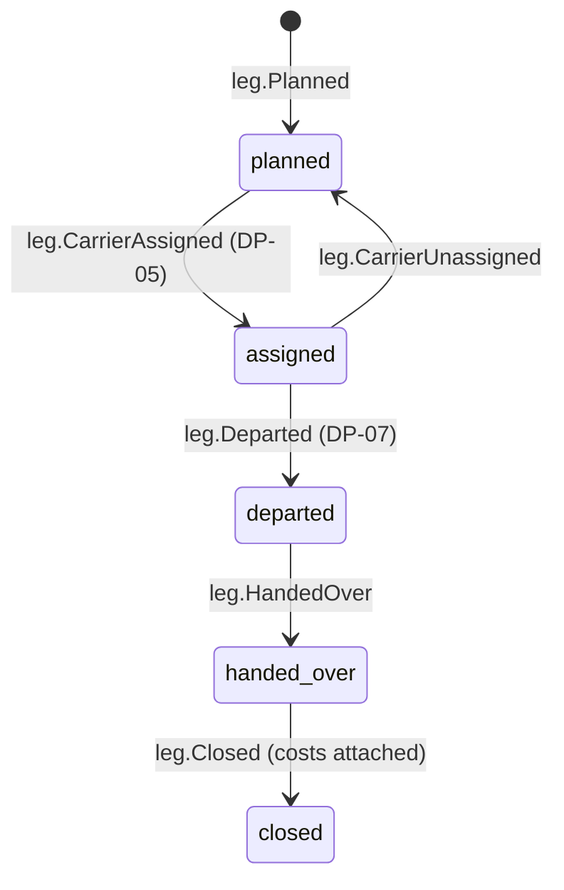

# Leg

Back to [[Entities Index]] · See [[Transport and Logistics Flow]]

## Purpose

A **Leg** (river alias: *reach*; uk: «Етап доставки») is one segment of transport from one [[Location]] or [[Hub]] to another, by one [[Carrier]]. A route such as Leeds → Przemyśl → Lviv hub → Kharkiv oblast is three or four legs.

## Business description

Legs make the physical journey visible and the carrier's work recognisable. Each leg has a planned origin, destination, date window, carrier, vehicle and the [[Consignment]]s it carries. The carrier runs it from a mobile checklist opened by a **leg-scoped magic link**: no account needed, and access limited to this leg and expiring when it closes. The checklist lets them record departure, fuel and tolls, border crossing, handover (with photo and the receiver's confirmation) and arrival.

Costs are recorded **on the leg**: fuel, tolls, ferry, parking, customs, driver subsistence. They become [[Cost Record]]s with receipts and are approved at [[DP-06 Cost Approval]]. A leg is `closed` only when its cost records are submitted, or explicitly marked "no costs".

A transport [[Gift]], such as a company donating a van run, is realised as a leg whose costs are borne by the giver. The leg then records the in-kind contribution so that the [[Transparency Ledger]] stays honest.

## Attributes

| Field | Type | Default visibility | Notes |
|---|---|---|---|
| `id` | ULID | `team` | |
| `flowId` | id → [[Flow]] | `team` | |
| `sequence` | int | `participants` | Order within the route |
| `from` / `to` | id → [[Location]] / [[Hub]] | `participants` (settlement), `public` (oblast/country) | Final-leg destination address `private` to the carrier during the leg |
| `window` | `{plannedDepart, plannedArrive}` | `participants` | |
| `carrierId` | id → [[Carrier]] ([[Person]] or [[Partner Organisation]]) | `team` | `participants` see first name / company if consented |
| `vehicle` | `{kind, plate}` | `team` | Plate is `private`; never public |
| `consignmentIds` | id[] → [[Consignment]] | `team` | |
| `mode` | enum | `participants` | `van`, `car`, `truck`, `rail`, `post`, `courier`, `ferry`, `on_foot` |
| `transportGiftId` | id → [[Gift]] | `team` | If the leg is itself a gift |
| `accessLinkHash` | hash | system | Magic link; token never stored |
| `departedAt` / `handedOverAt` | timestamps | `participants` | |
| `handover` | `{receivedBy, method, mediaIds[], note}` | `team` | Receiver: hub operator, next carrier, recipient or proxy |
| `costRecordIds` | id[] → [[Cost Record]] | `team` | Totals `public` in aggregate |
| `distanceKm` | number | `participants` | |
| `incidents` | `[{kind, note, at}]` | `team` | Delay, breakdown, checkpoint, damage |
| `status` | enum | `participants` | |

## States and lifecycle

- A delay or incident is recorded with `leg.IncidentReported` and does not change the state.
- If the carrier cannot proceed, the leg is handed over early, at the nearest safe point, to a hub or another carrier. A new leg is planned from there.

## Relationships

Part of a [[Flow]] · carries [[Consignment]]s · performed by a [[Carrier]] · connects [[Location]]s and [[Hub]]s · incurs [[Cost Record]]s · may realise a transport [[Gift]] · final leg produces a [[Delivery Confirmation]] request.

## Events emitted

`leg.Planned`, `leg.CarrierAssigned`, `leg.CarrierUnassigned`, `leg.AccessLinkIssued`, `leg.Departed`, `leg.CheckpointPassed`, `leg.IncidentReported`, `leg.HandedOver`, `costRecord.Submitted`, `leg.NoCostsDeclared`, `leg.Closed`.

## Decision points involved

[[DP-05 Routing and Carrier Assignment]] · [[DP-06 Cost Approval]] · [[DP-07 Dispatch]] · [[DP-08 Delivery Confirmation Review]] (final leg, carrier evidence).

## Privacy notes

> [!privacy]
> Live GPS is **not** tracked. Progress is recorded as check-ins at settlement or hub level, for carrier safety in conflict areas. Public maps show legs between oblasts or countries only, published with a delay. Vehicle plates and carrier phone numbers are `private`. See [[Safeguarding]].

## Principles

> [!principle] We, together
> Carriers are credited as part of the chain on the [[Journey Story]], with their consent, and never as lone heroes ([[Brand and Tone of Voice]]).

> [!principle] P8 — honest numbers
> Transport costs are shown openly, per leg in aggregate ("Lviv → Kharkiv: fuel ₴4,200, tolls €0").

## UI touchpoints

Carrier leg checklist (mobile, magic link; see [[Carrier]]) · [[Coordinator Workspace]] (route planner, carrier assignment) · [[Flow Map]] · [[Journey Story]].
