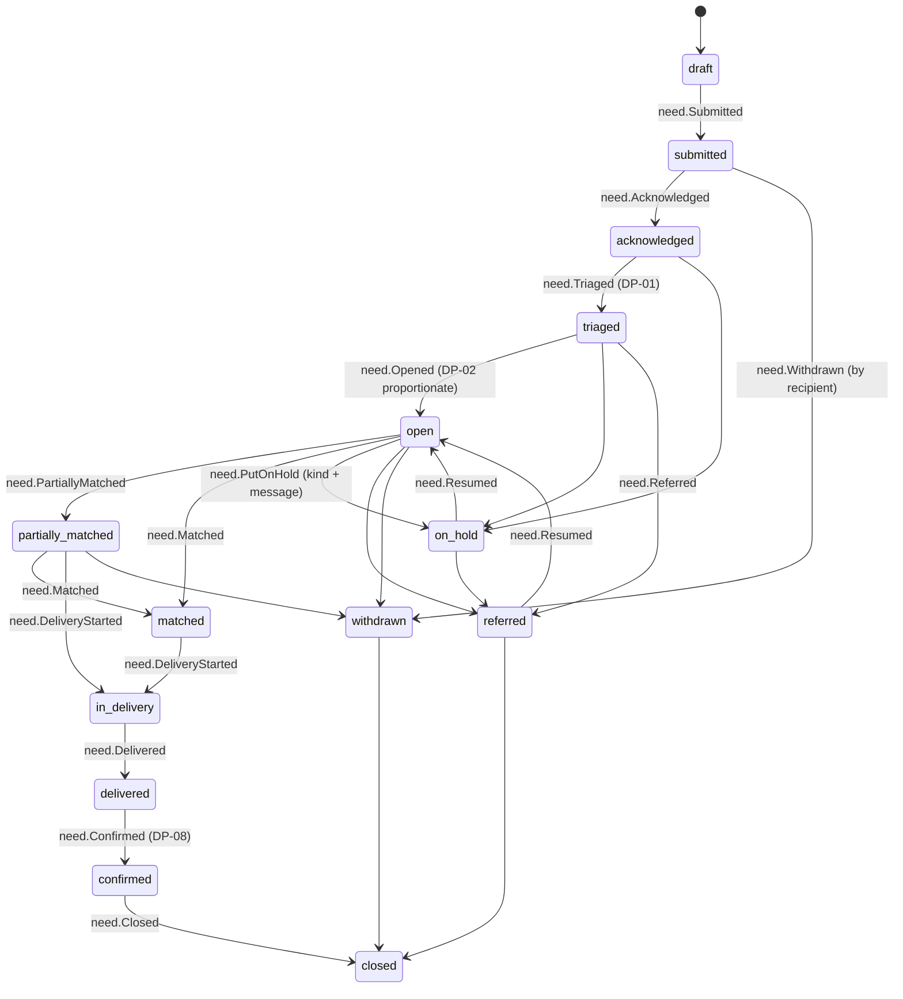

# Need

Back to [[Entities Index]] · Lifecycle narrative: [[Lifecycle of a Need]] · Glossary: [[Glossary]]

## Purpose

A **Need** (river alias: *the left bank*; uk: «Потреба») is a request for help expressed by, or on behalf of, a [[Recipient]]. It says **what** is needed, in **what form**, **where**, **by when**, **for whom**, and **how urgent it feels** to the person asking. It is the starting point of every [[Flow]] on the left bank of the river.

## Business description

A Need is respected before it is checked ([[Guiding Principles#P2. A need is respected]]). Anyone can submit one, at any time, with or without an account: an anonymous submitter gives a contact channel and receives a one-time tracking link ([[ADR-005 Open Access for Recipients]]). A need can be submitted **on behalf of** someone else: a neighbour, a relative, a volunteer, a village council, a school or a care home. It can also be entered by a [[Coordinator]] from a phone call.

The Need captures **form** as well as content. "Warmth for the winter" can arrive as a generator, fuel, a wood-burning stove, blankets or money for a local supplier, and these are different Needs. The recipient says which forms are acceptable. This drives [[DP-04 Matching]] ("water finds its level", see [[The River Concept]]).

**Urgency is self-assessed.** The system never ranks needs by worthiness, vulnerability scores or emotional appeal. Coordinators may add a separate, logistics-only *time-sensitivity* note, such as a dispatch cut-off or a road closure. They never silently downgrade the recipient's own urgency, and any adjustment is explained to the recipient.

There is **no "rejected" state.** If the organisation cannot help, the need is `referred` to a [[Partner Organisation]] or another service, or put `on_hold` with a named kind and a kind, plain-language message. The left bank stays open ([[Guiding Principles#P3. The left bank is always open]]).

One Need may be served by several Flows, for example medicine from one giver and a generator from another. One Flow may serve many Needs, for example one van for a whole village.

## Attributes

Visibility levels follow [[Visibility Levels]]. Each field carries its own level. [[Projection]]s redact per audience.

| Field | Type | Default visibility | Notes |
|---|---|---|---|
| `id` | ULID | `team` | Stable identifier; never shown publicly |
| `reference` | string | `private` | Human-friendly code given to the submitter (e.g. `ORA-N-26-0142`) |
| `orgId` | id → [[Organisation]] | `team` | Receiving organisation |
| `status` | enum (see below) | `private` | Aggregated counts only in `public` |
| `recipientId` | id → [[Person]] | `private` | The person, household or institution helped. PII lives in the person's private store, not here |
| `submittedBy` | `{personId \| null, relation}` | `private` | `relation`: `self`, `family`, `neighbour`, `volunteer`, `institution`, `coordinator`, `partner` |
| `onBehalfOf` | boolean | `private` | True when submitter ≠ recipient; triggers a gentle consent check with the recipient where possible ([[Consent]]) |
| `forWhom` | `{kind, householdSize, ageBands[], considerations[]}` | `private` | `kind`: `person`, `household`, `group`, `institution`. `considerations`: infant, older person, disability, chronic illness, pregnancy (optional, never required) |
| `what.title` | text (own words) | `private` | Written by the submitter, in their own language |
| `what.description` | rich text | `private` | Free text; voice note transcription optional |
| `categoryIds` | id[] → [[Category]] | `participants` | e.g. `energy.generator`, `medicine.chronic` |
| `quantity` | `{amount, unit}` | `participants` | Optional; "enough for 3 people for a month" is acceptable |
| `form.accepted` | enum[] | `participants` | `goods_new`, `goods_used_ok`, `cash_or_voucher`, `local_purchase`, `service`, `transport`, `time_or_skill` |
| `form.notes` | text | `private` | e.g. "diesel, not petrol", "size 34 boots" |
| `form.substitutesOk` | boolean + text | `participants` | Whether a close alternative is welcome |
| `where.locationId` | id → [[Location]] | `private` | Precise address private. `participants` see settlement, `public` sees oblast only |
| `where.deliveryPreference` | enum | `private` | `doorstep`, `collect_at_hub`, `via_institution`, `via_neighbour`, `pharmacy_voucher` |
| `when.neededBy` | date \| window | `participants` | Optional hard date |
| `when.recurrence` | enum | `team` | `one_off`, `weekly`, `monthly`, `seasonal` |
| `urgency.self` | enum | `private` | `can_wait`, `within_weeks`, `within_days`, `today` — the recipient's own words, never overwritten |
| `urgency.timeSensitivityNote` | text | `team` | Logistics-only note from triage; visible to recipient if it changes expectations |
| `intentStatementId` | id → [[Intent Statement]] | `private` | Optional "why I am asking"; never required |
| `language` | BCP 47 | `team` | `uk`, `en-GB`, … drives [[Translation]] |
| `contactChannel` | ref → person private store | `private` | SMS, phone, email, Telegram, Viber, or via proxy |
| `trackingTokenHash` | hash | system | For account-less tracking link; token itself never stored |
| `verification` | `{level, verificationIds[]}` | `team` | Depth V0–V4 ([[Canonical Parameters]]); a reference to the parallel [[Verification]] record, not a status |
| `safeguardingFlag` | `{raised, category}` | `sealed` | Only [[Safeguarding]] Lead + assigned coordinator |
| `hold` | `{kind, messageToRecipient, reviewAt}` | `private` | `kind`: `awaiting_resources`, `awaiting_clarification`, `seasonal`, `outside_area_temporarily` |
| `referral` | `{partnerOrgId \| service, message, consentId}` | `private` | Sharing with a partner requires recipient consent |
| `flowIds` | id[] → [[Flow]] | `team` | Many-to-many |
| `consentIds` | id[] → [[Consent]] | `private` | Story, photo, referral consents |
| `aiSummary` | `{text, reviewedBy}` | `team` | Vertex draft to help triage; advisory, human-reviewed ([[Vertex AI Integration]]) |
| `publicSummary` | text | `public` | Only when curated and consented, e.g. "A family in Kharkiv oblast asked for a generator for winter" |

## States and lifecycle

- `acknowledged` is reached automatically in under 1 hour, followed by first human contact within 48 hours ([[Canonical Parameters]]). The recipient always knows their request has been heard.
- `partially_matched`: some accepted forms or quantities are covered by a [[Flow]], others are still open.
- Recurring needs close each occurrence and spawn a new Need linked by `previousNeedId`.
- `withdrawn` is only ever the recipient's (or their proxy's) choice. Coordinators cannot withdraw a need.
- **Verification is not a status.** [[DP-02 Need Verification]] runs as a parallel [[Verification]] record (`verification.Requested` → `verification.Completed` / `verification.Waived`). While it runs the need stays `triaged`; `need.Opened` follows when the chosen depth is satisfied or waived. There is no `verifying` or `verified` Need status.

## Relationships

- Belongs to a [[Recipient]] ([[Person]] or institution), optionally submitted by another [[Person]] acting as proxy.
- Classified by one or more [[Category]] entries. Located at a [[Location]].
- Served by one or more [[Flow]]s, which link to [[Gift]]s. Delivery is evidenced by [[Delivery Confirmation]].
- May be grouped under a [[Campaign]] or [[Programme]] by a coordinator.
- Guarded by [[Consent]], [[Visibility Policy]], [[Verification]] and optionally [[Intent Statement]].
- May produce [[Gratitude Note]]s and, with consent, [[Journey Story]] publications.
- All changes recorded as [[Log Event]]s. See [[Entity Relationship Map]].

## Events emitted

| Event | When |
|---|---|
| `need.Drafted` | Draft saved (account holders only; anonymous drafts stay on device) |
| `need.Submitted` | Submitted via web, phone intake or partner |
| `need.Acknowledged` | Receipt acknowledged to the submitter |
| `need.ClarificationRequested` / `need.Clarified` | Coordinator asks, recipient answers (status unchanged) |
| `need.Amended` | Recipient or coordinator changes content (new version; history kept) |
| `need.Triaged` | [[DP-01 Need Triage]] outcome recorded |
| `need.Opened` | Visible to matching |
| `need.PartiallyMatched` / `need.Matched` | Linked to Flow(s) at [[DP-04 Matching]] |
| `need.DeliveryStarted` / `need.Delivered` / `need.Confirmed` | Mirror of Flow and [[Delivery Confirmation]] progress |
| `need.PutOnHold` / `need.Resumed` | With `kind` and message |
| `need.Referred` | To partner or service |
| `need.Withdrawn` | By recipient or proxy |
| `need.Closed` | Final |
| `safeguarding.ConcernRaised` | `sealed` visibility |
| `visibility.Changed` | Via [[DP-12 Visibility Change]] |

Full catalogue: [[Event Catalogue]].

## Decision points involved

- [[DP-01 Need Triage]]: category, completeness, hold, refer or open; logistics note.
- [[DP-02 Need Verification]]: proportionate depth; history and signals choose *how much* to check, never *whether* to help.
- [[DP-04 Matching]]: forms and quantities matched to Gifts.
- [[DP-08 Delivery Confirmation Review]]: especially proxy or carrier-evidence confirmations.
- [[DP-09 Publication Consent]] and [[DP-12 Visibility Change]]: any story or public summary.

## Privacy notes

> [!privacy] Private by default
> Everything about a Need that could identify a person is `private`. [[Giver]]s and [[Carrier]]s see a pseudonymised view ("a family of four in Izium raion"). Carriers see the delivery address only for their assigned [[Leg]], and only for its duration. The public sees aggregates by oblast and [[Category]]. See [[Privacy Model]] and [[Data Minimisation]].

> [!privacy] On-behalf-of submissions
> When a proxy submits, the recipient's details are held under the recipient's own [[Person]] record. Where the recipient can be reached, they are asked (by SMS or a call) to confirm and to choose their consents. Proxies never gain access to the recipient's later messages unless the recipient agrees.

> [!privacy] Sensitive categories
> Health, disability and similar details are optional free text. They are never required fields and are encrypted with per-person keys (crypto-shredding on erasure; see [[Data Retention]]).

## Principles

> [!principle] P2 — a need is respected
> No worthiness score, no ranking, no "most heart-breaking" sort. Queues default to *oldest acknowledged first* within self-assessed urgency. See [[Guiding Principles#P2. A need is respected]].

> [!principle] P3 — the left bank is always open
> A person with an unconfirmed past delivery or a contested [[Reputation]] signal can still submit. History only changes verification depth ([[ADR-005 Open Access for Recipients]]).

> [!principle] P6 — clear water
> AI assistance may help phrase a need clearly, but clarity is never a precondition. A one-line need is valid.

## UI touchpoints

- [[Help Seeker Section]]: 4-step form (what and form, where, when and urgency, contact), voice input, "asking for someone else" switch, tracking page.
- [[Coordinator Workspace]]: intake queue, triage panel, phone-intake form, hold/refer dialogues with message templates.
- [[Public Portal]] and [[Flow Map]]: aggregated needs by oblast and category.
- [[Accessibility]] and [[Multilingual Experience]]: reading age about 9, uk-first.
