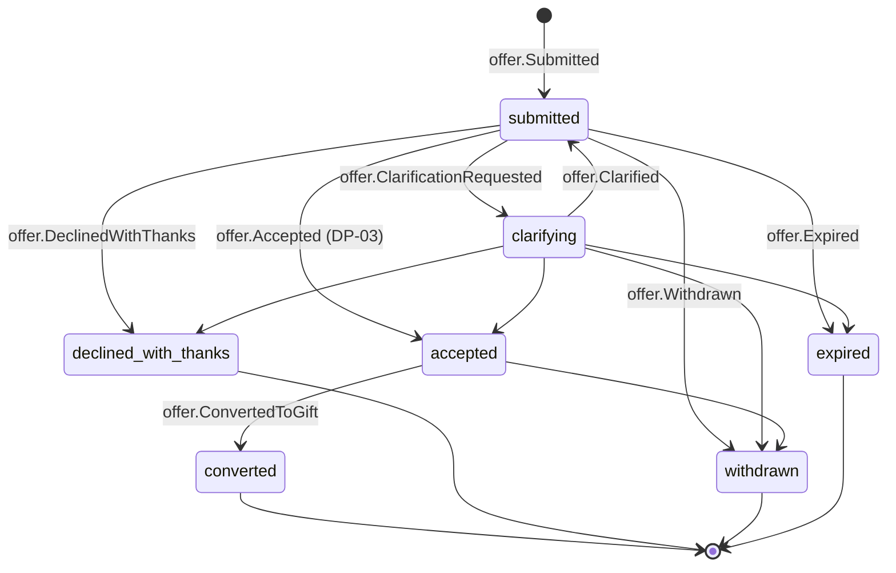

# Offer

Back to [[Entities Index]] · See also [[Lifecycle of a Gift]]

## Purpose

An **Offer** (river alias: *spring*; uk: «Пропозиція допомоги») is a declared willingness to give, made before anything has changed hands. It lets the organisation **shape** a gift so that it fits real [[Need]]s, and gives it the chance to **decline gracefully** when it does not fit.

## Business description

A [[Giver]], [[Sponsor]], [[Volunteer]], [[Carrier]] or [[Partner Organisation]] says: "I can give *this*, in *this form*, *here*, *then*." The Offer may be:

- **money**: a one-off or recurring amount, usually made directly through a payment link. The Offer stage is then very short and becomes a pledged [[Gift]] straight away.
- **goods**: new or used, with condition, quantity and pickup location.
- **service**: e.g. a pharmacist's consultation, a plumber's day, legal advice.
- **time**: volunteering, packing shifts, translation.
- **transport**: van space, a driver, a route and a date window.

Offers of goods, services, time and transport pass through [[DP-03 Offer Acceptance]]. A coordinator checks fit with open needs and hub capacity (no one needs 400 used winter coats in July). They also check the intent: no proselytising, political branding, data harvesting or publicity-for-sale conditions ([[Guiding Principles|Guiding Principles, P6]]).

An accepted Offer is **converted** into one or more [[Gift]]s. A van offer, for example, might become two transport gifts on two [[Leg]]s. An offer that doesn't fit is **declined with thanks**. It is never "rejected", and the giver is pointed to a better home for it where possible.

## Attributes

| Field | Type | Default visibility | Notes |
|---|---|---|---|
| `id` | ULID | `team` | |
| `orgId` | id → [[Organisation]] | `team` | |
| `offeredBy` | id → [[Person]] / [[Organisation]] | `private` | Giver's identity; `team` sees name for coordination |
| `onBehalfOfOrgId` | id → [[Partner Organisation]] | `team` | When a company or partner offers |
| `kind` | enum | `participants` | `money`, `goods`, `service`, `time`, `transport` |
| `description` | text | `team` | In giver's words |
| `categoryIds` | id[] → [[Category]] | `participants` | |
| `quantity` | `{amount, unit}` | `team` | |
| `condition` | enum | `team` | Goods: `new`, `as_new`, `used_good`, `mixed` |
| `money` | `{amount, currency, recurrence}` | `private` | ISO 4217; amount private to giver + finance unless giver opts in |
| `availability` | `{from, until, windows[]}` | `team` | Especially for time, service, transport |
| `pickupLocationId` | id → [[Location]] | `private` | Precise address private; `team` sees town |
| `transport` | `{vehicle, capacityKg, capacityM3, routeFrom, routeTo, date}` | `team` | For carrier offers |
| `restriction` | `{kind, text}` | `team` | Giver's wish ("only for children's needs", "transport only"); becomes a restricted fund on the [[Gift]] |
| `targetNeedIds` / `campaignId` | id | `team` | If offered in response to a specific need or [[Campaign]] |
| `intentStatementId` | id → [[Intent Statement]] | `team` | Optional short "why I give" |
| `recognitionPreference` | enum | `private` | `anonymous`, `first_name`, `full_name`, `organisation_name`. Governs [[Recognition]], never priority |
| `declineMessage` | text | `private` | Kind explanation + suggestion |
| `giftIds` | id[] → [[Gift]] | `team` | Result of conversion |

## States and lifecycle

- Money offers made through a payment link skip to `converted` automatically. The payment provider webhook appends `gift.Received` ([[Money Flow and Cost Transparency]]).
- `expired`: the availability window passed without a match. The giver gets a warm note and an invitation to re-offer.

## Relationships

- Made by a [[Giver]], [[Sponsor]], [[Carrier]], [[Volunteer]] or [[Partner Organisation]].
- May respond to a [[Need]] or a [[Campaign]]. Converted into one or more [[Gift]]s.
- Classified by [[Category]]; pickup at a [[Location]] or [[Hub]].
- Accepted through [[DP-03 Offer Acceptance]]; intent optionally stated via [[Intent Statement]].

## Events emitted

`offer.Submitted`, `offer.ClarificationRequested`, `offer.Clarified`, `offer.Amended`, `offer.Accepted`, `offer.ConvertedToGift`, `offer.DeclinedWithThanks`, `offer.Withdrawn`, `offer.Expired`. See [[Event Catalogue]].

## Decision points involved

- [[DP-03 Offer Acceptance]]: fit, capacity, intent, safety (e.g. medicines need a licence and expiry checks).
- [[DP-04 Matching]]: the accepted offer's resulting gifts are matched to needs.
- [[DP-05 Routing and Carrier Assignment]]: for transport offers.

## Privacy notes

> [!privacy]
> Offer amounts and giver identity are `private` by default. Recipients never see who offered unless the giver chose named recognition **and** the recipient wants to know. Pickup addresses are released to the assigned [[Carrier]] only for the pickup [[Leg]].

## Principles

> [!principle] P1 — a gift is a gift
> An offer cannot carry conditions that buy visibility, influence or data: "I'll give if you put my logo on the aid", or "if recipients sign up to my newsletter". Such conditions are declined at [[DP-03 Offer Acceptance]]. See [[Recognition Anti-Patterns]].

> [!principle] P6 — clear water
> The decline message is always kind and specific, and suggests an alternative where possible.

## UI touchpoints

- [[Giver Section]]: "What can you give?" chooser (money · goods · service · time · transport), with live hints from open needs by category.
- [[Coordinator Workspace]]: offers inbox, clarification thread, accept / decline-with-thanks templates, conversion wizard.
- [[Campaign Page]]: offer buttons scoped to the campaign.
