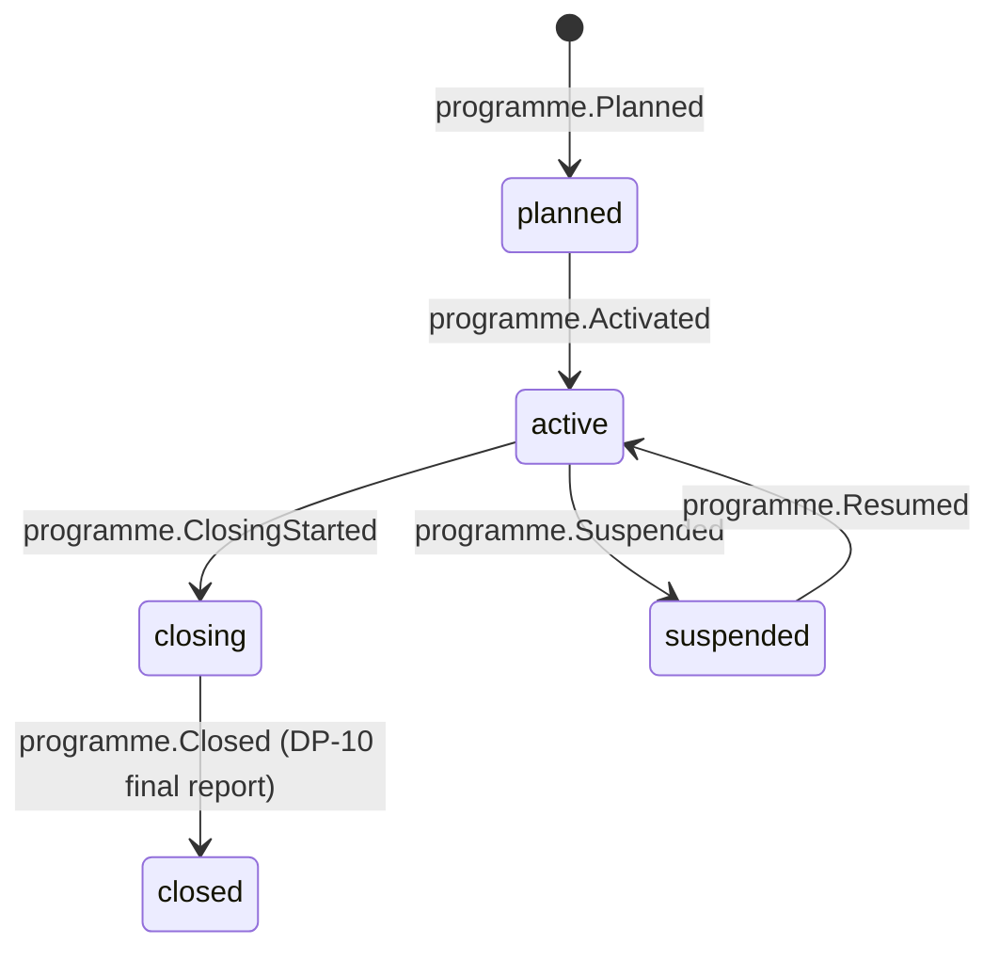

# Programme

Back to [[Entities Index]]

## Purpose

A **Programme** (river alias: *basin*; uk: «Програма») is a long-running body of work that contains many [[Campaign]]s and [[Flow]]s under one purpose, geography or funder, such as "Winter Warmth — Kharkiv and Dnipro oblasts 2026–27". It is optional at Tier 3 and standard at Tier 4 ([[Scaling Tiers]]).

## Business description

Programmes let a larger organisation plan and report at the level trustees, grant funders and auditors think in: objectives, budgets, regions, periods and outcomes. A programme:

- groups campaigns and flows for reporting;
- holds **restricted funding** from grants and major [[Sponsor]]s, with conditions, reporting deadlines and eligible cost categories;
- sets defaults for its flows: the [[Category]] focus, the [[Verification]] depth, the [[Visibility Policy]] and the partner organisations involved;
- defines the indicators that feed [[Impact Metrics]] and the programme [[Impact Report]].

A programme may be run jointly with [[Partner Organisation]]s. Each partner's contributions, costs and deliveries stay attributable.

## Attributes

| Field | Type | Default visibility | Notes |
|---|---|---|---|
| `id`, `slug` | ULID, string | `public` | |
| `orgId` | id → [[Organisation]] | `public` | Lead organisation |
| `partnerOrgIds` | id[] → [[Partner Organisation]] | `public` | With partner consent |
| `title`, `summary`, `objectives` | per-locale content | `public` | |
| `period` | `{startsAt, endsAt}` | `public` | |
| `regions` | id[] → [[Location]] (oblast level) | `public` | Never finer than oblast publicly |
| `categoryFocus` | id[] → [[Category]] | `public` | |
| `programmeLeadId` | id → [[Person]] | `team` | |
| `fundingLines` | `[{sponsorId, amount, currency, restriction, reportingDue}]` | `team` | Grant terms; `public` aggregate only with funder consent |
| `eligibleCostCategories` | enum[] | `team` | Enforced at [[DP-06 Cost Approval]] |
| `indicators` | `[{key, target, unit}]` | `public` | e.g. households reached, generators delivered |
| `defaults` | `{verificationLevel, visibilityPolicyId}` | `team` | Inherited by flows |
| `campaignIds` / `flowIds` | id[] | `team` | |
| `status` | enum | `public` | |

## States and lifecycle

`closing`: no new flows; open flows finish, costs reconcile, grant reports are drafted.

## Relationships

Contains [[Campaign]]s and [[Flow]]s · funded by [[Sponsor]]s and [[Gift]]s with restrictions · run by an [[Organisation]] and [[Partner Organisation]]s · reported by [[Impact Report]] and [[Donor Report]] · scopes [[Role]] assignments (e.g. a programme-scoped Finance Steward).

## Events emitted

`programme.Planned`, `programme.Activated`, `programme.FundingLineAdded`, `programme.IndicatorDefined`, `programme.Suspended`, `programme.Resumed`, `programme.ClosingStarted`, `programme.Closed`.

## Decision points involved

[[DP-06 Cost Approval]] (eligibility against funding lines) · [[DP-10 Report Publication]] · [[DP-12 Visibility Change]] (funder names public).

## Privacy notes

> [!privacy]
> Programme dashboards aggregate people-level data. Small cells (for example fewer than 5 households in a raion) are suppressed or merged in any `public` or funder-facing output. See [[Data Minimisation]].

## Principles

> [!principle] P11 — scale without changing character
> A programme adds structure, not distance. Needs inside a programme are still respected individually and never turned into "caseload units".

## UI touchpoints

[[Admin Studio]] (programme set-up, funding lines) · [[Coordinator Workspace]] (programme filter) · [[Impact Report]] / [[Public Portal]] programme pages · [[Content Editor]].
