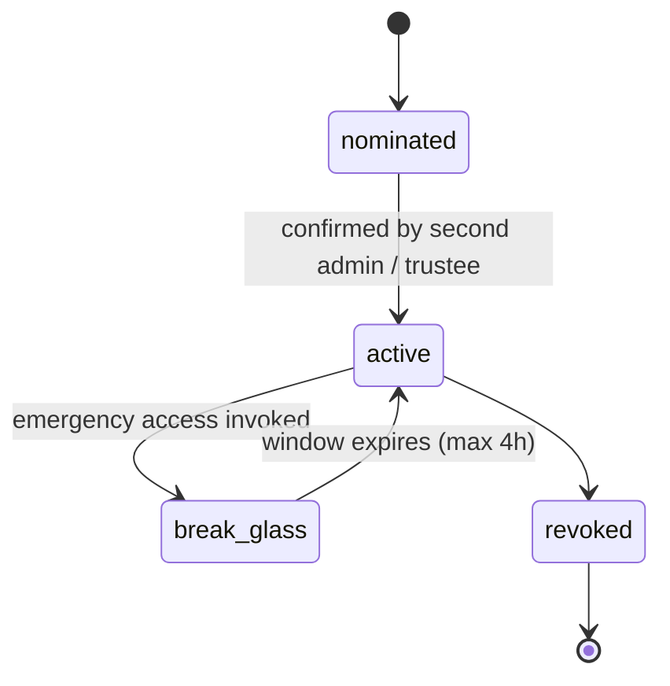

# Administrator

Back to [[Entities Index]].

## Purpose

*River alias: the keeper of the riverbed — not of any single stream.*

A [[Person]] responsible for the configuration of an operating [[Organisation]]'s portal: people and [[Role]]s, feature switches, [[Visibility Policy]] defaults, retention, integrations and branding. Administration is about the **shape of the system**, not access to people's data.

## Business description

Iryna, director of Open River Aid, is accountable to trustees and auditors. As Administrator she onboards staff, maps Google groups to roles, turns on Tier 2 need intake once a Safeguarding Lead is named, sets retention periods, and appoints an Auditor for the annual review. She wants oversight without micromanagement: dashboards built from projections, not access to every recipient file.

An Administrator does **not** automatically see `private` or `sealed` data. To read a specific record they need a role on it, or they invoke **break-glass** access: time-limited, with a written reason, notifying the Safeguarding Lead and logged as `system.BreakGlassUsed`.

## Responsibilities

| Area | Actions | Guard-rail |
|---|---|---|
| People and roles | Grant / revoke / time-box roles, map IAP groups | Granting Safeguarding Lead or Finance Steward needs a second Administrator or trustee (four-eyes). |
| Organisation settings | Locales, currency, features, branding | Logged as `organisation.SettingsChanged`. |
| Visibility defaults | Organisation-wide [[Visibility Policy]] | Cannot lower protection below platform floors; changes go through [[DP-12 Visibility Change]]. |
| Retention | Periods per record kind | Cannot go below legal minimums or above platform maximums. See [[Data Retention]]. |
| Integrations | Payment links, notification providers, Vertex AI features | Secrets live in Secret Manager; admins never see raw keys. |
| Erasure | Fulfil erasure requests (crypto-shred) | Two-step: request, then confirm after hold period. |

## Attributes

| Field | Type | Default visibility | Notes |
|---|---|---|---|
| `personId` | ref | `team` | |
| `grant` | [[Role]] (Administrator, scope: organisation) | `team` | |
| `workspaceSubject` | IAP identity | `team` | Staff-only; see [[IAP Staff Access]]. |
| `mfaEnforced` | boolean | `team` | Must be true (Workspace policy). |
| `breakGlassHistory` | projection | `team` | Visible to trustees and Auditors. |

## States / lifecycle

Follows the [[Role]] lifecycle (active → suspended / revoked / expired). An Organisation must always have **at least two** active Administrators from Tier 2 upwards; the last Administrator cannot revoke themselves.

## Relationships

- Configures the [[Organisation]], its [[Visibility Policy]] and [[Role]] grants.
- Oversees via projections in [[Admin Studio]]; appoints Auditors (see [[Accountability and Audit]]).
- Accountable for set-up in the [[Responsibility Matrix]].

## Events emitted

Administrators act mostly through other aggregates' events:

| Event | When |
|---|---|
| `role.Granted` / `role.Revoked` | People management. |
| `organisation.SettingsChanged` | Configuration. |
| `visibility.PolicyChanged` | Defaults changed. |
| `system.BreakGlassUsed` | Emergency access, with reason, start and end, and records opened. |
| `person.KeyShredded` | Erasure fulfilled. |

## Decision points involved

- [[DP-12 Visibility Change]] — organisation-wide defaults.
- [[DP-10 Report Publication]] — annual reports (with Editor).
- [[Escalation and Disputes]] — final internal escalation before trustees.

## Privacy notes

> [!privacy] Power over structure, not over people
> Administrators shape rules; they do not browse personal records. Every break-glass is visible to the Safeguarding Lead, trustees and Auditors.

## Principles

> [!principle] [[Guiding Principles#P4. Private by default|P4 Private by default]]
> Even the most powerful role sees personal data only when needed and logged.

> [!principle] [[Guiding Principles#P7. The river remembers|P7 The river remembers]]

## UI touchpoints

- [[Admin Studio]] — all administration.
- [[Content Editor]] — branding, navigation (with Editor).
