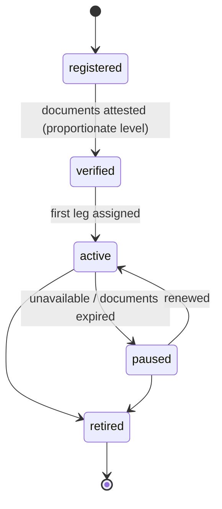

# Carrier

Back to [[Entities Index]].

## Purpose

*River alias: the boatman.*

Anyone who moves a [[Consignment]] along a [[Leg]]: a volunteer driver, a courier, a postal service, a logistics company or a [[Partner Organisation]]. The Carrier role holds what the coordinator needs to plan transport safely and what the carrier needs to be reimbursed and thanked.

## Business description

Mykola drives a volunteer van between Lviv and Kharkiv. For each Leg he opens a **leg-scoped magic link** on his phone: a checklist (load, depart, hand over), photo capture at hand-over, and cost entry for fuel and tolls with receipt photos. He does not need a full account, and the app tolerates poor connectivity by queueing actions offline.

A Polish logistics firm may carry the UK → Poland Leg under a commercial contract; it is still a Carrier, and its invoice becomes a [[Cost Record]]. A national postal service may be a Carrier with only a tracking number.

## Attributes

| Field | Type | Default visibility | Notes |
|---|---|---|---|
| `carrierId` | ULID | `team` | |
| `kind` | volunteer_driver \| courier \| postal_service \| logistics_company \| partner_organisation | `team` | |
| `subjectRef` | `personId` \| `orgId` | `private` | |
| `vehicle` | {type, capacityKg, capacityM3, refrigerated} | `team` | Registration plate `private`. |
| `routesServed` | [[Location]] pairs / corridors | `team` | e.g. Lviv → Kharkiv oblast. |
| `documentsChecked` | [{kind: driving_licence \| insurance \| company_registration \| cross_border_permit, checkedAt, checkedBy, expiresAt}] | `private` | Attestation only; documents are seen, not stored. See [[Verification]]. |
| `reimbursementMethod` | {kind, externalRef} | `private` | Bank details are not stored in the portal. |
| `availability` | calendar slots / "ad hoc" | `team` | |
| `emergencyContact` | contact ref | `sealed` | For incidents on dangerous routes. |
| `publicCredit` | none \| first_name \| full_name \| organisation_name | `private` | Named credit in a [[Journey Story]] only with [[Consent]]. |

## States / lifecycle

Leg-level states (planned → assigned → departed → handed_over → closed) live on [[Leg]].

## Relationships

- Assigned to [[Leg]]s at [[DP-05 Routing and Carrier Assignment]]; carries [[Consignment]]s between [[Hub]]s and [[Location]]s.
- Submits [[Cost Record]]s approved at [[DP-06 Cost Approval]].
- May submit a carrier-with-evidence [[Delivery Confirmation]] when the recipient cannot.
- Receives [[Gratitude Note]]s via the [[Gratitude Loop]].
- Reliability and timeliness signals feed [[Reputation]].

## Events emitted

| Event | When |
|---|---|
| `role.Granted` (role: carrier) | Carrier role created. |
| `verification.Completed` | Document attestation recorded. |
| `role.AvailabilityChanged` | Slots or corridors offered. |
| `leg.AccessLinkIssued` / `leg.AccessLinkRevoked` | Leg-scoped access. |
| `role.Paused` / `role.Resumed` / `role.Relinquished` | Status changes. |
| `leg.IncidentReported` | Accident, delay, border problem — visibility `team`, or `sealed` if people are at risk. |

Leg actions emit `leg.*` events (e.g. `leg.Departed`, `leg.HandedOver`).

## Decision points involved

- [[DP-05 Routing and Carrier Assignment]] · [[DP-06 Cost Approval]] · [[DP-07 Dispatch]] · [[DP-08 Delivery Confirmation Review]].

## Privacy notes

> [!privacy] Carriers see only their leg
> A magic link shows the pick-up and drop-off for one Leg, a contact for hand-over and the Consignment manifest. The final recipient's address is shown only on the last Leg, and only for as long as it is open. Photos taken at hand-over go through EXIF/GPS stripping and default to `private`.

> [!privacy] Location of carriers
> Live location is not tracked. Carriers report milestones. On high-risk routes, even milestones default to `team`.

## Principles

> [!principle] [[Guiding Principles#P8. Honest numbers, beautifully shown|P8 Honest numbers]]
> Transport costs are real and shown openly, with receipts.

> [!principle] [[Guiding Principles#P9. Thanks travels upstream|P9 Thanks travels upstream]]
> The boatman is part of the chain and is thanked.

## UI touchpoints

- [[Coordinator Workspace]] — carrier pool, assignment.
- Carrier leg view (mobile, magic link) within [[Public Portal]]; offline behaviour in [[Accessibility]].
