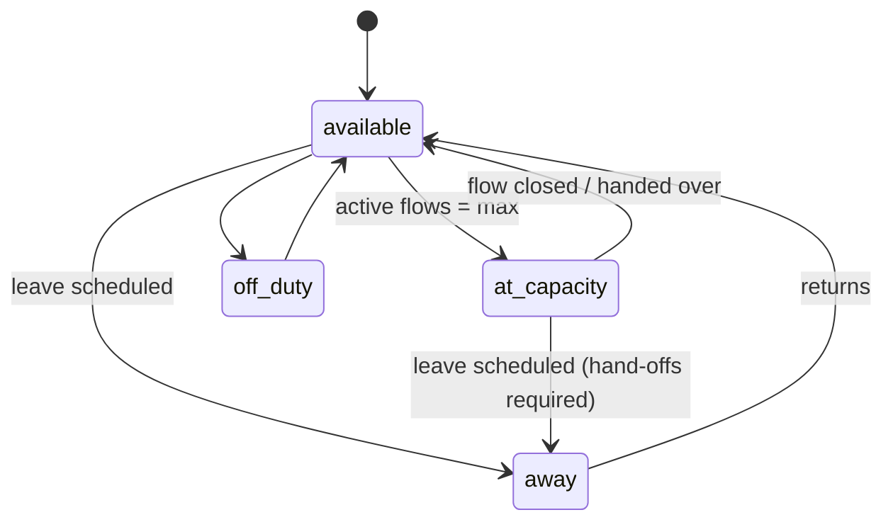
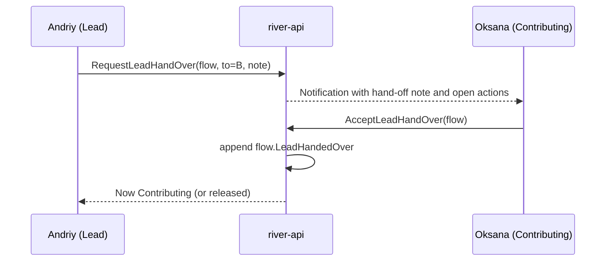

# Coordinator

Back to [[Entities Index]].

## Purpose

*River alias: the riverkeeper — one who tends the channel so water can reach where it is needed.*

A staff or volunteer [[Person]] who shapes [[Flow]]s: triages [[Need]]s, clarifies [[Offer]]s, matches, plans [[Leg]]s, records costs, reviews confirmations and prepares reports. Coordinators take most decisions in [[Decision Points Overview]].

## Business description

Andriy juggles 40 open requests, three vans and a group chat. The portal replaces the chat with one queue of next actions. Every Flow has exactly **one Lead Coordinator** (accountable) and **any number of Contributing Coordinators** (helping with parts such as transport, calls or reporting). Leadership can pass between people; each **hand-off** is logged with a note so nothing is lost when Andriy goes on leave.

Coordinators are staff with Google Workspace identities entering the studio through [[IAP Staff Access]]. Suggestions from [[Vertex AI Integration]] (need summaries, matching suggestions, report drafts) are advisory only; a Coordinator always decides.

## Attributes

| Field | Type | Default visibility | Notes |
|---|---|---|---|
| `personId` | ref | `team` | |
| `grants` | [[Role]] refs (Coordinator, variant lead \| contributing, scope) | `team` | |
| `languages` | BCP 47 list | `team` | Used to route needs in `uk` to Ukrainian speakers. |
| `regions` | [[Location]] refs | `team` | Areas they know. |
| `specialisms` | [[Category]] refs | `team` | e.g. medical, transport, institutions. |
| `capacity` | {maxActiveFlows, currentActiveFlows (projection)} | `team` | Prevents silent overload. |
| `availability` | available \| at_capacity \| away (from, to) \| off_duty | `team` | `away` triggers hand-off prompts. |
| `onCall` | boolean | `team` | For urgent needs out of hours. |
| `publicTitle` | string | `public` with [[Consent]] | e.g. "Andriy, coordinator in Lviv" in a [[Journey Story]]. |

## States / lifecycle

Availability state (the role grant lifecycle is in [[Role]]):

### Hand-off

A hand-off is not complete until accepted. If unaccepted within the configured window, the Flow is escalated to the Organisation's coordinating lead ([[Escalation and Disputes]]).

## Relationships

- Leads or contributes to [[Flow]]s, [[Campaign]]s, [[Programme]]s through [[Role]] grants.
- Takes decisions at DP-01 to DP-08 and DP-11; see [[Responsibility Matrix]].
- May hold variants: Safeguarding Lead, Finance Steward, Editor.
- Works alongside [[Carrier]]s, [[Volunteer]]s and [[Partner Organisation]]s. Described in [[Coordination Model]].

## Events emitted

| Event | When |
|---|---|
| `role.AvailabilityChanged` | available / away / off duty, or max active flows updated. |
| `flow.CoordinatorJoined` | Lead or Contributing added to a Flow. |
| `flow.LeadHandoverProposed` / `flow.LeadHandoverDeclined` | Hand-off proposal; acceptance emits `flow.LeadHandedOver`. |
| `ai.SuggestionAccepted` / `ai.SuggestionRejected` | A Vertex suggestion accepted (possibly edited) or dismissed (keeps AI accountable). |

## Decision points involved

[[DP-01 Need Triage]] · [[DP-02 Need Verification]] · [[DP-03 Offer Acceptance]] · [[DP-04 Matching]] · [[DP-05 Routing and Carrier Assignment]] · [[DP-06 Cost Approval]] (as Lead, or Finance Steward) · [[DP-07 Dispatch]] · [[DP-08 Delivery Confirmation Review]] · [[DP-11 Reputation Review]].

## Privacy notes

> [!privacy] Access follows assignment
> A Coordinator sees `private` fields only for Flows where they hold a grant. On hand-off, the previous Lead's access narrows to Contributing or ends. `sealed` needs the Safeguarding Lead variant.

## Principles

> [!principle] [[Guiding Principles#P2. A need is respected|P2 A need is respected]]
> Coordinators triage by urgency and fit, never by "worthiness".

> [!principle] [[Guiding Principles#P7. The river remembers|P7 The river remembers]]
> Every decision and hand-off is an event with an actor, so responsibility is clear and shared honestly.

## UI touchpoints

- [[Coordinator Workspace]] — queue, flow board, hand-off, suggestions.
- [[Admin Studio]] — capacity and regions.
