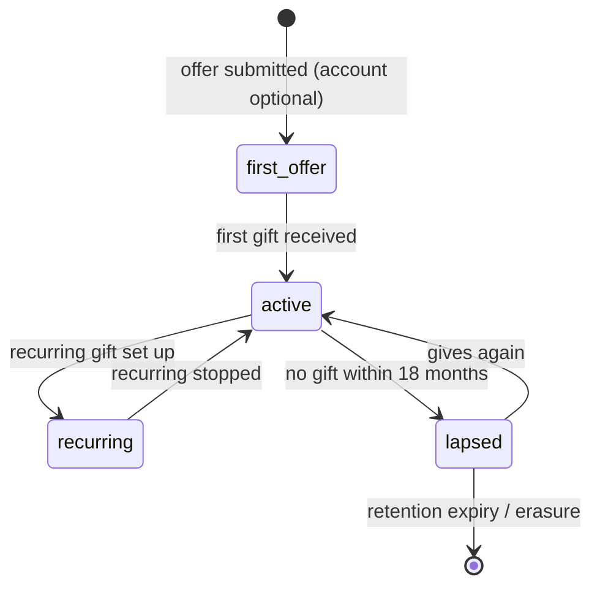

# Giver

Back to [[Entities Index]].

## Purpose

*River alias: the spring.*

A [[Person]] or [[Organisation]] that gives money, goods, services, time or transport. The Giver role holds preferences about how the giver is thanked, reported to and (optionally) named — never anything that could make a gift into a purchase.

## Business description

James in Leeds gives GBP 20 each month through a payment link. He wants to see that his money became diesel and that the diesel reached a village. A furniture shop gives six beds; a pharmacist gives time. Each of them is a Giver.

A Giver's contribution starts as an [[Offer]], is clarified and accepted ([[DP-03 Offer Acceptance]]), and becomes one or more [[Gift]]s allocated to [[Flow]]s. The Giver then receives a [[Donor Report]], [[Gratitude Note]]s (when the recipient chooses to send thanks) and can follow a [[Journey Story]].

Money gifts at Tier 1 go through external payment links; the portal records the pledge and evidence of receipt only (card data never touches the portal — see [[Money Flow and Cost Transparency]]).

## Attributes

| Field | Type | Default visibility | Notes |
|---|---|---|---|
| `giverId` | ULID | `team` | |
| `kind` | individual \| organisation \| group (e.g. a school class) | `team` | |
| `subjectRef` | `personId` \| `orgId` | `private` | |
| `displayPreference` | anonymous \| first_name \| initials \| full_name \| organisation_name | `private` | Default `anonymous` for the public; see below. |
| `showAmounts` | boolean | `private` | Default false. Amounts are never public per giver unless chosen. |
| `giftAidDeclaration` | {declared, declaredAt, wordingVersion, addressRef} | `private` | UK Gift Aid: requires legal name and home address; held on [[Person]] private. |
| `recurring` | {frequency, provider, externalRef} | `private` | External subscription reference only. |
| `reportPreference` | per_gift \| monthly \| quarterly \| none | `private` | Drives [[Donor Report]] cadence. |
| `thanksPreference` | all \| summary \| none | `private` | How [[Gratitude Note]]s reach them. |
| `preferredLocale` | BCP 47 | `team` | |
| `restrictionsOffered` | text / purpose refs | `team` | e.g. "for transport only" — becomes a restricted fund if accepted. |

### Display levels in practice

| Audience | Default | With consent |
|---|---|---|
| `public` | Counted in aggregates ("312 givers") | Name on [[Gratitude Wall]]; amount only if `showAmounts` |
| `participants` | "a giver from Leeds" | First name / full name |
| `team` | Name and gifts | — |

## States / lifecycle

## Relationships

- Makes [[Offer]]s which become [[Gift]]s; gifts join [[Flow]]s and [[Campaign]]s.
- Receives [[Donor Report]]s and [[Gratitude Note]]s via the [[Gratitude Loop]].
- May also be a [[Sponsor]] when funding is purpose-bound.
- Has [[Reputation]] signals (reliability of pledges, clarity of offers) visible to themselves and to coordinators.

## Events emitted

| Event | When |
|---|---|
| `role.Derived` / `role.Granted` (role: giver) | Derived on first offer, or granted on explicit sign-up. |
| `person.PreferenceChanged` | Naming or amount display changed. |
| `person.GiftAidDeclared` / `person.GiftAidWithdrawn` | UK Gift Aid declaration. |
| `gift.RecurringStarted` / `gift.RecurringStopped` | From payment-provider webhook or manual record. |
| `person.PreferenceChanged` | Cadence change. |

## Decision points involved

- [[DP-03 Offer Acceptance]] — goods, services, conditions.
- [[DP-04 Matching]] — gift allocated to a need.
- [[DP-09 Publication Consent]] — naming on public surfaces.

## Privacy notes

> [!privacy] Amounts are private
> Per-giver amounts are `private` by default. Public figures are aggregated. A giver's name appears publicly only with a [[Consent]] for that purpose, never as a reward for giving more.

> [!question] Anonymity towards coordinators
> Whether a Giver may be anonymous to the coordinator (not just to the public) — relevant for anti-money-laundering and Gift Aid — is resolved in [[Open Questions]]: anonymous to staff is allowed only below GBP 5,000 cumulative in 12 months (or equivalent) and without Gift Aid ([[Canonical Parameters]]).

## Principles

> [!principle] [[Guiding Principles#P1. A gift is a gift|P1 A gift is a gift]]
> No tiers, badges or visibility bought with money. Recognition is for taking part. See [[Recognition Anti-Patterns]].

> [!principle] [[Guiding Principles#P9. Thanks travels upstream|P9 Thanks travels upstream]]

## UI touchpoints

- [[Giver Section]] — give, track, preferences, reports.
- [[Public Portal]] — campaign pages, [[Transparency Ledger]].
- [[Coordinator Workspace]] — offer clarification, gift reconciliation.
