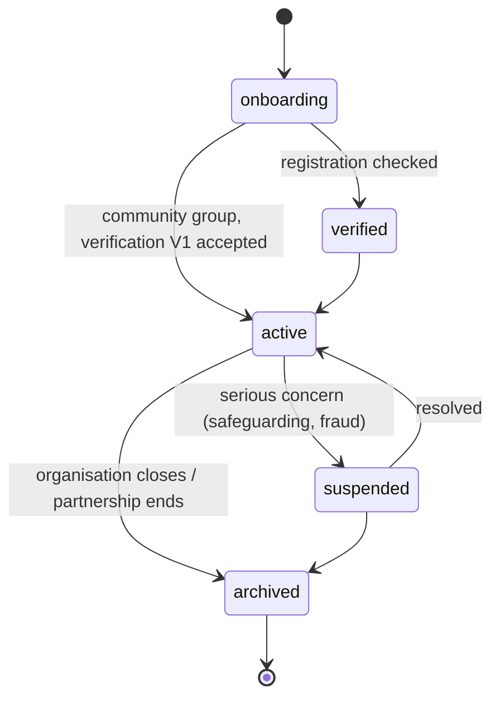

# Organisation

Back to [[Entities Index]].

## Purpose

*River alias: the keeper of a stretch of riverbed.*

A legal or community body that operates flows (the **operating organisation**, i.e. tenant) or takes part in them (as a [[Partner Organisation]], corporate [[Giver]] or [[Sponsor]], logistics [[Carrier]] or receiving institution for a [[Recipient]]). Every [[Log Event]] belongs to exactly one operating Organisation: `orgs/{orgId}/events`.

## Business description

In the demo, **Open River Aid** («Відкрита ріка») is the operating Organisation: a small UK-registered charity, working with Ukrainian coordinators, with hubs in Lviv and (Tier 3) Dnipro. Around it are other Organisations: a Polish logistics company, a Kharkiv village school receiving generators, Sarah's company sponsoring transport.

The operating Organisation owns its configuration: default locales and currency, [[Visibility Policy]] defaults, retention periods, enabled [[Scaling Tiers]] features, safeguarding contacts and branding. At Tier 4 one deployment may host several operating Organisations (see [[Scaling Architecture]]).

## Attributes

| Field | Type | Default visibility | Notes |
|---|---|---|---|
| `orgId` | ULID / slug | `public` | e.g. `open-river-aid`. |
| `name` / `nameLocalised` | string / map locale→string | `public` | «Відкрита ріка» for `uk`. |
| `legalName` | string | `public` | For operating orgs and verified partners. |
| `kind` | enum: charity, ngo, community_group, company, public_institution, school, faith_body, logistics_provider | `public` | |
| `registration` | {country (ISO 3166), registry, number} | `public` | e.g. Charity Commission for England and Wales number. |
| `isOperating` | boolean | `team` | True if this org runs flows on this deployment (tenant). |
| `defaultLocales` | BCP 47 list | `public` | `en-GB`, `uk`. |
| `baseCurrency` | ISO 4217 | `public` | `GBP`; other currencies converted at event-time rate. See [[Cost Record]]. |
| `address` | [[Location]] ref | `public` for operating org; `team` for recipient institutions | A school receiving aid may not want its address public. |
| `safeguardingLeadRef` | `personId` | `team` | Must be set before Tier 2 need intake is switched on. |
| `featureSwitches` | map | `team` | Tier features. See [[Scaling Tiers#Feature switchboard (summary)]]. |
| `visibilityDefaults` | [[Visibility Policy]] ref | `team` | |
| `retentionPolicy` | ref | `team` | See [[Data Retention]]. |
| `verificationLevel` | V0–V4 | `team` | From [[Verification]]. |
| `status` | enum | `team` | |

## States / lifecycle

An archived operating Organisation keeps its log and public reports (P7) under its retention policy; personal data is shredded as retention expires.

## Relationships

- Has members: [[Person]]s through [[Role]] grants scoped to the Organisation.
- Operates [[Programme]]s, [[Campaign]]s, [[Flow]]s and [[Hub]]s.
- May appear as [[Partner Organisation]], [[Giver]], [[Sponsor]], [[Carrier]] or institutional [[Recipient]].
- Owns [[Visibility Policy]] defaults and [[Publication]]s.

## Events emitted

| Event | When |
|---|---|
| `organisation.Registered` | Created (tenant or external body). |
| `organisation.Verified` | Registration or legitimacy check completed ([[Verification]]). |
| `organisation.SettingsChanged` | Locale, currency, retention, feature switches. Payload lists keys changed, old and new values. |
| `organisation.SafeguardingLeadAppointed` | The named Safeguarding Lead changes. |
| `organisation.Suspended` / `organisation.Reinstated` | Serious concern and its resolution. |
| `organisation.Archived` | Closure. |
| `system.BreakGlassUsed` | An emergency elevation of access (see [[Administrator]]). |

## Decision points involved

- [[DP-03 Offer Acceptance]] — organisations offering goods or services.
- [[DP-12 Visibility Change]] — changing organisation-wide defaults.
- [[DP-10 Report Publication]] — annual and impact reports carry the organisation's name.

## Privacy notes

> [!privacy] Institutions can be people-shaped
> A small village school or a care home receiving aid can identify the people in it. Institutional recipients therefore default to `team` for address and `participants` for name, with public naming only by [[Consent]] from an authorised representative.

## Principles

> [!principle] [[Guiding Principles#P11. Scale without changing character|P11 Scale without changing character]]
> One volunteer group and a multi-country programme use the same Organisation model; tiers switch features on.

> [!principle] [[Guiding Principles#P7. The river remembers|P7 The river remembers]]
> Organisation settings changes are logged, so an auditor can see which defaults applied at any moment.

## UI touchpoints

- [[Admin Studio]] — organisation settings, features, safeguarding lead.
- [[Public Portal]] — about page, registration details, [[Transparency Ledger]].
- [[Coordinator Workspace]] — partner and institution cards.
