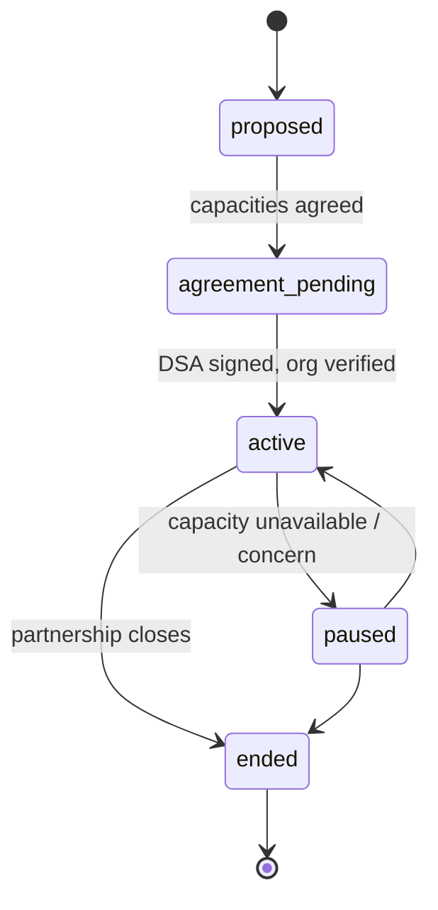

# Partner Organisation

Back to [[Entities Index]].

## Purpose

*River alias: a tributary or neighbouring river — another body of water that joins ours for a stretch.*

An [[Organisation]] that works **with** the operating organisation under an explicit partnership, in one or more capacities: **giver**, **carrier**, **hub operator**, **co-coordinator**, or **referral destination** for needs the operating organisation cannot meet.

## Business description

In [[Scenario B — Regional Aid Hub]], Open River Aid works with a Dnipro community foundation that runs the Dnipro [[Hub]] and co-coordinates deliveries in the oblast, and with a Polish logistics company that carries the cross-border [[Leg]]. When a Need is for legal advice that Open River Aid does not provide, it is **referred** to a partner legal clinic — the Need moves to the `referred` state rather than being refused.

Partners reduce duplication: they see the needs and offers they are entitled to see, and take actions through their members' [[Role]] grants. Sharing personal data with a partner requires a **data sharing agreement** and, for recipient data, either the recipient's [[Consent]] or another documented lawful basis.

## Capacities

| Capacity | What the partner does | Typical grant |
|---|---|---|
| `giver` | Donates goods, money or services | [[Giver]] role for the partner org |
| `carrier` | Moves consignments on legs | [[Carrier]] role |
| `hub_operator` | Runs a [[Hub]]: receives, stores, repacks | Volunteer / Coordinator roles scoped to the Hub |
| `co_coordinator` | Contributes to or leads flows in its region | Coordinator (contributing or lead) scoped to Flows / Campaign |
| `referral_destination` | Accepts referred needs | Receives a referral package |

## Attributes

| Field | Type | Default visibility | Notes |
|---|---|---|---|
| `partnershipId` | ULID | `team` | |
| `orgRef` | `orgId` | `public` once active and consented | |
| `capacities` | set (above) | `team` | |
| `scope` | regions / programmes / categories | `team` | |
| `dataSharingAgreement` | {version, signedAt, signatories, expiresAt, documentRef} | `team` | Required before any `private` data flows. |
| `contacts` | `personId`s | `team` | |
| `referralCategories` | [[Category]] refs | `team` | What they accept. |
| `verificationLevel` | V0–V4 | `team` | See [[Verification]]. |
| `publicAcknowledgement` | boolean | `private` | Named on reports with consent. |
| `status` | enum | `team` | |

## States / lifecycle

On `ended`, partner members' grants are revoked and the partner's copies of shared data are subject to the agreement's return-or-delete clause.

## Relationships

- Specialises an [[Organisation]]; its members are [[Person]]s with scoped [[Role]]s.
- May operate [[Hub]]s, carry [[Leg]]s, give [[Gift]]s, co-lead [[Flow]]s, or receive referred [[Need]]s.
- Described operationally in [[Coordination Model]].

## Events emitted

| Event | When |
|---|---|
| `partner.Proposed` | Partnership proposed. |
| `partner.AgreementSigned` | Data sharing agreement recorded. |
| `partner.CapacityDeclared` / `partner.CapacityWithdrawn` | Capacities change. |
| `partner.ReferralSent` / `partner.ReferralAccepted` / `partner.ReferralReturned` | Need referral handshake (paired with `need.Referred`). |
| `partner.Paused` / `partner.Ended` | Status changes. |

## Decision points involved

- [[DP-01 Need Triage]] — referral as an outcome.
- [[DP-03 Offer Acceptance]] — partner offers.
- [[DP-04 Matching]] and [[DP-05 Routing and Carrier Assignment]] — partner capacity.
- [[DP-12 Visibility Change]] — sharing a record with a partner.

## Privacy notes

> [!privacy] Referral packages are minimal
> A referral carries the need description, region and contact channel — only with the recipient's consent to be contacted by that partner. If consent cannot be obtained, the recipient is given the partner's contact details instead.

> [!privacy] No bulk sharing
> Partners receive records one by one through the API, each share logged. There is no export of recipient lists to partners.

## Principles

> [!principle] [[Guiding Principles#P3. The left bank is always open|P3 The left bank is always open]]
> "We cannot help, but here is who can" — referral keeps the bank open when one organisation cannot meet a need.

> [!principle] [[Guiding Principles#P6. Clear water — clarity and purity of intent|P6 Clear water]]
> Partners state their intent; partnerships used for proselytising, political capture or data harvesting are declined.

## UI touchpoints

- [[Admin Studio]] — partnership set-up and agreements.
- [[Coordinator Workspace]] — shared queues, referrals.
