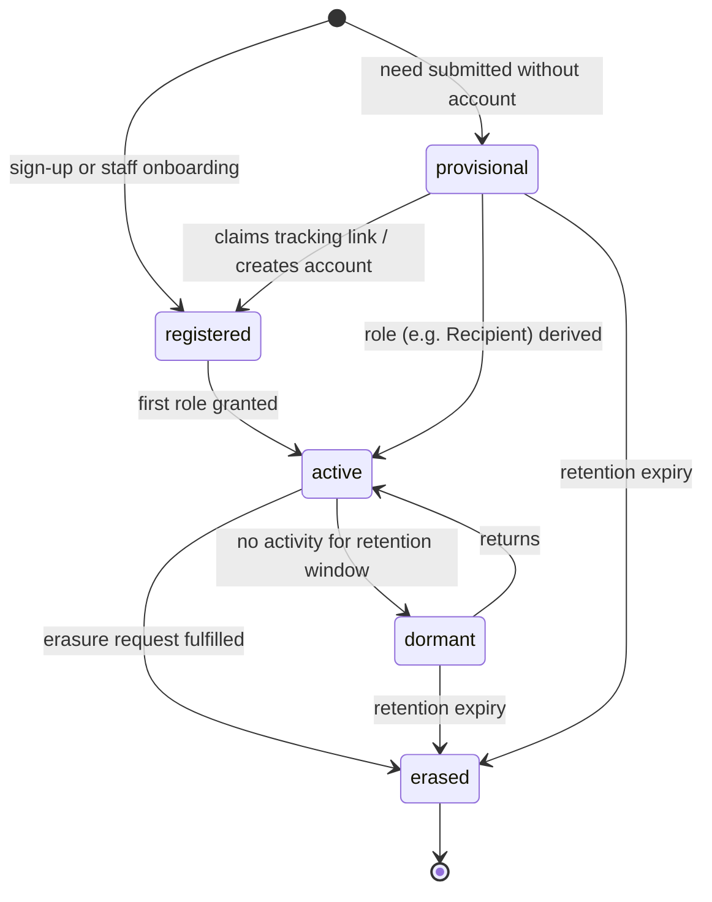

# Person

Back to [[Entities Index]].

## Purpose

*River alias: none — a person is not a part of the river; they are who the river is for.*

The single place where a human being's personal data lives. Every other entity ([[Need]], [[Gift]], [[Leg]], [[Gratitude Note]]) refers to a Person only by `personId`. This keeps personally identifiable information out of the [[Log Event]] stream and makes erasure possible through crypto-shredding.

## Business description

A Person may be Olena asking for a generator, James giving monthly, Mykola driving the van, or Iryna running the charity. The same Person can hold several [[Role]]s at once (a volunteer who also gives; a recipient who later becomes a carrier). A Person does **not** need an account: a recipient who submits a need with only a phone number becomes a *provisional* Person, reachable through a one-time tracking link. Staff Persons are linked to a Google Workspace / Cloud Identity account through [[IAP Staff Access]]; public Persons optionally to a Firebase Authentication user ([[Identity and Access]]).

A Person belongs to one or more [[Organisation]]s' records. There is no global cross-organisation profile unless the Person consents to it.

## Attributes

Stored in `orgs/{orgId}/people/{personId}` (non-sensitive) and `orgs/{orgId}/people/{personId}/private` (restricted, encrypted with the Person's own Cloud KMS key).

| Field | Type | Default visibility | Notes |
|---|---|---|---|
| `personId` | ULID | `team` | Stable reference used in all events. Carries no meaning. |
| `displayName` | string | `private` | What the person asked to be called. May be a first name or nickname. |
| `legalName` | string (encrypted) | `private` | Only collected when a process requires it (e.g. Gift Aid, customs, carrier contract). |
| `contactChannels[]` | {kind: phone \| email \| telegram \| viber \| post, value, verified, preferred} (encrypted) | `private` | At least one for a provisional Person. |
| `preferredLocale` | BCP 47 (`en-GB`, `uk`) | `team` | Drives UI and notification language. See [[Multilingual Experience]]. |
| `accessibilityNeeds` | set of enums (large text, voice input, screen reader, low literacy, low bandwidth) | `private` | Used to adapt forms and contact. See [[Accessibility]]. |
| `homeLocation` | [[Location]] ref | `private` | Stored at the precision needed; coarsened for every other audience. |
| `yearOfBirth` | integer, optional | `sealed` | Only when age matters for safeguarding (minors, elderly). Never full date by default. |
| `authLinks` | {firebaseUid?, workspaceSubject?} | `team` | Links to identity providers. Never exposes provider tokens. |
| `kmsKeyRef` | string | system only | Per-person key; destroying it shreds encrypted fields. |
| `status` | enum (see below) | `team` | |
| `createdVia` | web \| studio \| api \| proxy | `team` | Proxy = entered on the person's behalf by a neighbour, institution or coordinator. |

> [!privacy] No special-category data by default
> Health, ethnicity, religion and similar data are not attributes of Person. If a [[Need]] genuinely requires them (e.g. medicine), they sit on the Need at `sealed` or `private`, with the minimum detail. See [[Data Minimisation]].

## States / lifecycle

`erased` means the Person's KMS key is destroyed: encrypted fields become unreadable, the non-sensitive shell keeps only `personId` so that the log stays consistent. See [[Data Retention]].

## Relationships

- Holds many [[Role]] grants, scoped to [[Organisation]], [[Programme]], [[Campaign]] or [[Flow]].
- Appears as [[Recipient]], [[Giver]], [[Sponsor]], [[Coordinator]], [[Carrier]], [[Volunteer]] or [[Administrator]] through those roles.
- Is the subject of [[Consent]] records, [[Verification]] records and [[Reputation]] signals.
- May act on behalf of another Person (proxy) — the link is recorded on the [[Recipient]].

## Events emitted

| Event | When |
|---|---|
| `person.ProvisionallyRecorded` | A need is submitted without an account. |
| `person.Registered` | Account created or staff onboarded. |
| `person.ContactChannelAdded` / `person.ContactChannelVerified` / `person.ContactChannelRemoved` | Contact details change. Payload carries only channel kind, never the value. |
| `person.ProfileUpdated` | Non-sensitive profile fields change (field names only in payload). |
| `person.LinkedToIdentity` | Firebase or Workspace identity linked. |
| `person.Merged` | Two records found to be the same Person (by coordinator, with reason). |
| `person.ErasureRequested` / `person.KeyShredded` | Right-to-erasure handling; `Erased` records key destruction. |

## Decision points involved

- [[DP-02 Need Verification]] — identity checks, when proportionate.
- [[DP-11 Reputation Review]] — contested signals about this Person.
- [[DP-12 Visibility Change]] — raising any of this Person's fields above default.

## Privacy notes

> [!privacy] PII never enters the log
> Event payloads carry `personId` only. Names, phone numbers and addresses live in the encrypted `private` document and are joined at read time for audiences allowed to see them. This is what makes [[ADR-001 Event-Sourced Append Log]] compatible with the right to erasure.

> [!privacy] Proxy entry
> When someone enters a need for Olena, Olena is still the subject. Her consent is sought directly at the first safe opportunity; until then, nothing about her leaves `private`. See [[Consent Management]].

## Principles

> [!principle] [[Guiding Principles#P4. Private by default|P4 Private by default]]
> Personal data is held once, encrypted, and visible only to those who need it to deliver help.

> [!principle] [[Guiding Principles#P3. The left bank is always open|P3 The left bank is always open]]
> A Person needs no account, no ID and no history to ask for help.

## UI touchpoints

- [[Help Seeker Section]] — minimal-data intake, tracking link.
- [[Giver Section]] — account and preferences.
- [[Coordinator Workspace]] — person card, proxy links, merge.
- [[Admin Studio]] — staff onboarding, erasure requests.
