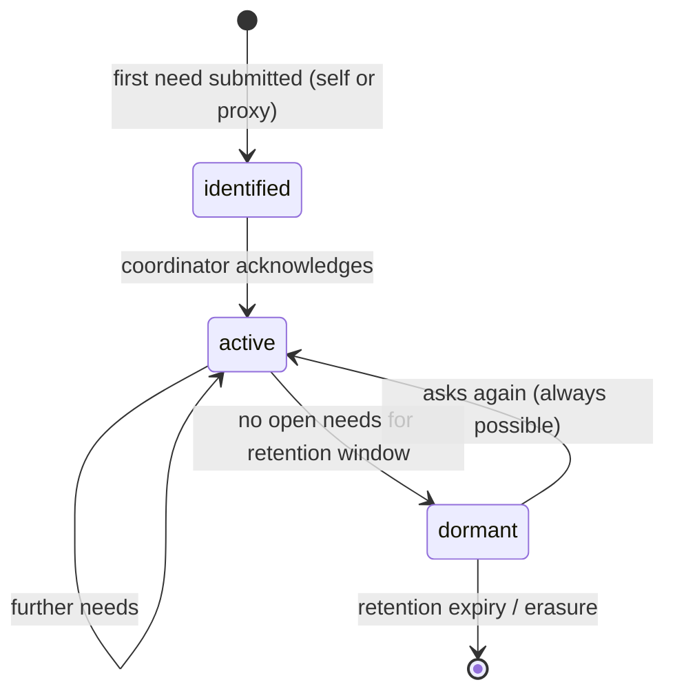

# Recipient

Back to [[Entities Index]].

## Purpose

*River alias: the left bank.*

The person, household, community or institution for whom a [[Need]] exists. A Recipient is a role over a [[Person]] (or an [[Organisation]] for institutions); it exists so that help can be addressed, delivered and thanked for, while the recipient keeps control of their own story.

## Business description

Olena, 63, asks for a generator and winter medicine for herself and her grandson. She does so on an old Android phone, in Ukrainian, without creating an account: she gives a phone number and receives an SMS with a tracking link. Her neighbour could equally have asked *on her behalf*, or the village school could ask for its pupils.

A Recipient never has to prove they "deserve" help ([[Guiding Principles#P2. A need is respected|P2]]). What is checked, and how deeply, is decided proportionately at [[DP-02 Need Verification]]. Whatever happens, the Recipient can always ask again, see the status of their request, withdraw it, and choose what, if anything, is ever shown to others.

### Recipient kinds

| Kind | Example | Who acts | Notes |
|---|---|---|---|
| `individual` | Olena | the Person | |
| `household` | Olena and grandson | a named household contact | Household size stored as a range, not names. |
| `community` | 14 homes on one street | a community contact | Often via proxy. |
| `institution` | village school, care home, hospital | authorised representative of the [[Organisation]] | Institutional verification applies. |
| `represented` | a minor, a person without a phone | guardian, neighbour, social worker | Proxy link recorded; subject still consulted when safe. |

## Attributes

| Field | Type | Default visibility | Notes |
|---|---|---|---|
| `recipientId` | ULID | `team` | |
| `kind` | enum (above) | `team` | |
| `subjectRef` | `personId` \| `orgId` | `private` | |
| `proxyRef` | `personId`, optional | `private` | Who asks on the subject's behalf; relation stated in their own words. |
| `householdSize` | range (1, 2–4, 5+) | `private` | Never a list of names. |
| `approxLocation` | [[Location]] ref | `private` (exact); `participants` coarsened to oblast/region | "a family in Kharkiv oblast". |
| `preferredChannel` | sms \| phone_call \| email \| telegram \| viber \| via_proxy | `private` | |
| `preferredLocale` | BCP 47 | `team` | |
| `accessibility` | from [[Person]] | `private` | Adapts contact and forms. |
| `safeguardingFlags` | set (minor_involved, domestic_risk, exploitation_risk, other) | `sealed` | Set only by coordinators / Safeguarding Lead. See [[Safeguarding]]. |
| `trackingLinkState` | active \| used \| expired | `private` | One-time link for account-free recipients. |
| `publicPseudonym` | generated string | `participants` | e.g. "a grandmother in Kharkiv oblast"; editable by the Recipient. |

## States / lifecycle

A Recipient has no workflow of its own — that belongs to each [[Need]]. The role itself is:

There is **no** blocked, banned or rejected state. A Recipient can always submit a new need.

## Relationships

- Expresses one or more [[Need]]s; takes part in [[Flow]]s.
- Confirms arrival in a [[Delivery Confirmation]] (self, proxy, or carrier-with-evidence).
- May author a [[Gratitude Note]] — optional, never requested as a condition.
- Is the subject of [[Consent]], [[Verification]] and internal-only [[Reputation]] signals.

## Events emitted

| Event | When |
|---|---|
| `role.Derived` (role: recipient) | Derived on first `need.Submitted`. |
| `person.ProxyLinked` / `person.ProxyUnlinked` | Someone asks on the subject's behalf, or stops. |
| `person.PreferenceChanged` | Channel or locale change. |
| `person.PseudonymAssigned` | Recipient edits how they are described to participants. |
| `safeguarding.ConcernRaised` / `safeguarding.Closed` | Sealed events; payload visible only at `sealed`. |

## Decision points involved

- [[DP-01 Need Triage]], [[DP-02 Need Verification]] — how a need is handled; never whether the Recipient may ask.
- [[DP-08 Delivery Confirmation Review]] — confirmation by self or proxy.
- [[DP-09 Publication Consent]] — any story, photo or thanks.

## Privacy notes

> [!privacy] Invisible by default
> Nothing about a Recipient is public by default. Participants see a pseudonym and a region. Faces, names, villages and stories appear only with a specific [[Consent]], captured in the Recipient's language, and removed on withdrawal.

> [!privacy] Reputation is internal only
> Signals about a Recipient are visible to the Recipient and their assigned coordinators; they are used to choose verification depth and routing — never to refuse or delay access to asking. See [[Reputation]].

## Principles

> [!principle] [[Guiding Principles#P3. The left bank is always open|P3 The left bank is always open]] · [[ADR-005 Open Access for Recipients]]

> [!principle] [[Guiding Principles#P10. Dignity in every pixel|P10 Dignity in every pixel]]
> Recipients are shown with agency, never as objects of pity.

> [!question] Minors and self-registration
> Decided ([[Canonical Parameters]], [[Open Questions]]): the minimum age for a self-registered Recipient is 18. People aged 16–17 ask through a trusted adult or institution; under-18s are always `represented`, with `minor_involved` set.

## UI touchpoints

- [[Help Seeker Section]] — ask, track, withdraw, consent, thank.
- [[Coordinator Workspace]] — recipient card with proxy, contact and flags.
- [[Accessibility]] and [[Multilingual Experience]] — reading age, voice input, `uk` first.
