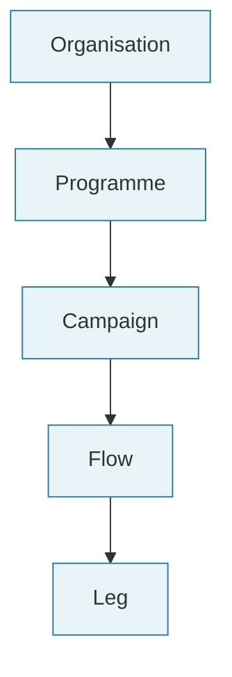
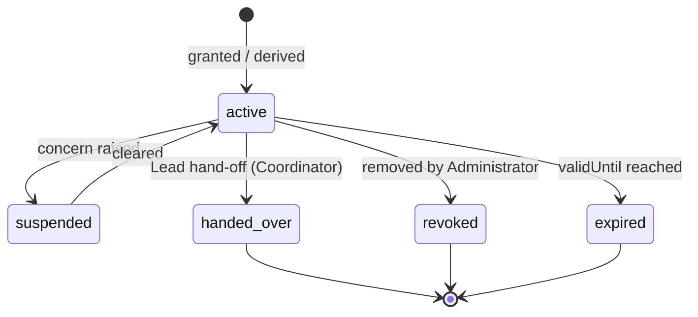

# Role

Back to [[Entities Index]].

## Purpose

*River alias: the place a person stands on the river — on a bank, in a boat, at the keeper's post.*

A **scoped grant** that allows a [[Person]] to act in a given capacity. Authorisation in `river-api` is always "does this Person hold a Role, with this variant, covering this scope, right now?". Roles are data, granted and revoked through logged events.

## Business description

A Person may hold several Roles at once. Andriy is Lead Coordinator on one [[Flow]], Contributing Coordinator on two others, and Finance Steward for the Lviv [[Hub]] campaign. James is a Giver and, on Saturdays, a Volunteer. Participant roles (Recipient, Giver, Carrier) are often *derived* from what someone does (submitting a need makes the Person a Recipient on that need); staff roles are *granted* by an [[Administrator]].

### Base roles

| Role | Typical scope | Granted or derived | Note |
|---|---|---|---|
| [[Recipient]] | Need / Flow | Derived on need submission | Never requires approval. |
| [[Giver]] | Organisation | Derived on offer / gift | |
| [[Sponsor]] | Campaign / Programme | Derived on sponsor commitment | |
| [[Coordinator]] | Organisation / Programme / Campaign / Flow | Granted | Per Flow: one **Lead**, any number of **Contributing**. |
| [[Carrier]] | Leg / Organisation | Granted per Leg or registered pool | Magic-link access scoped to a single Leg. |
| [[Volunteer]] | Hub / Campaign / Organisation | Granted | |
| [[Partner Organisation]] member | Partnership scope | Granted | Acts on behalf of the partner. |
| [[Administrator]] | Organisation | Granted | |

### Role variants

Variants add responsibilities on top of a base role (usually Coordinator or Administrator). They exist to separate duties.

| Variant | Adds | Must not | Visibility reach |
|---|---|---|---|
| **Safeguarding Lead** | Read and act on `sealed` data; handle safeguarding concerns; approve unsealing; review sensitive media before publication. Named on the [[Organisation]]. | Be the only approver of their own safeguarding decisions on cases they coordinate (a second lead or trustee reviews). | `sealed` within scope |
| **Finance Steward** | Approve [[Cost Record]]s ([[DP-06 Cost Approval]]), reconcile gifts received, manage restricted funds. | Approve a Cost Record they submitted or for a Leg they carried. | `team` for money; no `sealed` |
| **Editor** | Create and edit [[Publication]]s in the [[Content Editor]]; request [[Consent]]; propose publication ([[DP-10 Report Publication]]). | Publish identifiable content without a valid Consent; see `private` person data beyond what consent covers. | Consented, pseudonymised views |
| **Auditor** | Read-only access to the log, projections and approvals within scope, time-boxed. | Issue any command. | `team`; `private` fields redacted unless audit scope explicitly includes them |

## Scoping

- A grant at a scope applies to everything **beneath** it (an Organisation-wide Coordinator can see all flows), never above.
- `sealed` access never inherits: a Safeguarding Lead grant must name its scope explicitly.
- Grants may be time-boxed (`validUntil`) — mandatory for Auditor and for Carrier magic links (expire when the Leg closes).

## Attributes

| Field | Type | Default visibility | Notes |
|---|---|---|---|
| `roleGrantId` | ULID | `team` | |
| `personId` | ref | `team` | Or `orgId` for partner-level grants. |
| `role` | enum (base roles) | `team` | |
| `variant` | enum: none, lead, contributing, safeguarding_lead, finance_steward, editor, auditor | `team` | `lead` / `contributing` apply to Coordinator on a Flow. |
| `scope` | {kind: organisation \| programme \| campaign \| flow \| leg \| hub, id} | `team` | |
| `grantedBy` | `personId` \| `system` | `team` | `system` for derived roles. |
| `validFrom` / `validUntil` | timestamp | `team` | |
| `source` | iap_group \| manual \| derived \| magic_link | `team` | Staff roles may map from Google groups via IAP claims. |
| `status` | active \| suspended \| revoked \| expired | `team` | |
| `publicTitle` | string, optional | `public` only with [[Consent]] | e.g. "Coordinator, Lviv" on a report. |

## States / lifecycle

## Relationships

- Links [[Person]] (or [[Organisation]]) to a scope: [[Organisation]], [[Programme]], [[Campaign]], [[Flow]], [[Leg]], [[Hub]].
- Referenced by every [[Log Event]] as `actor.role`.
- Mapped from IAP identity for staff: [[IAP Staff Access]]; enforced in [[Security Rules]] and `river-api`.
- Accountability per decision point: [[Responsibility Matrix]].

## Events emitted

| Event | When |
|---|---|
| `role.Granted` | Staff or partner role granted. |
| `role.Derived` | Participant role created by an action (need, offer, leg assignment). |
| `role.Suspended` / `role.Reinstated` | Concern raised and cleared. |
| `role.Revoked` | Removed, with reason. |
| `role.Expired` | Time-boxed grant ends (system actor). |
| `flow.LeadHandedOver` | Lead Coordinator of a Flow changes; payload has from, to and a hand-off note ref. |

## Decision points involved

- [[DP-05 Routing and Carrier Assignment]] — derives Carrier roles on Legs.
- [[DP-06 Cost Approval]] — requires Finance Steward or Lead Coordinator.
- [[DP-09 Publication Consent]] / [[DP-10 Report Publication]] — Editor.
- [[DP-12 Visibility Change]] — unsealing requires Safeguarding Lead.

## Privacy notes

> [!privacy] Least privilege, per scope
> A Contributing Coordinator on one Flow sees that Flow's `private` data only. Seeing another Flow requires a grant there. Every read of `sealed` data is itself logged.

## Principles

> [!principle] [[Guiding Principles#P7. The river remembers|P7 The river remembers]]
> Who could do what, and when, is reconstructable from `role.*` events — essential for [[Accountability and Audit]].

> [!principle] [[Guiding Principles#P4. Private by default|P4 Private by default]]
> Roles grant the minimum visibility needed to deliver help, for as long as it is needed.

## UI touchpoints

- [[Admin Studio]] — grant, revoke, time-box, map Google groups.
- [[Coordinator Workspace]] — Lead / Contributing on a Flow, hand-off.
- [[Content Editor]] — Editor capabilities.
