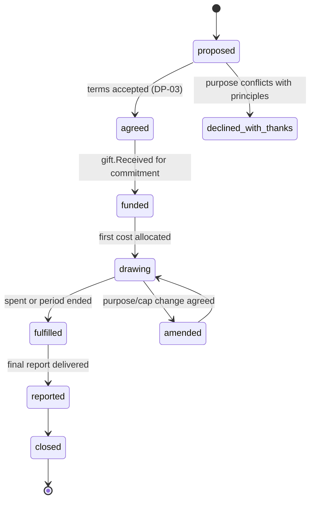

# Sponsor

Back to [[Entities Index]].

## Purpose

*River alias: the tributary — a stream that joins the river for a defined stretch.*

A [[Giver]] who funds a **defined purpose** under an agreed commitment: most often transport and logistics costs, sometimes a [[Campaign]] or a [[Programme]] line. Sponsor funds are **restricted**: they may only be spent on the stated purpose, and every [[Cost Record]] charged to them is traceable.

## Business description

Sarah's company funds transport for Open River Aid for one quarter: up to GBP 6,000 for fuel, ferries and tolls on the UK → Poland → Lviv route. She needs a public summary for her company's social value statement and a private, detailed report for her board.

The portal models this as a **Sponsor Commitment** held on the Sponsor role: purpose, cap, currency, period and reporting obligations. As Cost Records are approved ([[DP-06 Cost Approval]]) and allocated to the commitment, the Sponsor's live report updates. Unspent funds are handled as the commitment states (returned, rolled over with permission, or reallocated with permission).

## Attributes

| Field | Type | Default visibility | Notes |
|---|---|---|---|
| `sponsorId` | ULID | `team` | |
| `subjectRef` | `orgId` \| `personId` | `team` | Usually an [[Organisation]]. |
| `contactPersonRef` | `personId` | `private` | Sarah. |
| `commitments[]` | Sponsor Commitment (below) | `team` | |
| `recognitionPreference` | none \| name_in_reports \| name_and_logo | `private` | Requires [[Consent]]; never scaled by amount. |
| `reportingObligations` | {cadence, format, audience: private \| public, dueDates} | `team` | |
| `preferredLocale` | BCP 47 | `team` | |

**Sponsor Commitment**

| Field | Type | Default visibility | Notes |
|---|---|---|---|
| `commitmentId` | ULID | `team` | |
| `purpose` | [[Category]] ref + text | `participants` | e.g. "Transport: fuel, tolls, ferries". |
| `scope` | [[Campaign]] \| [[Programme]] \| route | `team` | |
| `cap` | {amount, currency (ISO 4217)} | `team` | Public only in aggregate unless consented. |
| `period` | {from, to} | `team` | |
| `unspentPolicy` | return \| roll_over_with_permission \| reallocate_with_permission | `team` | |
| `receivedTotal` / `allocatedTotal` / `spentTotal` | projection | `team` | Derived from the log; never hand-edited. |

## States / lifecycle

Commitment lifecycle:

## Relationships

- Is a specialised [[Giver]]; its money arrives as [[Gift]]s linked to a commitment.
- Funds [[Cost Record]]s on [[Leg]]s and [[Flow]]s within scope.
- Receives [[Donor Report]]s (private) and may appear on [[Campaign Page]]s and [[Impact Report]]s (public, with consent).
- Traced in [[Money Flow and Cost Transparency]] and the [[Transparency Ledger]].

## Events emitted

| Event | When |
|---|---|
| `role.Granted` (role: sponsor) | Sponsor role created. |
| `gift.CommitmentProposed` / `gift.CommitmentAgreed` / `gift.CommitmentDeclined` | Negotiation. |
| `gift.CommitmentAmended` | Purpose, cap or period changed (both parties' agreement noted). |
| `costRecord.FundingAssigned` | An approved Cost Record is charged to the commitment. |
| `gift.CommitmentFulfilled` / `gift.CommitmentClosed` | End of commitment. |
| `person.PreferenceChanged` | Naming preference changed. |

## Decision points involved

- [[DP-03 Offer Acceptance]] — conditions checked against principles.
- [[DP-06 Cost Approval]] — only approved costs draw on restricted funds.
- [[DP-10 Report Publication]] — public sponsor reports.

## Privacy notes

> [!privacy] Sponsors see costs, not people
> A Sponsor's report shows legs, costs, receipts (redacted of personal data) and aggregated deliveries. Recipients appear only as pseudonyms and regions unless a recipient has consented to more.

## Principles

> [!principle] [[Guiding Principles#P1. A gift is a gift|P1 A gift is a gift]]
> A sponsorship buys no say over who receives help, no priority, and no visibility over recipients. Conditions such as "only for families of one faith" or "photos of recipients with our logo" are declined with thanks. See [[Intent Statement]].

> [!principle] [[Guiding Principles#P8. Honest numbers, beautifully shown|P8 Honest numbers]]

> [!question] Logo recognition and P1
> Is a Sponsor's logo on a campaign page compatible with P1? Proposed rule: allowed with consent, same size and placement for every consenting sponsor, never proportional to amount, never on recipient-facing content or near recipient images. Needs confirmation.

## UI touchpoints

- [[Giver Section]] — sponsor dashboard and commitment view.
- [[Coordinator Workspace]] — allocate costs to commitments.
- [[Admin Studio]] — restricted funds overview (Finance Steward).
