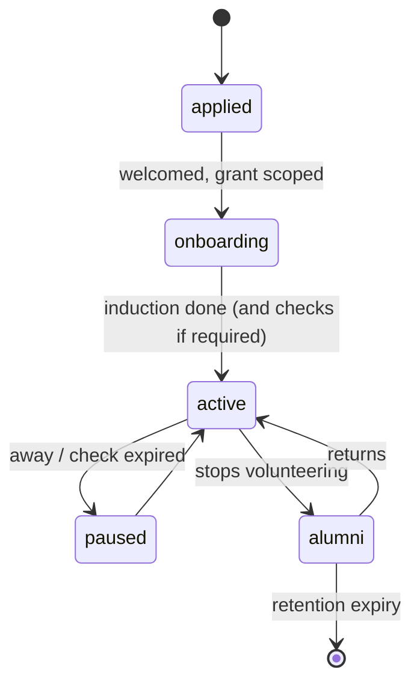

# Volunteer

Back to [[Entities Index]].

## Purpose

*River alias: the hands along the bank — sorting, packing and keeping the channel clear.*

A [[Person]] who gives **time and skills** rather than money or goods: packing at a [[Hub]], sorting donated [[Item]]s, translating and reviewing content, calling recipients back, photographing (with consent) deliveries. Volunteers are part of the chain and are recognised for taking part.

## Business description

On Saturdays, James packs winter kits at the Leeds collection point. Kateryna, a student in Lviv, reviews Ukrainian [[Translation]]s drafted by Vertex AI. A retired nurse makes callback calls to recipients who asked by phone. Each is a Volunteer with tasks, skills and availability.

Volunteers do not coordinate Flows (that needs the [[Coordinator]] role), but may be granted narrow scopes: one Hub, one Campaign, or a translation queue. Tasks that bring them into contact with recipient data or vulnerable people require an appropriate check (in the UK, a DBS check) at [[Verification]] level V3.

## Attributes

| Field | Type | Default visibility | Notes |
|---|---|---|---|
| `volunteerId` | ULID | `team` | |
| `personId` | ref | `team` | |
| `skills` | set: packing, sorting, driving, translation, callbacks, photography, data_entry, events | `team` | |
| `languages` | BCP 47 with proficiency | `team` | Needed for translation review. |
| `availability` | recurring slots / ad hoc | `team` | |
| `hubAffinity` | [[Hub]] refs | `team` | |
| `checks` | [{kind: dbs_basic \| dbs_enhanced \| reference \| training_safeguarding, attestedAt, expiresAt}] | `private` | Attestation only; certificate numbers not stored beyond what law requires. |
| `canSeeRecipientData` | boolean (derived from checks + grant) | `team` | |
| `hoursLogged` | projection | `private` | Shown to the volunteer; public only aggregated. |
| `publicCredit` | none \| first_name \| full_name | `private` | With [[Consent]]. |

## States / lifecycle

## Relationships

- Works at [[Hub]]s on [[Consignment]]s and [[Item]]s; reviews [[Translation]]s; may capture [[Media Asset]]s.
- Holds a [[Role]] scoped to a Hub, Campaign or queue.
- Credited in [[Journey Story]] and counted in [[Impact Metrics]]; recognised through [[Recognition]] (not rankings).

## Events emitted

| Event | When |
|---|---|
| `role.Applied` / `role.Granted` | Joining. |
| `verification.Completed` / `verification.Expired` | Background or training checks. |
| `flow.TaskClaimed` / `flow.TaskCompleted` | Discrete tasks (pack 40 kits, review 12 blocks). |
| `role.TimeLogged` | Hours recorded. |
| `role.Paused` / `role.Relinquished` | Status changes. |

## Decision points involved

- [[DP-02 Need Verification]] — callback volunteers may contribute evidence, never decide.
- [[DP-09 Publication Consent]] — volunteer photographers capture consent together with media.

## Privacy notes

> [!privacy] Tasks, not files
> Volunteers see what the task needs: a packing list without names, a translation block without surrounding personal data, a callback number with only a first name. Contact with recipients is only through portal channels (no personal numbers exchanged).

## Principles

> [!principle] [[Guiding Principles#P1. A gift is a gift|P1 A gift is a gift]]
> Time is a gift too. Hours are acknowledged, never turned into a leaderboard. See [[Recognition Anti-Patterns]].

> [!principle] [[Guiding Principles#P10. Dignity in every pixel|P10 Dignity in every pixel]]
> Volunteer photographers follow the dignity guidance; no pity images.

## UI touchpoints

- [[Giver Section]] — "Give time" sign-up.
- [[Coordinator Workspace]] — task board, hub rota.
- [[Content Editor]] — translation review queue.
