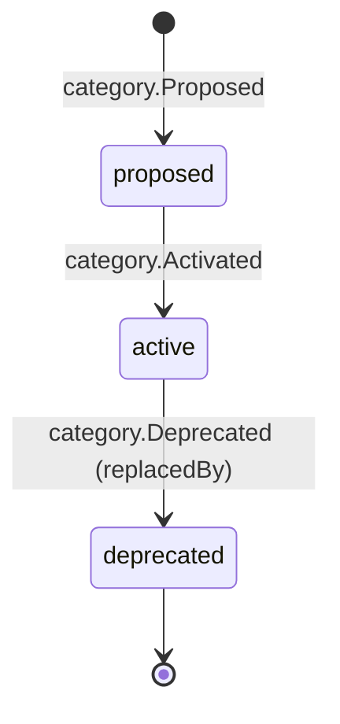

# Category

Back to [[Entities Index]]

## Purpose

A **Category** (uk: «Категорія») is a node in the shared **taxonomy of needs and goods**. It classifies [[Need]]s, [[Offer]]s, [[Item]]s and [[Hub]] acceptance lists so that [[DP-04 Matching]] can find fits, hubs can say what they accept, and reports can aggregate honestly.

## Business description

The taxonomy is **two levels** deep (group → category), with optional leaf types for goods that need special handling. It is **bilingual**: every node has en-GB and uk labels, written natively. It is **descriptive, not evaluative**: no category is "more deserving" than another, and categories never carry priority weights.

Recipients rarely pick categories themselves. They describe the need in their own words, and a coordinator, possibly helped by an AI suggestion, assigns categories at [[DP-01 Need Triage]]. Givers pick from friendly, icon-led group cards.

### Baseline taxonomy (top-level groups)

| Code | en-GB | uk | Example categories |
|---|---|---|---|
| `food` | Food | Продукти харчування | food parcels, baby food, special diets |
| `medicine` | Medicine and health | Ліки та здоров'я | chronic medication, first aid, medical devices, pharmacy vouchers |
| `energy` | Energy and heating | Енергія та опалення | generators, power stations, fuel, firewood, stoves |
| `shelter` | Shelter and repairs | Житло та ремонт | window film, roofing, building materials, repair labour |
| `hygiene` | Hygiene | Гігієна | hygiene kits, nappies, incontinence products, sanitary products |
| `clothing` | Clothing and bedding | Одяг та постіль | winter clothing, footwear, blankets, sleeping bags |
| `water` | Water | Вода | drinking water, filters, containers |
| `mobility` | Mobility and assistive aids | Мобільність та допоміжні засоби | wheelchairs, walkers, hearing aids |
| `education` | Education and children | Освіта та діти | school supplies, laptops, toys, childcare |
| `psychosocial` | Psychosocial support | Психосоціальна підтримка | counselling sessions, peer groups, respite |
| `transport` | Transport and evacuation | Транспорт та евакуація | lifts, evacuation transport, delivery of goods |
| `communication` | Connectivity | Зв'язок | phones, SIM credit, power banks, Starlink access |
| `legal_admin` | Legal and paperwork | Юридична допомога та документи | document recovery, legal advice |
| `livelihood` | Livelihoods | Засоби до існування | tools, seeds, small equipment |
| `animals` | Animal care | Догляд за тваринами | pet food, veterinary care |
| `other` | Something else | Інше | free text; reviewed monthly for new categories |

Handling flags on categories drive rules elsewhere: `medicine.*` requires expiry and batch on [[Item]]; `food.*` requires best-before; `energy.fuel` restricts carriers (hazardous goods); `psychosocial.*` and `legal_admin.*` default the related [[Need]] fields to stricter visibility.

## Attributes

| Field | Type | Default visibility | Notes |
|---|---|---|---|
| `code` | string, dotted | `public` | Stable key, e.g. `energy.generator` |
| `parentCode` | string | `public` | |
| `label` | `{en-GB, uk, …}` | `public` | Glossary-quality; see [[Translation]] |
| `description` | per-locale | `public` | For giver guidance |
| `icon` | token | `public` | From [[Design Language]] icon set |
| `forms` | enum[] | `public` | Typical forms: `goods`, `cash_or_voucher`, `service`, `transport`, `time` |
| `handlingFlags` | enum[] | `team` | `expiry_tracked`, `cold_chain`, `hazardous`, `licensed_only`, `sensitive_topic` |
| `defaultUnit` | string | `team` | `pcs`, `kg`, `l`, `session` |
| `status` | enum | `public` | |
| `replacedBy` | code | `public` | When merged |

## States and lifecycle

Categories are never deleted, because historical events reference them. A deprecated code keeps resolving to its replacement in projections.

## Relationships

Classifies [[Need]], [[Offer]], [[Item]], [[Hub]] (accepted categories), [[Article]] (topics) and [[Programme]] (focus) · aggregated in [[Impact Metrics]], [[Transparency Ledger]] and [[Flow Map]].

## Events emitted

`category.Proposed`, `category.Activated`, `category.LabelChanged`, `category.Deprecated`.

## Decision points involved

[[DP-01 Need Triage]] (assignment) · [[DP-03 Offer Acceptance]] (fit with hub acceptance) · [[DP-04 Matching]].

## Privacy notes

> [!privacy]
> Some categories reveal sensitive information about a person: medicine, mobility aids, psychosocial support. Such categories combined with a settlement can identify someone. Public projections show them only at oblast level, with small-cell suppression, and `psychosocial.*` is never shown on public maps.

> [!question] Shared taxonomy across organisations #open-question
> Should the taxonomy align with an external humanitarian standard, such as cluster or sector codes, to make partner exchange at Tier 3–4 easier? Or should it stay organisation-defined with a mapping table?

## Principles

> [!principle] P2 — a need is respected
> Categories describe; they do not rank. There is no "priority category" and no weight applied in matching.

## UI touchpoints

[[Help Seeker Section]] (icon cards, optional) · [[Giver Section]] ("what's needed now" by category) · [[Coordinator Workspace]] (triage) · [[Admin Studio]] (taxonomy editor) · [[Multilingual Experience]].
