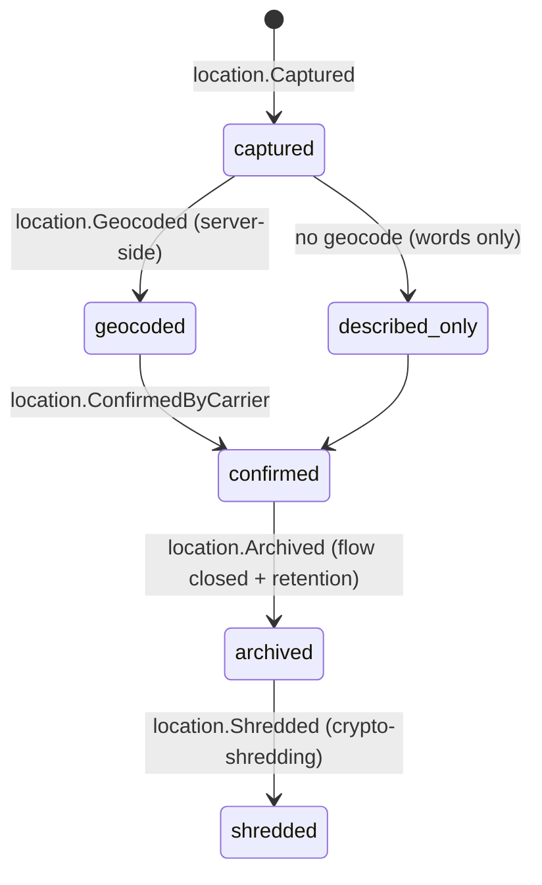

# Location

Back to [[Entities Index]]

## Purpose

A **Location** (uk: «Місцезнаходження») is a place that matters to a flow: a recipient's home, an institution, a [[Hub]], a pickup point, a border crossing, a leg's check-in point. It holds the place at **several precision levels at once**, so each audience sees only the precision it needs.

## Business description

In a war-affected country, a precise address can put people in danger. Location is therefore the most privacy-critical system entity. The rule is: **precise address private, public shows oblast only**.

Each Location is stored as a hierarchy:

| Precision level | Example | Default visibility |
|---|---|---|
| `exact` | вул. Шевченка 12, кв. 4 + coordinates | `private` (subject + assigned coordinator; final-leg carrier during the leg) |
| `settlement` | Балаклія / Balakliia | `participants` (pseudonymised: "a family in Balakliia") |
| `raion` | Ізюмський район / Izium raion | `participants` |
| `oblast` | Харківська область / Kharkiv oblast | `public` |
| `country` | Україна / Ukraine | `public` |

For **public outputs** ([[Flow Map]], [[Campaign Page]], [[Transparency Ledger]]) the projection applies **fuzzing**:

- **Snap to oblast centroid**, never a point within a settlement. Random jitter is not used, because repeated jitter can be averaged back to the real point.
- **Minimum cell size** (default 5 needs or deliveries) before an oblast/category cell is shown. Otherwise it is merged into "other oblasts".
- **Publication delay**: 72 hours for public aggregates; 7 days before a delivery appears on the public [[Flow Map]], or 14 days in high-risk oblasts (set by the Safeguarding Lead, reviewed monthly). Values from [[Canonical Parameters]]; per-oblast overrides may only be stricter.
- **Discreet flag**: some locations (a shelter, a discreet [[Hub]], a safeguarding case) are withheld even at settlement level from `participants`.

Addresses are captured in Ukrainian with a transliteration and geocoded server-side. Recipients can describe a place in words ("the green house behind the school"), and that is valid. Precise coordinates are never required.

## Attributes

| Field | Type | Default visibility | Notes |
|---|---|---|---|
| `id` | ULID | `team` | |
| `kind` | enum | `team` | `home`, `institution`, `hub`, `pickup_point`, `border_crossing`, `checkpoint`, `collection_point` |
| `country` | ISO 3166-1 | `public` | |
| `oblast` | ISO 3166-2 (e.g. `UA-63`) + name | `public` | |
| `raion` | code + name (uk + translit) | `participants` | KATOTTH code where available |
| `settlement` | code + name (uk + translit) | `participants` | |
| `addressLine` | encrypted text | `private` | Stored in the person's private store when it is a home ([[Person]]) |
| `directionsNote` | encrypted text | `private` | "Ring twice; side gate" |
| `geo` | `{lat, lng}` encrypted | `private` | Optional; never from photo EXIF |
| `publicCentroid` | `{lat, lng}` | `public` | Oblast centroid |
| `discreet` | boolean | `team` | |
| `frontlineDelayHours` | int | `team` | Per-oblast policy override |
| `ownerPersonId` | id → [[Person]] | `private` | For homes; drives crypto-shredding |

## States and lifecycle

## Relationships

Used by [[Need]] (`where`), [[Offer]] (pickup), [[Hub]], [[Leg]] (from/to), [[Consignment]] (destination), [[Delivery Confirmation]] (settlement-level check) and [[Programme]] (regions) · precision served by [[Projection]] per [[Visibility Levels]].

## Events emitted

`location.Captured`, `location.Geocoded`, `location.Corrected`, `location.ConfirmedByCarrier`, `location.DiscreetFlagSet`, `location.Archived`, `location.Shredded`. Payloads carry codes (oblast, raion, settlement), never the address line.

## Decision points involved

[[DP-05 Routing and Carrier Assignment]] (release of the exact address to the final-leg carrier) · [[DP-12 Visibility Change]] (e.g. an institution agreeing to be named publicly) · [[DP-09 Publication Consent]].

## Privacy notes

> [!privacy] Time-boxed release
> The exact address is released to a [[Carrier]] only when their leg is `departed` towards it, and access is revoked when the leg is `handed_over`. Each access is logged as an event.

> [!privacy] Photos are locations too
> See [[Media Asset]]: EXIF/GPS stripped, backgrounds reviewed.

> [!decision] Frontline delay policy
> The [[Safeguarding]] Lead sets the list of high-risk oblasts and reviews it at least monthly. The delays themselves (7 days, or 14 in high-risk oblasts) are fixed in [[Canonical Parameters]]. Every change is logged as a `visibility.*` event.

## Principles

> [!principle] P4 — private by default
> The system is useful with the coarsest precision that still gets help delivered.

## UI touchpoints

[[Help Seeker Section]] (oblast → settlement pickers, "describe in words", no map pin required) · carrier leg checklist (address revealed on departure) · [[Coordinator Workspace]] (route planner) · [[Flow Map]] · [[Admin Studio]] (fuzzing and delay policy).
