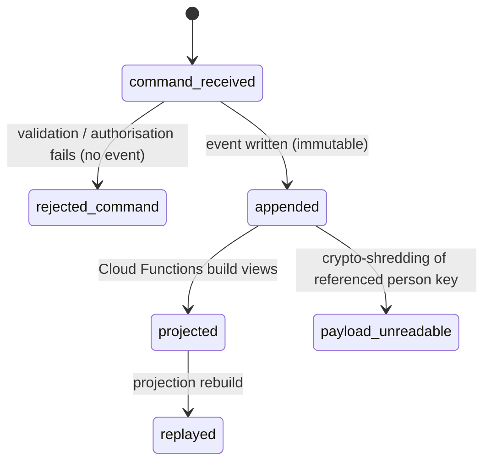

# Log Event

Back to [[Entities Index]] · Architecture: [[Event Log and Projections]] · Catalogue: [[Event Catalogue]]

## Purpose

A **Log Event** (river alias: *sediment*; uk: «Подія журналу») is an immutable, append-only record of something that happened: a need submitted, a leg handed over, a cost approved, a consent withdrawn. The log is the single source of truth. Every screen, report and reputation signal is a [[Projection]] of it ([[ADR-001 Event-Sourced Append Log]]).

## Business description

"The river remembers" ([[Guiding Principles#P7. The river remembers]]). Nothing is overwritten. A correction is a new event that refers to the one it corrects. This gives the organisation:

- **honest reporting**: every public number can be traced to events;
- **a real audit trail**: who did what, when, through which channel, and on whose behalf ([[Accountability and Audit]]);
- **explainable reputation**: the subject can see the events behind each signal ([[Reputation]]);
- **replay**: projections can be rebuilt at any time.

All writes go through the command API (`river-api`): **command → validate → authorise → append event(s)**. Clients never write domain data to Firestore directly.

## Attributes (event schema)

Stored at `orgs/{orgId}/events/{eventId}`. Firestore security rules: server-only create, **no update, no delete** ([[Security Rules]]).

| Field | Type | Default visibility | Notes |
|---|---|---|---|
| `id` | ULID | `team` | Time-sortable; also the document id |
| `type` | string | `team` | Namespaced `aggregate.PastTense`, e.g. `need.Submitted`, `leg.HandedOver` |
| `aggregate` | `{kind, id}` | `team` | e.g. `{kind: "need", id: "01J…"}` |
| `orgId` | id → [[Organisation]] | `team` | Tenant / partition key |
| `actor` | `{personId \| null, role, via}` | `team` | `personId` null for anonymous submitters and system; `role` as held at that moment ([[Role]]); `via`: `web` \| `studio` \| `api` \| `system` \| `vertex` |
| `occurredAt` | timestamp | `team` | When it happened in the world (may be earlier, e.g. offline receipt capture) |
| `recordedAt` | timestamp | `team` | Server time of append |
| `payload` | object | per `visibility` | Domain data. **No PII**: references `personId`s only |
| `visibility` | visibility level | — | `sealed` \| `private` \| `team` \| `participants` \| `public`; ceiling for projections |
| `correlationId` | id | `team` | Groups a business transaction, typically the [[Flow]] or intake session |
| `causationId` | id \| null | `team` | The event or command that caused this one; corrections point to the corrected event |
| `schemaVersion` | int | `team` | Per `type`; upcasters handle old versions on replay |

Example:

```json
{
  "id": "01J9Z3K6Q4R8T2VXW5Y7B0C1DE",
  "type": "leg.HandedOver",
  "aggregate": { "kind": "leg", "id": "01J9Y…" },
  "orgId": "open-river-aid",
  "actor": { "personId": "01J8…", "role": "carrier", "via": "web" },
  "occurredAt": "2026-11-14T15:42:00+02:00",
  "recordedAt": "2026-11-14T13:47:12Z",
  "payload": { "toHubId": "LVIV-1", "consignmentIds": ["01J9…"], "mediaIds": ["01J9…"] },
  "visibility": "participants",
  "correlationId": "flow:01J9X…",
  "causationId": "01J9Z2…",
  "schemaVersion": 1
}
```

## States and lifecycle

An event has no mutable state. Its life is about *being produced and consumed*:



`rejected_command` is a failed command, not an event. It is logged to [[Observability]] only.

## Relationships

Every entity is an **aggregate** whose history is a stream of Log Events: [[Need]], [[Offer]], [[Gift]], [[Flow]], [[Consignment]], [[Leg]], [[Cost Record]], [[Delivery Confirmation]], [[Gratitude Note]], [[Publication]], [[Consent]], [[Verification]] and more. Events are consumed by [[Projection]]s, feed [[Reputation]] and [[Impact Metrics]], and are exported to BigQuery at Tier 3–4 ([[Scaling Architecture]]).

## Events emitted

Log Events *are* the events. Meta-events about the log itself: `system.ProjectionRebuilt`, `system.SchemaUpcasterRegistered`, `system.LogExported` (system actor).

## Decision points involved

Every decision point records its outcome as an event with the decider's `actor`. See [[Decision Points Overview]] and [[Accountability and Audit]].

## Privacy notes

> [!privacy] PII stays out of the log
> Personal data lives in `orgs/{orgId}/people/{personId}/private`, encrypted with a per-person data encryption key (DEK, wrapped by Cloud KMS). Events contain **no plaintext PII**: they carry ids and business facts, and any personal free text (a need description, a gratitude note) is stored encrypted with the author's per-person key. On erasure the key is destroyed (**crypto-shredding**, `person.KeyShredded`): the log stays append-only and intact, but everything it referenced about that person — including that free text — becomes unreadable. See [[Event Log and Projections#Crypto-shredding]], [[Data Retention]] and [[Privacy Model]].

> [!privacy] Event visibility is a ceiling
> A projection may show an event's content at or below the event's `visibility`, never above it. `sealed` events (safeguarding) are excluded from all projections except the Safeguarding Lead's view.

## Principles

> [!principle] P7 — the river remembers
> No update, no delete. Corrections are new events with `causationId` pointing to the corrected event.

> [!principle] AI is an actor, not an author
> Anything Vertex AI produces is recorded with `via: vertex`. Only a human's subsequent event makes it effective ([[Vertex AI Integration]]).

## UI touchpoints

[[Admin Studio]] (audit explorer, filter by aggregate/actor/correlation) · [[Coordinator Workspace]] (activity timeline per flow) · subject's "why do I see this signal?" view ([[Reputation Signals]]).
