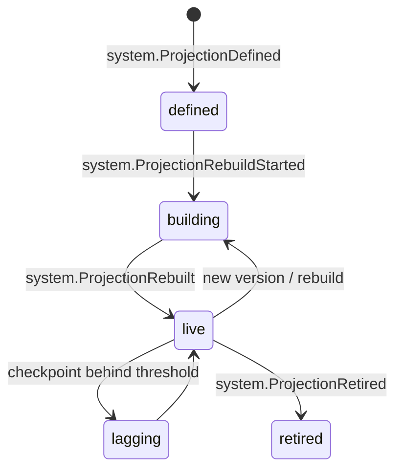

# Projection

Back to [[Entities Index]] · Architecture: [[Event Log and Projections]]

## Purpose

A **Projection** (river alias: *surface*; uk: «Проєкція») is a read model derived from [[Log Event]]s for a specific **purpose** and a specific **audience**: a coordinator's queue, a giver's journey timeline, a campaign's progress bar, the [[Transparency Ledger]], a reputation signal set. "The surface shows the depths honestly" ([[The River Concept]]).

## Business description

Projections are how the same facts are shown safely to different people. One `leg.HandedOver` event can become:

| Audience | Projection shows |
|---|---|
| `team` | Carrier name, hub, time, photo, consignment codes |
| `participants` | "Your gift reached our Lviv hub on 14 Nov, carried by Mykola" (if Mykola consented to first-name credit) |
| `public` | Flow Map: a line Poland → Lviv, published with a delay; +1 to "legs completed this month" |

Projections are built by Cloud Functions (2nd gen) triggered on event creation. They are **idempotent**, keyed by event id, and **rebuildable by replay** from the log. A projection definition is versioned. A change in logic means a rebuild into a new version followed by an atomic switch-over.

Staff projections live under `orgs/{orgId}/views/...`. Public, sanitised projections live under `public/{orgId}/...`, where no field above `public` level may ever be written. [[Security Rules]] allow public reads only there. Because Firestore rules cannot hide individual fields of a document, a staff view that mixes levels is written as **one document per visibility level** (`…/{id}`, `…/{id}/lvl/private`, `…/{id}/lvl/sealed`); see [[Security Rules#Level-split views]] and [[Firebase Data Model]].

**Live data blocks** in the [[Content Editor]] bind to projections, so articles and reports show real numbers.

## Attributes

| Field | Type | Default visibility | Notes |
|---|---|---|---|
| `name` | string | `team` | e.g. `needQueue`, `flowJourney`, `campaignProgress`, `ledger`, `reputationSignals`, `flowMapPublic` |
| `version` | int | `team` | Definition version |
| `audience` | visibility level | — | Max level of any field written |
| `path` | Firestore path | `team` | `orgs/{orgId}/views/{name}/…` or `public/{orgId}/{name}/…` |
| `sourceEventTypes` | string[] | `team` | Subscribed event types |
| `redactionRules` | ref → [[Visibility Policy]] | `team` | Field-level redaction per audience |
| `aggregationRules` | `{minCell, delayHours, geoPrecision}` | `team` | Small-cell suppression, publication delay, [[Location]] precision |
| `checkpoint` | `{lastEventId, updatedAt}` | `team` | For lag monitoring and resume |
| `status` | enum | `team` | |

## States and lifecycle

## Relationships

Derived from [[Log Event]]s · shaped by [[Visibility Policy]], [[Consent]] and [[Visibility Levels]] · reads PII only through authorised server-side joins with the [[Person]] private store, and never into `public/` · consumed by [[Publication]]s, [[Report]]s, [[Coordinator Workspace]], [[Public Portal]], [[Reputation]] and [[Impact Metrics]].

## Events emitted

`system.ProjectionDefined`, `system.ProjectionRebuildStarted`, `system.ProjectionRebuilt`, `system.ProjectionRetired` (`system.*` meta-events with `actor.via: system`; see [[Log Event]] and [[Event Catalogue]]).

## Decision points involved

[[DP-12 Visibility Change]]: a visibility change triggers re-projection of affected documents. [[DP-09 Publication Consent]]: withdrawal of consent triggers removal from public projections.

## Privacy notes

> [!privacy] Redact on write, not on read
> Public projections are *built* sanitised: no private field is written to `public/` and then hidden in the UI. If a visibility level drops (for example, consent is withdrawn), the projection is recomputed and the CDN purged.

> [!privacy] Re-identification guard
> Public aggregates apply a minimum cell size of 5 and the publication delays in [[Canonical Parameters]] (72 hours for aggregates; 7 days, or 14 in high-risk oblasts, on the [[Flow Map]]), and never show finer than oblast level. See [[Location]] and [[Data Minimisation]].

## Principles

> [!principle] P8 — honest numbers
> Any number on any page is a projection of the log, never a hand-typed claim. Aggregated cost amounts are public by default ([[Guiding Principles#P8. Honest numbers, beautifully shown]]).

## UI touchpoints

Everything read-only: [[Public Portal]], [[Coordinator Workspace]] dashboards, [[Giver Section]] journey, [[Transparency Ledger]], [[Flow Map]], live data blocks in the [[Content Editor]]; rebuild controls in [[Admin Studio]].
