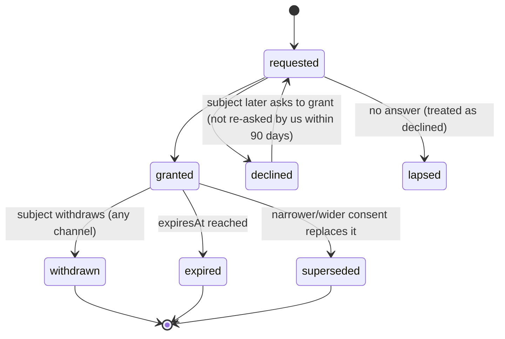
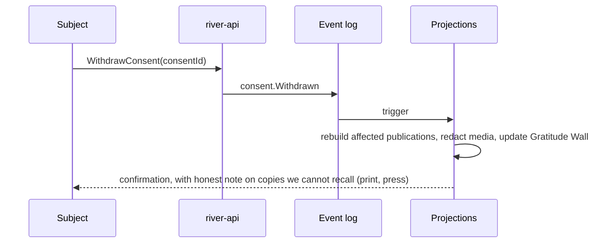

# Consent

Back to [[Entities Index]].

## Purpose

*River alias: none — consent is too important to be a metaphor.*

A recorded, **specific**, **purpose-bound**, **revocable** permission from a [[Person]] (or their authorised representative) for one defined use of their personal data, image, words or name. Consent is what allows anything identifiable to move above its default [[Visibility Levels|visibility level]].

## Business description

After her generator arrives, Olena is asked in Ukrainian, by her coordinator, whether her thank-you may be shared with the people who helped. She says yes to that — and no to a photo on the website. Two Consent records: one granted, one declined. Six months later she asks for her story to be taken down; the [[Journey Story]] is unpublished within the hour and every projection that used her words is rebuilt.

Consent is **one purpose, one scope, one audience**. "I agree to everything" does not exist in this system. Operational processing needed to deliver help (contacting Olena about her delivery) relies on other lawful bases and is not dressed up as consent; the privacy notice explains this plainly. See [[Consent Management]] for capture and withdrawal workflows.

## Purposes

| Purpose key | What it permits | Default audience ceiling | Typical subject |
|---|---|---|---|
| `gratitude_to_participants` | Share a Gratitude Note with those who took part | `participants` | Recipient |
| `story_anonymised` | Use the story, pseudonymised, in a [[Journey Story]] or [[Report]] | `public` | Recipient |
| `story_named` | Use first name / name in a story | `public` | Recipient, Carrier, Volunteer |
| `quote_words` | Quote their own words verbatim | as story | Recipient |
| `photo_no_face` | Publish a photo in which they are not identifiable | `public` | Any |
| `photo_identifiable` | Publish a photo in which they can be recognised | `public` | Any (adult); minors: guardian and Safeguarding Lead |
| `location_precise` | Name the village / town rather than the oblast | `public` | Recipient, institution |
| `name_on_gratitude_wall` | Appear by name on [[Gratitude Wall]] | `public` | Giver, Sponsor, Carrier, Volunteer |
| `amount_disclosure` | Show the amount given | `public` | Giver, Sponsor |
| `sponsor_recognition` | Sponsor name / logo on reports | `public` | Sponsor |
| `referral_contact` | Be contacted by a named [[Partner Organisation]] | partner `team` | Recipient |
| `reputation_portability` | Share reputation signals with another organisation | other org `team` | Carrier, Partner |
| `newsletter` | Receive the [[Newsletter Digest]] | — | Any |
| `ai_assisted_processing` | Optional Vertex AI help on their text beyond core operations (e.g. story drafting) | — | Recipient, Giver |

New purposes are added by the organisation's Safeguarding Lead and Administrator together, each with approved wording in every active locale.

## Attributes

| Field | Type | Default visibility | Notes |
|---|---|---|---|
| `consentId` | ULID | `team` | |
| `subjectRef` | `personId` | `private` | |
| `grantedBy` | self \| guardian \| authorised_representative \| proxy_relayed | `private` | `proxy_relayed` is valid only for `gratitude_to_participants` until confirmed directly. |
| `purpose` | key (above) | `team` | |
| `scope` | {kind: publication \| media_asset \| flow \| gratitude_note \| organisation, id} | `team` | Specific object whenever possible. |
| `audienceCeiling` | visibility level | `team` | Highest level this consent allows. |
| `wordingVersion` / `locale` | ref / BCP 47 | `team` | Exactly what was shown or read out. |
| `captureChannel` | web \| sms_reply \| verbal_recorded_by_coordinator \| paper | `team` | Verbal consent names the coordinator who recorded it. |
| `decision` | granted \| declined | `private` | Declines are recorded so we do not ask again and again. |
| `grantedAt` / `expiresAt` | timestamps | `team` | Identifiable photos default to 24 months. |
| `status` | enum | `team` | |

## States / lifecycle

### Withdrawal effect

## Relationships

- Subject: [[Person]]. Scope: [[Publication]], [[Media Asset]], [[Gratitude Note]], [[Flow]], [[Partner Organisation]].
- Consulted by [[Visibility Policy]] resolution for every identifiable field above default.
- Captured and reviewed at [[DP-09 Publication Consent]]; requested by Editors and Coordinators.

## Events emitted

`consent.Requested` · `consent.Granted` · `consent.Declined` · `consent.Withdrawn` · `consent.Expired` (a request left unanswered, or a time-limited consent ending) · `consent.Superseded` · `consent.WordingPublished` (new wording version for a purpose).

## Decision points involved

- [[DP-09 Publication Consent]] (primary) · [[DP-10 Report Publication]] · [[DP-12 Visibility Change]] · [[DP-08 Delivery Confirmation Review]] (photos at delivery).

## Privacy notes

> [!privacy] Asking is part of care
> Consent is asked at a calm moment, in the person's language, never at the doorstep as a condition of receiving the goods, and never bundled. Declining has no effect on help.

> [!privacy] Children
> For minors, identifiable purposes require guardian consent **and** Safeguarding Lead approval, and are off by default at organisation level. See [[Safeguarding]].

## Principles

> [!principle] [[Guiding Principles#P5. Consent is specific and revocable|P5 Consent is specific and revocable]]

> [!principle] [[Guiding Principles#P4. Private by default|P4 Private by default]]

> [!question] Verbal consent evidence
> Is a coordinator's record of verbal consent sufficient for `photo_identifiable`, or do we require a follow-up SMS confirmation from the subject? Proposed: SMS confirmation where the subject has a phone.

## UI touchpoints

- [[Help Seeker Section]] — "Your permissions" page: every consent, one tap to withdraw.
- [[Giver Section]] — naming, amounts, newsletter.
- [[Coordinator Workspace]] — record verbal consent.
- [[Content Editor]] — consent status on every block and media item; publish blocked without it.
