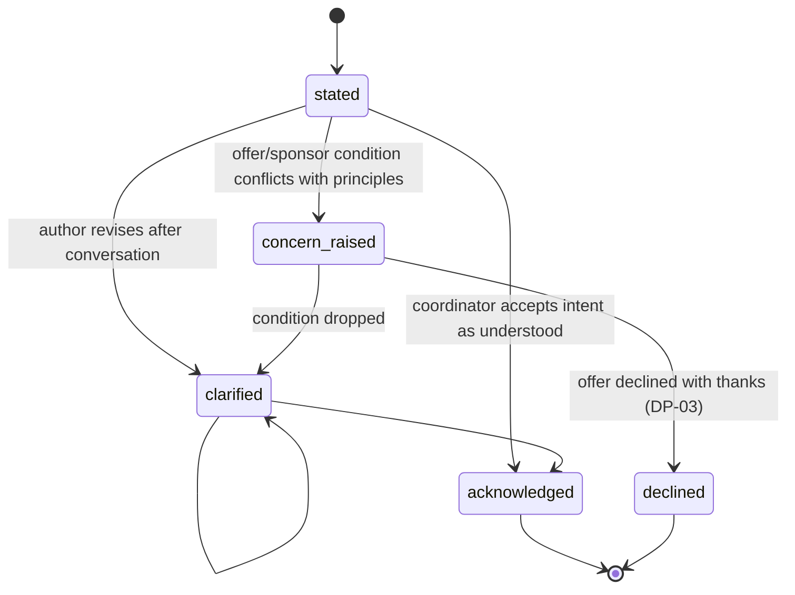

# Intent Statement

Back to [[Entities Index]].

## Purpose

*River alias: the source — where the water comes from, and whether it is clear.*

A short, plain-language declaration of **why** someone is asking or giving, and on **what conditions**. It exists for clarity — so that coordinators can shape help well and hidden agendas can surface — not for judgement.

## Business description

Olena writes: "The power goes off for days. My grandson has asthma and needs his nebuliser." That sentence tells a coordinator more about the *form* of help (a generator of the right size, not money) than any form field. A company offering laptops writes: "We are refreshing our office equipment and want the laptops to be useful" — clear and welcome. A group offering food "on condition that families attend our meeting" states a condition that conflicts with the [[Ethics Charter]], and the offer is declined with thanks at [[DP-03 Offer Acceptance]].

Intent Statements are attached to [[Need]]s, [[Offer]]s, [[Sponsor]] commitments and [[Partner Organisation]] proposals. For recipients, writing one is **optional and never required**: a need with no intent statement is processed exactly like one with a long explanation. Clarity can be helped along — by a coordinator's call or a Vertex AI drafting aid — never demanded.

## Attributes

| Field | Type | Default visibility | Notes |
|---|---|---|---|
| `intentId` | ULID | `team` | |
| `subjectRef` | {kind: need \| offer \| sponsor_commitment \| partnership, id} | `team` | |
| `authorRef` | `personId` | `private` | May be a proxy for a recipient. |
| `text` | string (≤ 600 chars suggested) | `private` for needs; `team` for offers | Original words kept; never overwritten. |
| `locale` | BCP 47 | `team` | |
| `declaredConditions[]` | {kind: publicity, recipient_criteria, use_restriction, timing, reporting, other; text} | `team` | Conditions a giver attaches. |
| `assistance` | none \| coordinator \| vertex_draft | `team` | If Vertex helped, the author approved the final wording. |
| `versions[]` | {text, at, by} | `private` | Clarifications append versions. |
| `concern` | none \| raised \| resolved | `team` | Only for givers / partners / sponsors. |

### Conditions: acceptable vs declined

| Acceptable conditions | Declined with thanks |
|---|---|
| Purpose restriction ("for transport costs") | Requiring recipients to hold a belief, attend an event or join a group |
| Region or category preference | Publicity-for-sale ("photos of recipients with our brand") |
| Reporting request | Collecting recipient data for the giver's own use |
| Timing ("before winter") | Political messaging attached to aid |
| Anonymity request | Selecting recipients by ethnicity, religion or politics |

## States / lifecycle

For recipients, `concern_raised` and `declined` are not reachable: a recipient's intent is never grounds to decline a need.

## Relationships

- Belongs to a [[Need]], [[Offer]], [[Sponsor]] commitment or [[Partner Organisation]] proposal.
- Feeds the *clarity* signal in [[Reputation]] (givers and partners only affect routing; recipients' clarity is internal and used only to offer help with wording).
- Informs [[DP-01 Need Triage]], [[DP-03 Offer Acceptance]] and [[DP-04 Matching]].
- Drafting aid via [[Vertex AI Integration]].

## Events emitted

| Event | When |
|---|---|
| `intent.Stated` | First statement recorded. |
| `intent.Clarified` | New version appended. |
| `intent.AssistanceUsed` | Vertex or coordinator helped draft (actor `via: vertex` where relevant). |
| `intent.ConcernRaised` / `intent.ConcernResolved` | Condition conflicts with principles, and its resolution. |
| `intent.Acknowledged` | Coordinator marks intent understood. |

## Decision points involved

- [[DP-01 Need Triage]] — reading the need's intent to shape form of help.
- [[DP-03 Offer Acceptance]] — conditions checked against [[Ethics Charter]].
- [[DP-04 Matching]] — intent helps fit gift to need.

## Privacy notes

> [!privacy] A recipient's words are theirs
> A recipient's intent text often contains health, family or financial detail. It is `private` by default and never quoted in a [[Journey Story]] without a specific [[Consent]] for that quotation. Vertex drafting runs without storing prompts beyond the event log reference.

## Principles

> [!principle] [[Guiding Principles#P6. Clear water — clarity and purity of intent|P6 Clear water]]
> Clarity is encouraged and helped along — never demanded as a condition of help.

> [!principle] [[Guiding Principles#P2. A need is respected|P2 A need is respected]]
> Nobody has to perform suffering to receive help; a one-line need is enough.

## UI touchpoints

- [[Help Seeker Section]] — optional "Tell us more, if you want" field with voice input.
- [[Giver Section]] — "Why are you giving?" and "Any conditions?" on offers.
- [[Coordinator Workspace]] — intent shown beside need / offer; concern handling.
