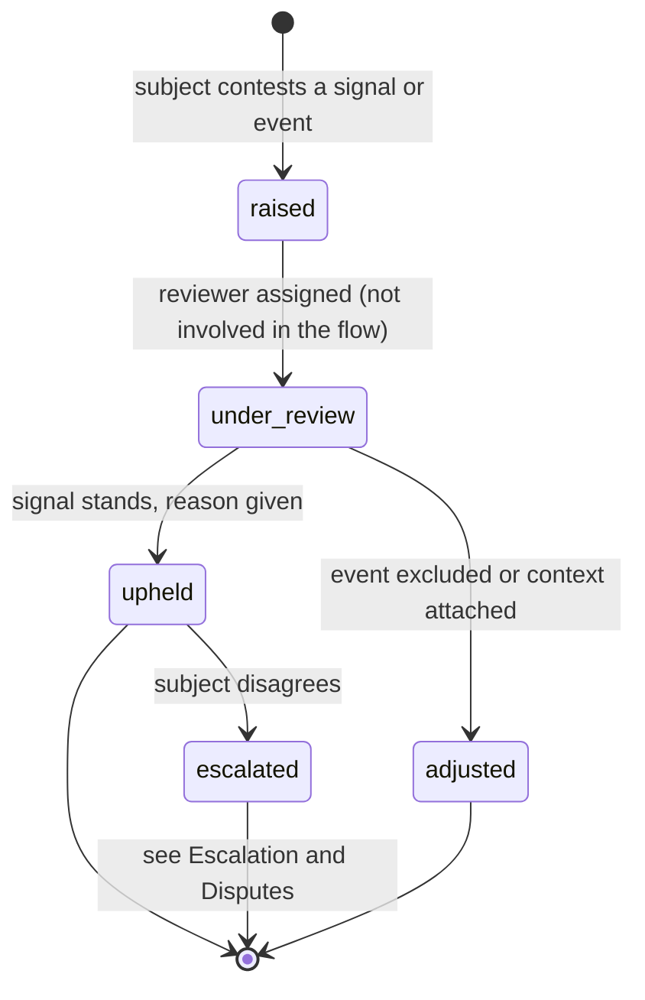
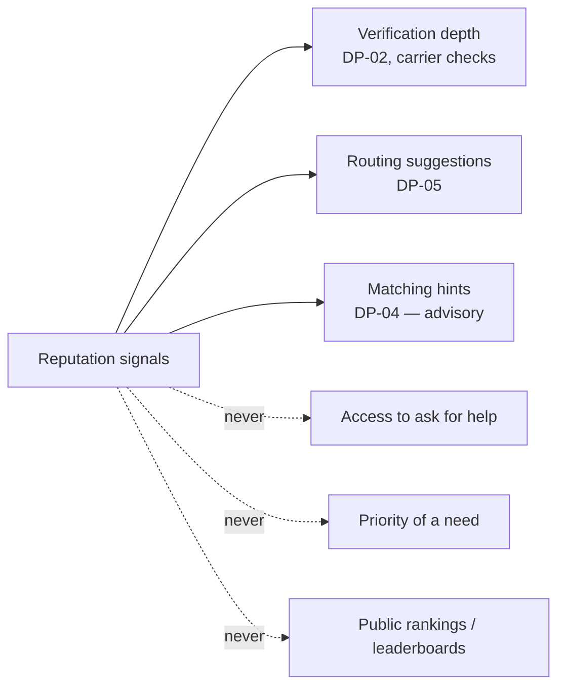

# Reputation

Back to [[Entities Index]].

## Purpose

*River alias: the current — the momentum of trust built by past flows.*

An **explainable, contestable set of signals** about how a participant has taken part in flows, derived entirely from the [[Log Event]] stream. Reputation helps coordinators decide **how** to route and how deeply to verify. It is not a score, not a rank, and it never decides **whether** someone in need may ask for help.

## Business description

Mykola has carried 23 legs, 22 on time and one delayed by a border closure. James's pledges have always been received. A new carrier has no history at all. Reputation makes this visible to the coordinator planning the next convoy, and to Mykola and James themselves — along with every event behind each signal.

Reputation is a [[Projection]], not a stored opinion. Nobody types a reputation; it is recomputed from what happened. People can add **context** ("the delay was the border closure on 3 March") and **contest** a signal at [[DP-11 Reputation Review]]. Detailed signal definitions live in [[Reputation Signals]]; how reputation changes over time is in [[Reputation Dynamics]].

## Signals

| Signal | What it measures | Derived from | Applies to |
|---|---|---|---|
| **Reliability** | Did what was promised | Pledged vs received gifts; assigned vs completed legs; accepted vs completed tasks | Giver, Sponsor, Carrier, Volunteer, Partner |
| **Timeliness** | Kept agreed times | Planned vs actual `leg.Departed`, `leg.HandedOver`; response times | Carrier, Coordinator, Partner |
| **Clarity** | Requests / offers understood without many clarification rounds | Count of `offer.ClarificationRequested`, `need.ClarificationRequested` | Giver, Recipient (internal), Partner |
| **Evidence completeness** | Receipts, photos, confirmations attached | Cost Records with receipts; legs with hand-over evidence | Carrier, Coordinator, Partner |
| **Gratitude received** | Thanks that reached them | `gratitudeNote.Delivered` to this participant | All participants except Recipient |
| **Confirmed deliveries** | Chains completed to the mouth | `deliveryConfirmation.Accepted` on flows they took part in | Carrier, Coordinator, Giver, Partner |

Each signal is shown as a **plain statement with counts** ("22 of 23 legs on time in the last 12 months"), never as a single number or star rating. There is no combined score.

## Attributes

A per-subject, per-organisation read model: `orgs/{orgId}/views/reputation/{subjectId}`.

| Field | Type | Default visibility | Notes |
|---|---|---|---|
| `subjectRef` | `personId` \| `orgId` | `private` | |
| `roleContext` | role kind | `private` | Signals are per role: carrier reliability is not giver reliability. |
| `signals[]` | {name, statement, numerator, denominator, window, trend, contributingEventIds[]} | `private` (subject + assigned coordinators) | Every value traceable to events. |
| `contextNotes[]` | {eventId, note, author, accepted} | `private` | Subject-supplied context. |
| `excludedEvents[]` | {eventId, reason, decidedAt DP-11} | `private` | Events excluded after review (force majeure, error). |
| `window` | default 12 months, older events decay | `team` | |
| `confidence` | none \| low \| established | `private` | Little history means "no signal", not "bad signal". |
| `lastComputedAt` | timestamp | `team` | |
| `portability` | boolean | `private` | Shared with another organisation only with [[Consent]]. |

## States / lifecycle

Reputation itself has no workflow; a **contest** does:

## How it is used — and not used

- **Recipients**: signals are internal only (subject and assigned coordinators). They may lead to *more* verification or a different form of help (e.g. goods rather than cash), but never to refusal, delay of acknowledgement or lower priority. Urgent needs are never held back for verification.
- **Carriers**: low reliability means a coordinator may pair them with an experienced carrier or start with short legs — not exclusion without review.
- **Givers**: signals help coordinators plan (a pledge-reliable giver's pledges can be counted on); they never affect recognition.

## Relationships

- Subject: a [[Person]] or [[Organisation]] in a [[Role]].
- Derived from [[Log Event]]s by a [[Projection]]; see [[Event Log and Projections]].
- Informs [[Verification]] depth and [[DP-05 Routing and Carrier Assignment]].
- Governed by [[DP-11 Reputation Review]] and [[Escalation and Disputes]].

## Events emitted

Signals are computed, so they emit no events on change. Human actions around them do:

| Event | When |
|---|---|
| `reputation.SignalAnnotated` | Subject or coordinator attaches context to a contributing event. |
| `reputation.ContestRaised` | Subject contests a signal or event. |
| `reputation.ContestRejected` / `reputation.SignalCorrected` | Outcome: upheld (contest rejected), or corrected — for example an event removed from computation (the event itself stays in the log) — with written reason ([[DP-11 Reputation Review]]). |
| `reputation.SharingConsented` / `reputation.SharingWithdrawn` | Portability to another organisation. |

## Decision points involved

- [[DP-11 Reputation Review]] — contests; reviewer must not have been involved in the contested flow.
- [[DP-02 Need Verification]] and [[DP-05 Routing and Carrier Assignment]] — consumers.

## Privacy notes

> [!privacy] Always visible to its subject
> Every person can see their own signals, the statement behind each, and the list of events that produced it. There is no hidden reputation — no private "watch list" computed outside this model.

> [!privacy] Concerns are not reputation
> Safeguarding concerns are handled as `sealed` records under [[Safeguarding]], not as reputation signals. Mixing them would leak sensitive matters into routine routing.

## Principles

> [!principle] [[Guiding Principles#P3. The left bank is always open|P3 The left bank is always open]] · [[ADR-005 Open Access for Recipients]]
> Reputation shapes routing and checks; it never shapes access.

> [!principle] [[Guiding Principles#P1. A gift is a gift|P1 A gift is a gift]] · [[Recognition Anti-Patterns]]
> No leaderboards of people; the amount given is not a signal.

> [!principle] [[Guiding Principles#P7. The river remembers|P7 The river remembers]]
> Because reputation is a projection of the log, it is explainable and rebuildable.

> [!question] How reputation is shown to its subject
> Already listed in [[Open Questions]]. Proposal: both — a short narrative ("You have carried 23 legs; thank you") with an expandable set of signals and their events.

> [!question] Signals across organisations
> Should a carrier's reputation with one tenant be visible to another on the same deployment (Tier 4)? Proposed: only with the subject's explicit, revocable consent.

## UI touchpoints

- [[Coordinator Workspace]] — signal panel on person / partner cards, with events.
- [[Giver Section]] and [[Help Seeker Section]] — "Your history" view with contest button.
- [[Admin Studio]] — DP-11 review queue.
