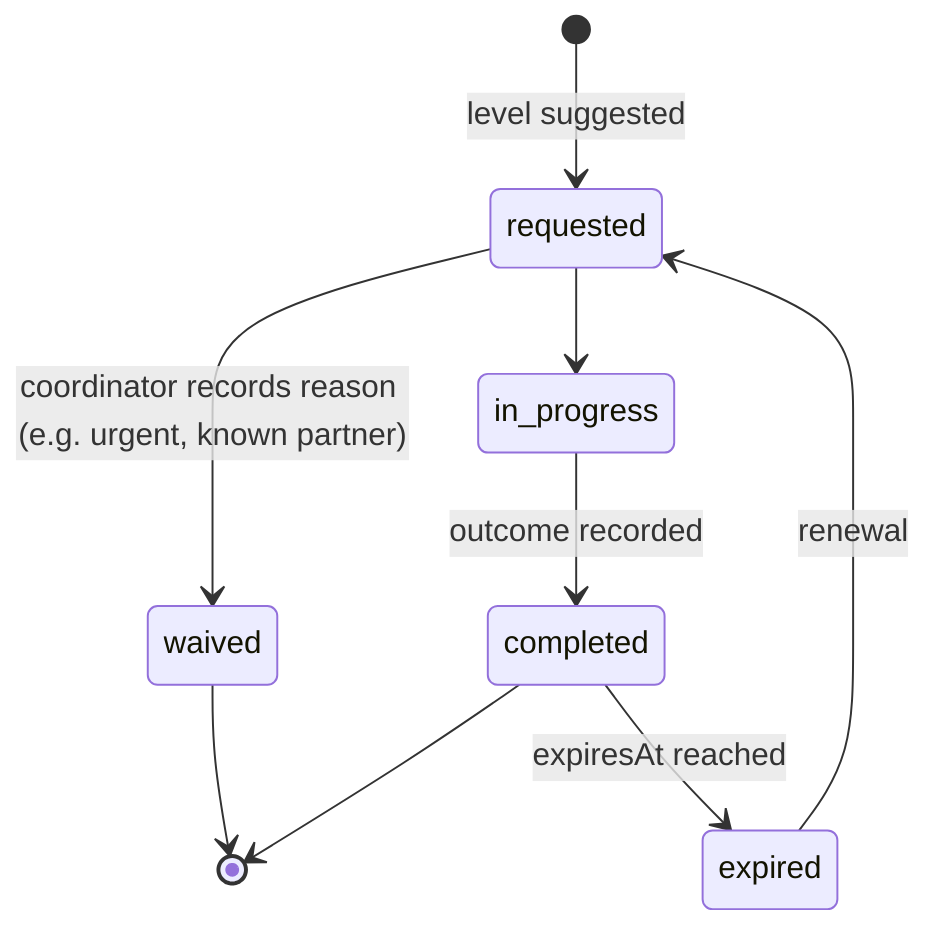

# Verification

Back to [[Entities Index]].

## Purpose

*River alias: soundings — measuring the depth before sending a boat through.*

A recorded check that a claim is real — an identity, a need, an organisation, a carrier's documents, a volunteer's suitability or a delivery. Verification is **proportionate to risk**: the lightest check that makes help safe and honest, and no more.

## Business description

Most needs Open River Aid receives are for modest goods delivered to a region where a local coordinator knows the villages. For those, a phone call back is enough (V1). A request for GBP 1,200 in cash for a boiler warrants corroboration from the village council or a partner (V2). A new partner organisation handling recipient data is checked against its registry (V3). A carrier crossing borders shows a driving licence and insurance, which the coordinator attests to without keeping copies.

Verification never becomes an obstacle course. A need that cannot be verified at the level suggested is not rejected: the coordinator may offer help in a different form (goods instead of cash), refer it, or place it `on_hold` with a kind, explained message ([[Need]] states).

## Levels

| Level | Name | What it means | Typical evidence | Stored |
|---|---|---|---|---|
| **V0** | Face value | Taken as stated | — | Level only |
| **V1** | Contact confirmed | We reached the person on the given channel; basic details consistent | Call back, OTP, reply | Level, method, date |
| **V2** | Corroborated | An independent, known party confirms | Village council, partner, institution, known coordinator | Level, corroborator ref (`team`), date |
| **V3** | Documented | Documents seen and checked | ID, registration, licence, DBS | Attestation: kind, checker, date, expiry. **Not** the document |
| **V4** | In person | Field visit or in-person meeting | Visit note | Attestation and short note (`private`) |

## Proportionality matrix

Suggested level by subject and risk factors. Coordinators may go lower with a reason; going higher than suggested needs a reason too (to prevent drift towards over-checking).

| Subject | Base | Raise one level if… | Never above |
|---|---|---|---|
| Need — goods, ≤ organisation threshold | V0 | duplicate pattern detected; cash requested | V2 (except safeguarding) |
| Need — cash or high value | V1 | above high-value threshold; reputation signals show unresolved inconsistencies | V3 |
| Need involving a minor or safeguarding flag | V1 | — | V4, decided by Safeguarding Lead |
| Organisation / partner | V1 | handles `private` data; receives funds | V3 |
| Carrier | V1 | cross-border; carries high-value or medical goods | V3 |
| Volunteer | V0 | contact with recipients or their data (DBS) | V3 |
| Delivery | V1 (recipient confirmation) | proxy or carrier-only confirmation | V2 |

Thresholds are configured per [[Organisation]] in GBP-equivalent at event-time FX.

## Attributes

| Field | Type | Default visibility | Notes |
|---|---|---|---|
| `verificationId` | ULID | `team` | |
| `subjectRef` | {kind: person \| need \| organisation \| carrier \| volunteer \| delivery, id} | `team` | |
| `claim` | enum: identity, need_exists, residence_region, organisation_legitimate, driving_permit, insurance, suitability, delivery_occurred | `team` | |
| `suggestedLevel` / `targetLevel` / `achievedLevel` | V0–V4 | `team` | Deviation requires `reason`. |
| `riskFactors[]` | enum list | `team` | Why the level was suggested. Explainable. |
| `method` | callback \| otp \| corroboration \| document_seen \| visit \| registry_lookup | `team` | |
| `attestations[]` | {by personId, at, note} | `private` | No document images stored. |
| `outcome` | confirmed \| inconclusive \| concerns | `private` | `concerns` about safeguarding go to `sealed`. |
| `expiresAt` | date | `team` | e.g. insurance expiry, DBS renewal. |
| `status` | enum | `team` | |

## States / lifecycle

> [!decision] Urgency overrides
> An urgent need proceeds to help while verification continues in parallel ([[DP-01 Need Triage]] → [[DP-02 Need Verification]]). Verification is never a queue a person in danger waits in.

## Relationships

- Subject: [[Person]], [[Need]], [[Organisation]] / [[Partner Organisation]], [[Carrier]], [[Volunteer]], [[Delivery Confirmation]].
- Depth informed by [[Reputation]] and risk factors; outcome may feed signals (e.g. evidence completeness).
- Safeguarding-related verifications governed by [[Safeguarding]].

## Events emitted

| Event | When |
|---|---|
| `verification.Requested` | Level suggested with risk factors. |
| `verification.DepthSet` | Target changed with reason. |
| `verification.EvidenceRecorded` | Evidence seen / call made. |
| `verification.Completed` | Outcome recorded. |
| `verification.Waived` | Skipped with reason. |
| `verification.Expired` | Time-bound attestation lapses. |

## Decision points involved

- [[DP-02 Need Verification]] (primary) · [[DP-03 Offer Acceptance]] (partners, sponsors) · [[DP-05 Routing and Carrier Assignment]] (carriers) · [[DP-08 Delivery Confirmation Review]] (deliveries).

## Privacy notes

> [!privacy] Seen, not kept
> Identity documents, licences and certificates are **viewed and attested**, not uploaded or stored. The portal keeps who checked what, when, and the expiry date. This minimises what could ever leak. See [[Data Minimisation]].

> [!privacy] Inconclusive is not guilt
> An `inconclusive` outcome is visible only to assigned coordinators and the subject, carries no label in other flows and does not become a reputation signal on its own.

## Principles

> [!principle] [[Guiding Principles#P2. A need is respected|P2 A need is respected]]
> Taken at face value first; verified proportionately.

> [!principle] [[Guiding Principles#P3. The left bank is always open|P3 The left bank is always open]]
> No verification outcome closes the left bank.

## UI touchpoints

- [[Coordinator Workspace]] — verification panel with suggested level and reasons.
- [[Help Seeker Section]] — plain explanation of why we may call back ("so help reaches the right door").
- [[Admin Studio]] — thresholds and levels per organisation.
