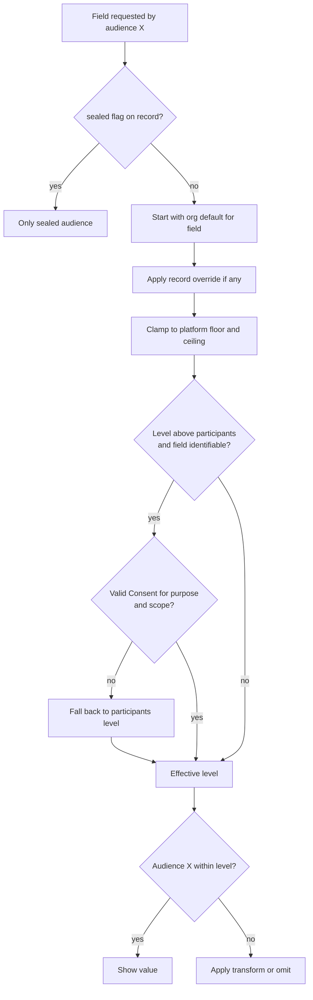
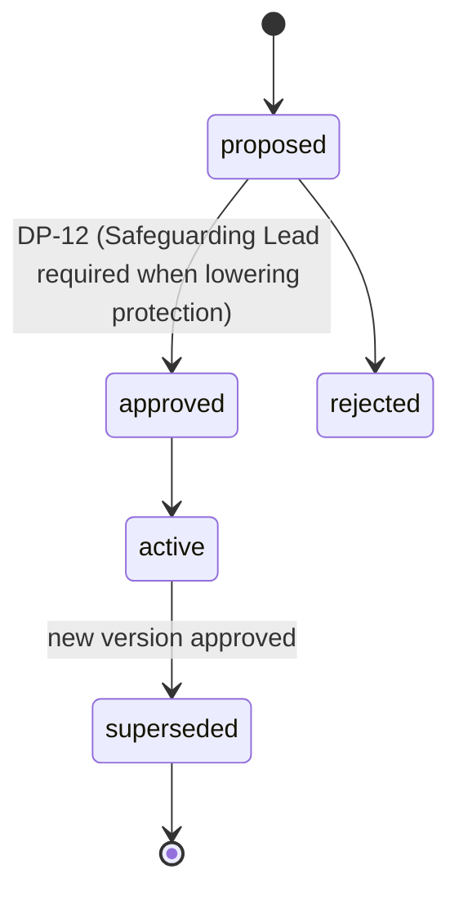

# Visibility Policy

Back to [[Entities Index]].

## Purpose

*River alias: clear or murky water — how far down each audience can see.*

The rules that decide, **field by field**, which audience may see what. A Visibility Policy assigns each field of each record kind a default level from the canonical [[Visibility Levels]] (`sealed`, `private`, `team`, `participants`, `public`), with floors, ceilings and consent requirements. [[Projection]]s apply it to produce a redacted view per audience.

## Business description

A single [[Need]] record has a description, a region, a village, a household size, a phone number and possibly a medical detail. The coordinator needs most of it; a giver who took part needs "a family in Kharkiv oblast needed a generator"; the public needs "37 generators delivered this winter". The Visibility Policy is what makes one record appear correctly to all three, without anyone hand-redacting.

Policies exist at three layers: **platform** (floors no organisation can lower: e.g. contact channels never above `private`), **organisation** (defaults set by an [[Administrator]]), and **record** (an override on one record, changed at [[DP-12 Visibility Change]] and bounded by [[Consent]]).

## The levels (canonical)

| Level | Who sees | Typical content |
|---|---|---|
| `sealed` | Named Safeguarding Lead + assigned coordinator | Safeguarding flags, concerns, minors' details |
| `private` | The subject + assigned coordinator(s) | Contact, exact address, need detail, amounts per giver |
| `team` | Organisation staff on the flow / campaign | Operational status, items, legs, costs |
| `participants` | Everyone who took part in that flow, pseudonymised | Journey milestones, pseudonym + region, thanks |
| `public` | Anyone; aggregated / anonymised unless consented | Totals, ledger, consented stories |

Full definitions: [[Visibility Levels]].

## Attributes

A policy is a set of **field rules**:

| Field | Type | Default visibility | Notes |
|---|---|---|---|
| `policyId` | ULID | `team` | |
| `layer` | platform \| organisation \| record | `team` | |
| `recordKind` | e.g. need, recipient, gift, leg, cost_record, media_asset | `team` | |
| `fieldPath` | string, e.g. `need.location.settlement` | `team` | |
| `defaultLevel` | level | `team` | |
| `floor` | level | `team` | Lowest protection allowed — e.g. `private` for contact channels means it can never go to `team` or higher audiences. |
| `ceiling` | level | `team` | Highest audience ever allowed. |
| `consentPurpose` | Consent purpose key, optional | `team` | Required to go above `participants` when identifiable. |
| `transform` | none \| pseudonymise \| coarsen_location(level) \| round_amount \| aggregate_only \| blur_faces | `team` | How the field is rendered for lower-trust audiences instead of hiding it. |
| `changedBy` / `reason` | ref / text | `team` | |

### Example rules (Open River Aid defaults)

| Field | Default | Floor → ceiling | Transform for `participants` / `public` | Consent to go higher |
|---|---|---|---|---|
| `recipient.displayName` | `private` | private → public | pseudonym | `story_named` |
| `need.location` | `private` | private → public | oblast / aggregate | `location_precise` |
| `need.medicalDetail` | `sealed` | sealed → private | hidden | never public |
| `person.contactChannels` | `private` | private → private | hidden | — |
| `gift.amount` | `private` | private → public | aggregate only | `amount_disclosure` |
| `costRecord.amount` | `team` | team → public | shown (receipts redacted) | — (P8: costs are public in aggregate by default) |
| `mediaAsset.image` | `private` | private → public | blur faces, strip EXIF | `photo_no_face` / `photo_identifiable` |

## Resolution

The most restrictive rule always wins. Withdrawal of Consent immediately lowers the effective level on the next projection run.

## States / lifecycle

Policies are versioned; each change appends a new version:

## Relationships

- Applies to every entity's fields; consulted by every [[Projection]] and by [[Security Rules]]. Because Firestore rules cannot hide individual fields, projections store one document per visibility level where a record mixes levels ([[Security Rules#Level-split views]], [[Firebase Data Model]]).
- Bounded by [[Consent]]; changed at [[DP-12 Visibility Change]].
- Defined conceptually in [[Visibility Levels]] and [[Privacy Model]].

## Events emitted

| Event | When |
|---|---|
| `visibility.PolicyChanged` | Organisation-level rule version approved. |
| `visibility.Changed` | Override on one record / field. |
| `visibility.Sealed` / `visibility.Unsealed` | Safeguarding sealing; unsealing needs the Safeguarding Lead. |
| `visibility.ChangeDeclined` | Proposal rejected at DP-12, with reason. |

Every [[Log Event]] also carries its own `visibility` field, which governs who may read the event itself.

## Decision points involved

- [[DP-12 Visibility Change]] (primary) · [[DP-09 Publication Consent]] · [[DP-10 Report Publication]].

## Privacy notes

> [!privacy] Raising protection is instant; lowering it is a decision
> Anyone with a role on a record can make it *more* private at once. Making anything *less* private goes through DP-12 and, when identifiable, needs Consent.

> [!privacy] Projections are the only doors
> Public and participant views are generated projections (`public/{orgId}/...`). No client ever reads the underlying record and redacts it itself.

## Principles

> [!principle] [[Guiding Principles#P4. Private by default|P4 Private by default]] · [[ADR-006 Private by Default Visibility]]

> [!principle] [[Guiding Principles#P8. Honest numbers, beautifully shown|P8 Honest numbers]]
> Costs and totals default to public in aggregate; privacy protects people, not the organisation's numbers.

## UI touchpoints

- [[Admin Studio]] — policy editor with preview "as seen by" each audience.
- [[Coordinator Workspace]] — per-record visibility chips; "make more private" button.
- [[Content Editor]] — live preview of each audience's view of data blocks.
