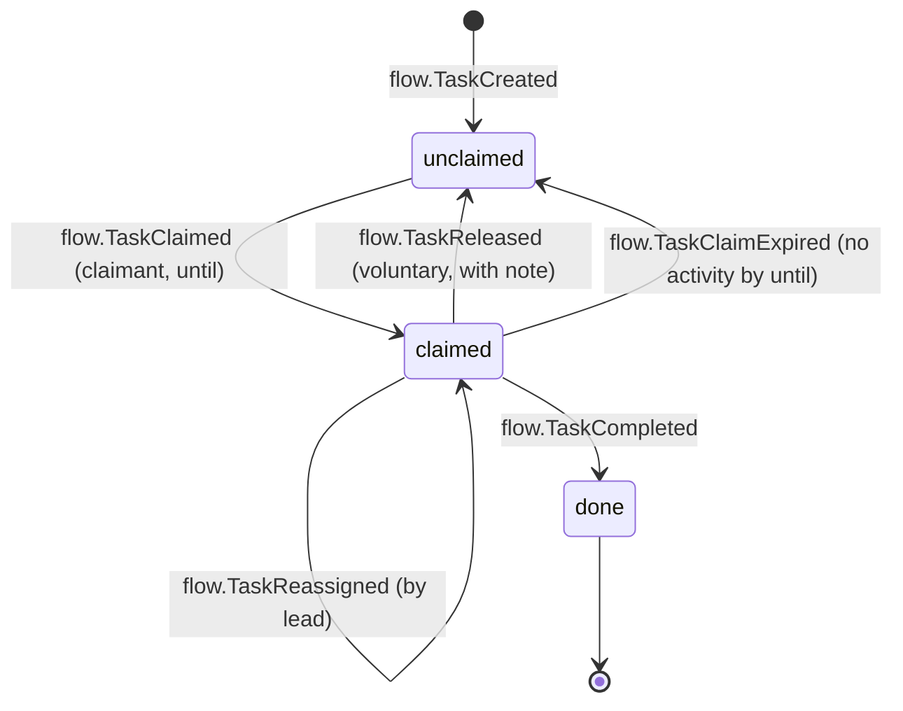
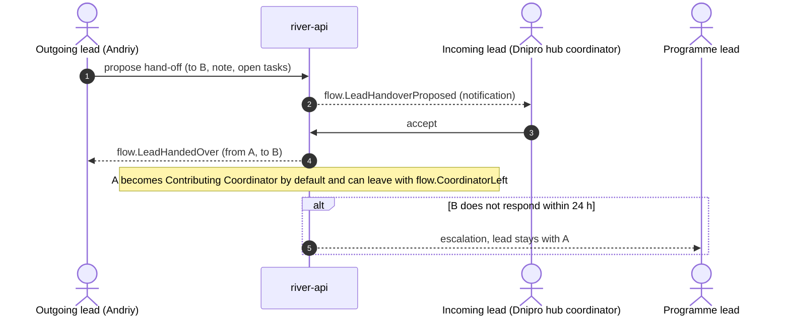
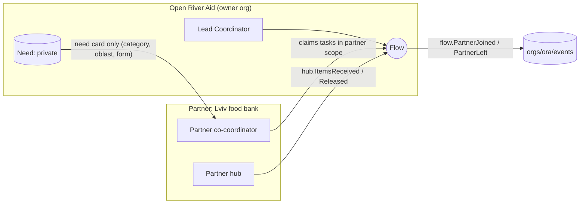

# Coordination Model

How several [[Coordinator]]s, sometimes from different organisations, tend one [[Flow]] together without stepping on each other. The aim is that no work gets lost, no work gets done twice, and it is always possible to say who is accountable. Back to [[Entity Relationship Map]].

> [!principle] One accountable person, many helping hands
> Every flow has **exactly one Lead Coordinator** at any moment, and any number of **Contributing Coordinators**. The lead is accountable for the flow's decisions at DP-04, DP-07 and DP-08. Contributors carry out work and may hold delegated decisions. Every change of hands is a logged event. See [[Responsibility Matrix]].

## Roles on a flow

| Role on flow | How many | Typical holder | Can decide | Cannot |
|---|---|---|---|---|
| Lead Coordinator | exactly 1 | Andriy (Open River Aid, Lviv) | Matching ([[DP-04 Matching]]), dispatch ([[DP-07 Dispatch]]), confirmation review ([[DP-08 Delivery Confirmation Review]]), cost approval up to a threshold ([[DP-06 Cost Approval]]) | Approve their own reimbursement claims |
| Contributing Coordinator | 0..n | Hub coordinator in Dnipro, a partner's logistics officer | Claimed tasks, routing proposals ([[DP-05 Routing and Carrier Assignment]]) when delegated | Change the lead; publish reports |
| Partner co-coordinator | 0..n | Staff of a [[Partner Organisation]] | Tasks inside their partner scope (for example their own hub and carriers) | See `private` recipient data beyond the fields shared under [[Consent]] |
| Safeguarding Lead (variant of [[Role]]) | 0..1 per org | Named person | Everything `sealed` | Routine logistics decisions |
| Finance Steward (variant of [[Role]]) | 1 per org | Treasurer | Cost approval above the threshold | Matching |

Roles are granted per scope (organisation, [[Programme]], [[Campaign]] or flow) through `role.Granted`. Staff reach the [[Coordinator Workspace]] through [[IAP Staff Access]].

## Work as claimable tasks

A flow breaks down into **tasks**: triage this need, verify it, find a carrier for leg 2, pack a consignment, chase a confirmation, draft the report. Tasks live in a shared queue, and a coordinator *claims* a task before working on it.

- A claim carries a **soft lock with a time limit** (`until`, default 24 h for routine tasks and 2 h for urgent ones). Other coordinators see "Andriy is on this until 18:00" and cannot claim it. They *can* comment.
- Expired claims return to the queue automatically, and the claimant gets a gentle notice. Expiry is **not** a negative reputation signal on the first occurrence. Only a pattern of repeated expiries lowers the reliability signal (see [[Reputation Dynamics]]).
- Commands on a claimed task by anyone other than the claimant or the lead are rejected by `river-api` with a helpful error. This is conflict avoidance at the command layer.

## Hand-offs

A hand-off transfers the lead role. The outgoing lead writes a **hand-off note**: open risks, promises made to the recipient, pending costs and anything the next person must know.

| Hand-off rule | Why |
|---|---|
| The lead role is never empty. The outgoing lead remains the lead until the incoming lead accepts. | Accountability is never lost |
| Mandatory hand-off note (minimum fields: promises to the recipient, open costs, safety notes) | Promises survive a change of hands |
| Access to `sealed` data does **not** transfer automatically. The Safeguarding Lead re-grants it. | Safeguarding separation |
| An administrator can force a hand-off (for illness or absence) with `flow.LeadHandedOver` and a reason | Continuity |

## Cross-organisation coordination (Tier 3+)

[[Partner Organisation]]s join flows as givers, carriers, [[Hub]] operators or co-coordinators. The portal treats a partner as a **scoped guest inside the flow**. The partner does not become a co-owner of the organisation's data.

- **Events stay in the owning organisation's log.** Partner actions are recorded with `actor.role = partner_coordinator` and the partner's `orgId` in the payload.
- **Sharing is field-level and consented.** When a recipient's address is needed for a partner's delivery leg, it is released to that leg's carrier only, for the life of the leg (see [[Visibility Levels]] and [[Data Minimisation]]).
- **Duplicate prevention between organisations.** A need shared with a partner receives a `sharedNeedRef`. If the partner is already serving the same household, it can link the two (`need.LinkedAsRelated`). The need is never refused.
- **Disagreements** between organisations about routing, costs or confirmation follow [[Escalation and Disputes]].

## Conflict avoidance, summarised

| Risk | Mechanism |
|---|---|
| Two coordinators match the same gift to different needs | Allocation is a command with optimistic concurrency on the gift's remaining balance. The second attempt fails with "already allocated". |
| Two people book different carriers for one leg | A leg can hold only one active `leg.CarrierAssigned`. Replacing it requires `leg.CarrierUnassigned` first. |
| A recipient is contacted by several coordinators | Recipient contact is a claimable task. One contact thread per need. |
| Silent drift (nobody owns the next step) | Every non-terminal flow has a "next action" projection. Flows with no activity for 72 h surface on the lead's dashboard and then on the programme lead's dashboard. |
| A partner acting outside scope | Scope checks on every command. Violations are rejected and logged as `system.ScopeViolationBlocked` (see [[Security Rules]]). |

## AI assistance

Vertex AI may *suggest* matches, route options or a hand-off summary drafted from the flow's events. Suggestions are logged with `via: vertex`, and a human accepts or discards them. They are never auto-applied. See [[Vertex AI Integration]]. #vertex

> [!question] Lead coordinator from a partner organisation
> Can the Lead Coordinator of a flow belong to a partner organisation rather than the organisation that owns the log? The current model says no: the lead is always from the owning organisation, and partners contribute. Large consortia (Tier 4) may need to allow it. #open-question
